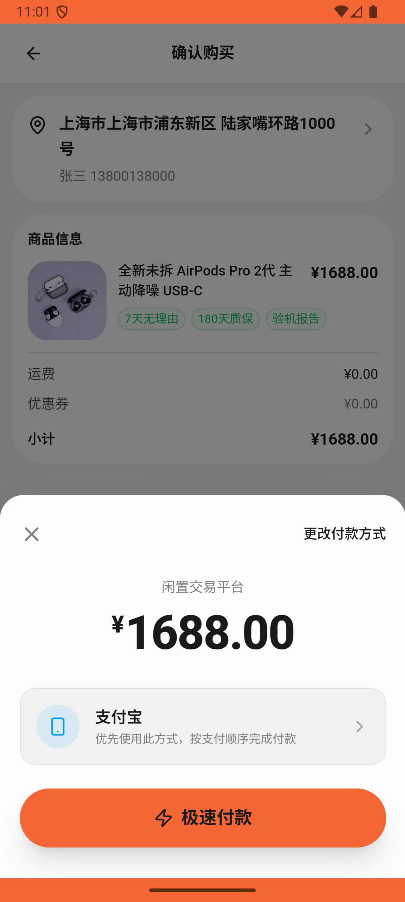

# message/v008_message_validator  ❌

- **Brand**: `xianzhiershouwang`
- **Class**: `XianzhiershouwangMessageV008MessageValidatorTask`
- **Pass@3**: **0/3**  (score = 0.00)
- **Elapsed**: 322s (~5.4 min)
- **Model**: `doubao-seed-2-0-lite-260428`
- **Raw log**: [./raw_logs/XianzhiershouwangMessageV008MessageValidatorTask.log](./raw_logs/XianzhiershouwangMessageV008MessageValidatorTask.log)
- **Generated**: 2026-05-26T23:06:00+08:00

## Task Goal

> 【当前账户档案】账号：zhangsan@example.com；昵称：张三；默认收货地址（JSON）：{"recipient": "张三", "phone": "13800138000", "address": "上海市 上海市 浦东新区 陆家嘴环路1000号"}。请基于以上档案打开 com.xianzhiershouwang 并完成以下任务：那个全新AirPods Pro 2代USB-C的帮我用支付宝买了，买完私信卖家催一下发货

## Attempts

| # | Outcome | Steps | Terminated | Reason | Start → End |
|---|---------|-------|------------|--------|-------------|
| 1 | ❌ failed | 8 | answer | – | 2026-05-26 23:00:38 → 2026-05-26 23:01:42 |
| 2 | ❌ failed | 9 | answer | – | 2026-05-26 23:01:42 → 2026-05-26 23:02:48 |
| 3 | ❌ failed | 21 | answer | – | 2026-05-26 23:02:48 → 2026-05-26 23:06:00 |

## Failure Details

### Episode 1 — ❌ failed

- steps_used: `8`
- terminated_reason: `answer`
- death shot: 
  - state: [`./death_shots/XianzhiershouwangMessageV008MessageValidatorTask/episode_001/step_008.json`](./death_shots/XianzhiershouwangMessageV008MessageValidatorTask/episode_001/step_008.json)
  - digest: [`episode_digest.md`](./death_shots/XianzhiershouwangMessageV008MessageValidatorTask/episode_001/episode_digest.md)

### Episode 2 — ❌ failed

- steps_used: `9`
- terminated_reason: `answer`
- death shot: 
  - state: [`./death_shots/XianzhiershouwangMessageV008MessageValidatorTask/episode_002/step_009.json`](./death_shots/XianzhiershouwangMessageV008MessageValidatorTask/episode_002/step_009.json)
  - digest: [`episode_digest.md`](./death_shots/XianzhiershouwangMessageV008MessageValidatorTask/episode_002/episode_digest.md)

### Episode 3 — ❌ failed

- steps_used: `21`
- terminated_reason: `answer`
- death shot: 
  - state: [`./death_shots/XianzhiershouwangMessageV008MessageValidatorTask/episode_003/step_021.json`](./death_shots/XianzhiershouwangMessageV008MessageValidatorTask/episode_003/step_021.json)
  - digest: [`episode_digest.md`](./death_shots/XianzhiershouwangMessageV008MessageValidatorTask/episode_003/episode_digest.md)

---

> 本摘要由 `sengclaw/scripts/pipeline/log_summarizer.py` 自动生成。 原始完整 log 见上方 Raw log 链接（含每 step 的 messages / tool_call / screenshot 引用）。
