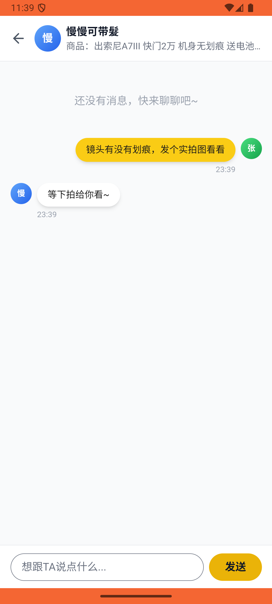

# message/v011_message_validator  ⚠️

- **Brand**: `xianzhiershouwang`
- **Class**: `XianzhiershouwangMessageV011MessageValidatorTask`
- **Pass@3**: **2/3**  (score = 1.00)
- **Elapsed**: 452s (~7.5 min)
- **Model**: `doubao-seed-2-0-lite-260428`
- **Raw log**: [./raw_logs/XianzhiershouwangMessageV011MessageValidatorTask.log](./raw_logs/XianzhiershouwangMessageV011MessageValidatorTask.log)
- **Generated**: 2026-05-26T23:41:02+08:00

## Task Goal

> 【当前账户档案】账号：zhangsan@example.com；昵称：张三；默认收货地址（JSON）：{"recipient": "张三", "phone": "13800138000", "address": "上海市 上海市 浦东新区 陆家嘴环路1000号"}。请基于以上档案打开 com.xianzhiershouwang 并完成以下任务：之前跟索尼A7III那个卖家聊过，帮我问问镜头有没有划痕，让他发个实拍图看看

## Attempts

| # | Outcome | Steps | Terminated | Reason | Start → End |
|---|---------|-------|------------|--------|-------------|
| 1 | ✅ passed | 18 | answer | – | 2026-05-26 23:33:29 → 2026-05-26 23:35:29 |
| 2 | ❌ failed | 36 | answer | – | 2026-05-26 23:35:29 → 2026-05-26 23:39:36 |
| 3 | ✅ passed | 12 | answer | – | 2026-05-26 23:39:36 → 2026-05-26 23:41:01 |

## Failure Details

### Episode 2 — ❌ failed

- steps_used: `36`
- terminated_reason: `answer`
- death shot: 
  - state: [`./death_shots/XianzhiershouwangMessageV011MessageValidatorTask/episode_002/step_036.json`](./death_shots/XianzhiershouwangMessageV011MessageValidatorTask/episode_002/step_036.json)
  - digest: [`episode_digest.md`](./death_shots/XianzhiershouwangMessageV011MessageValidatorTask/episode_002/episode_digest.md)

---

> 本摘要由 `sengclaw/scripts/pipeline/log_summarizer.py` 自动生成。 原始完整 log 见上方 Raw log 链接（含每 step 的 messages / tool_call / screenshot 引用）。
