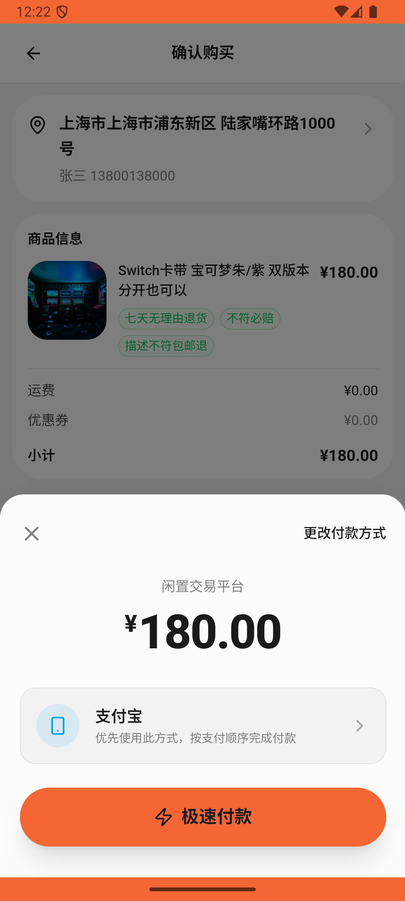

# order/v015_order_validator  ❌

- **Brand**: `xianzhiershouwang`
- **Class**: `XianzhiershouwangOrderV015OrderValidatorTask`
- **Pass@3**: **0/3**  (score = 0.00)
- **Elapsed**: 266s (~4.4 min)
- **Model**: `doubao-seed-2-0-lite-260428`
- **Raw log**: [./raw_logs/XianzhiershouwangOrderV015OrderValidatorTask.log](./raw_logs/XianzhiershouwangOrderV015OrderValidatorTask.log)
- **Generated**: 2026-05-27T00:23:50+08:00

## Task Goal

> 【当前账户档案】账号：zhangsan@example.com；昵称：张三；默认收货地址（JSON）：{"recipient": "张三", "phone": "13800138000", "address": "上海市 上海市 浦东新区 陆家嘴环路1000号"}。请基于以上档案打开 com.xianzhiershouwang 并完成以下任务：帮我搜一下Switch，找个包邮的最便宜那个支付宝买了

## Attempts

| # | Outcome | Steps | Terminated | Reason | Start → End |
|---|---------|-------|------------|--------|-------------|
| 1 | ❌ failed | 12 | answer | – | 2026-05-27 00:19:24 → 2026-05-27 00:20:51 |
| 2 | ❌ failed | 13 | answer | – | 2026-05-27 00:20:51 → 2026-05-27 00:22:28 |
| 3 | ❌ failed | 12 | answer | – | 2026-05-27 00:22:28 → 2026-05-27 00:23:50 |

## Failure Details

### Episode 1 — ❌ failed

- steps_used: `12`
- terminated_reason: `answer`
- death shot: 
  - state: [`./death_shots/XianzhiershouwangOrderV015OrderValidatorTask/episode_001/step_012.json`](./death_shots/XianzhiershouwangOrderV015OrderValidatorTask/episode_001/step_012.json)
  - digest: [`episode_digest.md`](./death_shots/XianzhiershouwangOrderV015OrderValidatorTask/episode_001/episode_digest.md)

### Episode 2 — ❌ failed

- steps_used: `13`
- terminated_reason: `answer`
- death shot: 
  - state: [`./death_shots/XianzhiershouwangOrderV015OrderValidatorTask/episode_002/step_013.json`](./death_shots/XianzhiershouwangOrderV015OrderValidatorTask/episode_002/step_013.json)
  - digest: [`episode_digest.md`](./death_shots/XianzhiershouwangOrderV015OrderValidatorTask/episode_002/episode_digest.md)

### Episode 3 — ❌ failed

- steps_used: `12`
- terminated_reason: `answer`
- death shot: 
  - state: [`./death_shots/XianzhiershouwangOrderV015OrderValidatorTask/episode_003/step_012.json`](./death_shots/XianzhiershouwangOrderV015OrderValidatorTask/episode_003/step_012.json)
  - digest: [`episode_digest.md`](./death_shots/XianzhiershouwangOrderV015OrderValidatorTask/episode_003/episode_digest.md)

---

> 本摘要由 `sengclaw/scripts/pipeline/log_summarizer.py` 自动生成。 原始完整 log 见上方 Raw log 链接（含每 step 的 messages / tool_call / screenshot 引用）。
