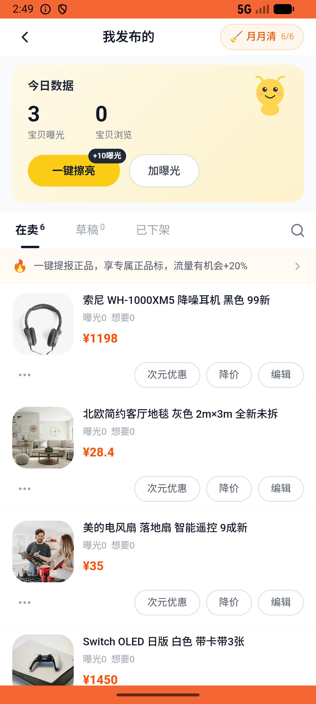

# post/v027_post_validator  ⚠️

- **Brand**: `xianzhiershouwang`
- **Class**: `XianzhiershouwangPostV027PostValidatorTask`
- **Pass@3**: **2/3**  (score = 1.00)
- **Elapsed**: 790s (~13.2 min)
- **Model**: `doubao-seed-2-0-lite-260428`
- **Raw log**: [./raw_logs/XianzhiershouwangPostV027PostValidatorTask.log](./raw_logs/XianzhiershouwangPostV027PostValidatorTask.log)
- **Generated**: 2026-05-27T03:53:30+08:00

## Task Goal

> 【当前账户档案】账号：zhangsan@example.com；昵称：张三；支付密码：无需密码，直接完成支付；默认收货地址（JSON）：{"recipient": "张三", "phone": "13800138000", "address": "上海市 上海市 浦东新区 陆家嘴环路1000号"}。请基于以上档案打开 com.xianzhiershouwang 并完成以下任务：帮我给那个索尼XM5耳机帖子搞个促销：先设成8折，然后再把价格直接降到1200

## Attempts

| # | Outcome | Steps | Terminated | Reason | Start → End |
|---|---------|-------|------------|--------|-------------|
| 1 | ❌ failed | 33 | answer | – | 2026-05-27 02:44:40 → 2026-05-27 02:49:14 |
| 2 | ✅ passed | 49 | answer | – | 2026-05-27 02:49:14 → 2026-05-27 02:55:07 |
| 3 | ✅ passed | 22 | answer | – | 2026-05-27 02:55:07 → 2026-05-27 02:57:49 |

## Failure Details

### Episode 1 — ❌ failed

- steps_used: `33`
- terminated_reason: `answer`
- death shot: 
  - state: [`./death_shots/XianzhiershouwangPostV027PostValidatorTask/episode_001/step_033.json`](./death_shots/XianzhiershouwangPostV027PostValidatorTask/episode_001/step_033.json)
  - digest: [`episode_digest.md`](./death_shots/XianzhiershouwangPostV027PostValidatorTask/episode_001/episode_digest.md)

---

> 本摘要由 `sengclaw/scripts/pipeline/log_summarizer.py` 自动生成。 原始完整 log 见上方 Raw log 链接（含每 step 的 messages / tool_call / screenshot 引用）。
