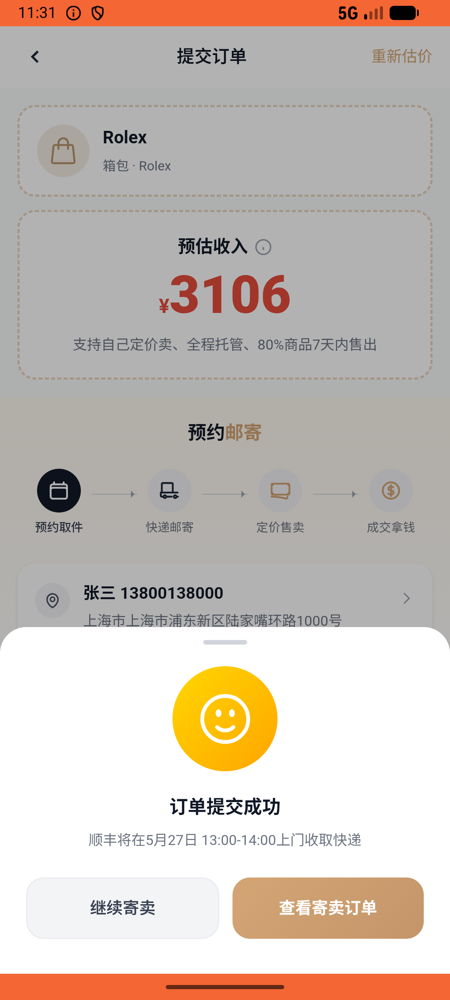
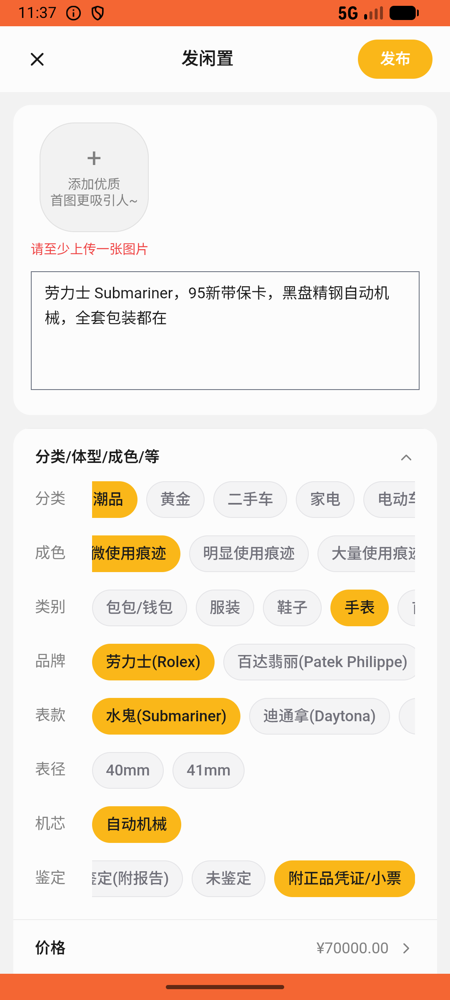
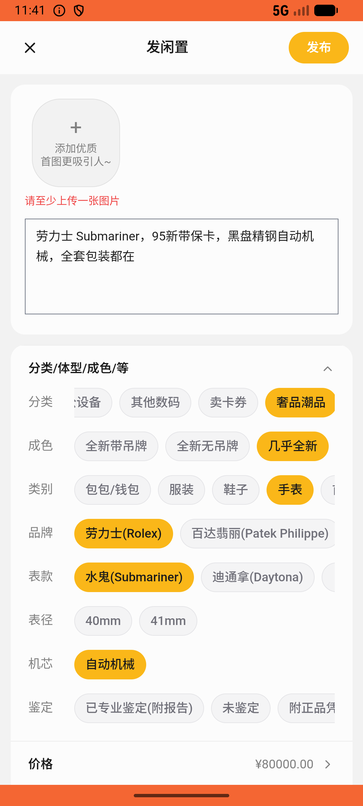

# recycle/v016_recycle_validator  ❌

- **Brand**: `xianzhiershouwang`
- **Class**: `XianzhiershouwangRecycleV016RecycleValidatorTask`
- **Pass@3**: **0/3**  (score = 0.00)
- **Elapsed**: 845s (~14.1 min)
- **Model**: `doubao-seed-2-0-lite-260428`
- **Raw log**: [./raw_logs/XianzhiershouwangRecycleV016RecycleValidatorTask.log](./raw_logs/XianzhiershouwangRecycleV016RecycleValidatorTask.log)
- **Generated**: 2026-05-27T11:41:42+08:00

## Task Goal

> 【当前账户档案】账号：zhangsan@example.com；昵称：张三；支付密码：无需密码，直接完成支付；默认收货地址（JSON）：{"recipient": "张三", "phone": "13800138000", "address": "上海市 上海市 浦东新区 陆家嘴环路1000号"}。请基于以上档案打开 com.xianzhiershouwang 并完成以下任务：我有块劳力士 Submariner 想寄卖，95新带保卡，黑盘精钢自动机械的，全套包装都在，帮我提交一下

## Attempts

| # | Outcome | Steps | Terminated | Reason | Start → End |
|---|---------|-------|------------|--------|-------------|
| 1 | ❌ failed | 30 | answer | – | 2026-05-27 11:27:37 → 2026-05-27 11:31:31 |
| 2 | ❌ failed | 46 | answer | – | 2026-05-27 11:31:31 → 2026-05-27 11:37:33 |
| 3 | ❌ failed | 28 | answer | – | 2026-05-27 11:37:33 → 2026-05-27 11:41:42 |

## Failure Details

### Episode 1 — ❌ failed

- steps_used: `30`
- terminated_reason: `answer`
- death shot: 
  - state: [`./death_shots/XianzhiershouwangRecycleV016RecycleValidatorTask/episode_001/step_030.json`](./death_shots/XianzhiershouwangRecycleV016RecycleValidatorTask/episode_001/step_030.json)
  - digest: [`episode_digest.md`](./death_shots/XianzhiershouwangRecycleV016RecycleValidatorTask/episode_001/episode_digest.md)

### Episode 2 — ❌ failed

- steps_used: `46`
- terminated_reason: `answer`
- death shot: 
  - state: [`./death_shots/XianzhiershouwangRecycleV016RecycleValidatorTask/episode_002/step_046.json`](./death_shots/XianzhiershouwangRecycleV016RecycleValidatorTask/episode_002/step_046.json)
  - digest: [`episode_digest.md`](./death_shots/XianzhiershouwangRecycleV016RecycleValidatorTask/episode_002/episode_digest.md)

### Episode 3 — ❌ failed

- steps_used: `28`
- terminated_reason: `answer`
- death shot: 
  - state: [`./death_shots/XianzhiershouwangRecycleV016RecycleValidatorTask/episode_003/step_028.json`](./death_shots/XianzhiershouwangRecycleV016RecycleValidatorTask/episode_003/step_028.json)
  - digest: [`episode_digest.md`](./death_shots/XianzhiershouwangRecycleV016RecycleValidatorTask/episode_003/episode_digest.md)

---

> 本摘要由 `sengclaw/scripts/pipeline/log_summarizer.py` 自动生成。 原始完整 log 见上方 Raw log 链接（含每 step 的 messages / tool_call / screenshot 引用）。
