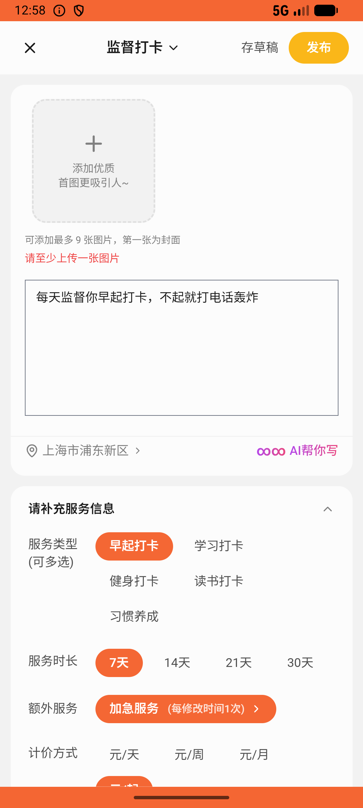
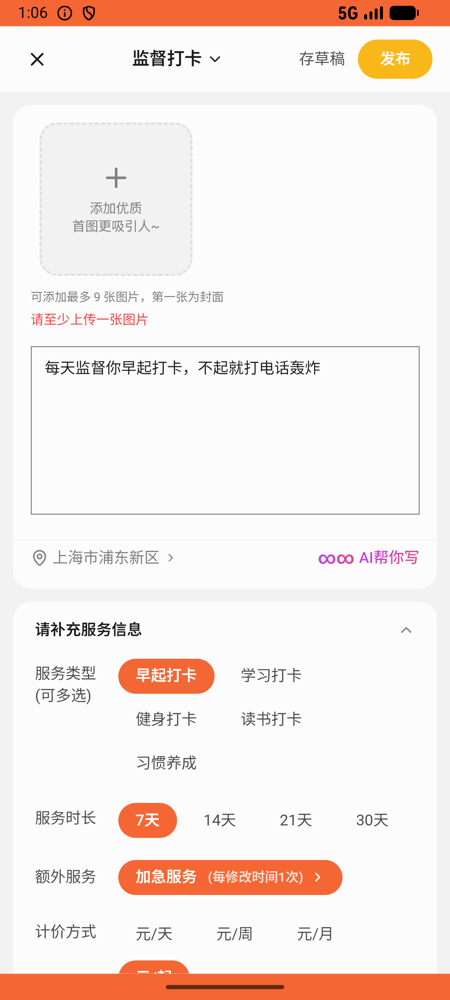

# side_job_resume/v001_side_job_resume_validator  ❌

- **Brand**: `xianzhiershouwang`
- **Class**: `XianzhiershouwangSideJobResumeV001SideJobResumeValidatorTask`
- **Pass@3**: **0/3**  (score = 0.00)
- **Elapsed**: 670s (~11.2 min)
- **Model**: `doubao-seed-2-0-lite-260428`
- **Raw log**: [./raw_logs/XianzhiershouwangSideJobResumeV001SideJobResumeValidatorTask.log](./raw_logs/XianzhiershouwangSideJobResumeV001SideJobResumeValidatorTask.log)
- **Generated**: 2026-05-27T13:06:08+08:00

## Task Goal

> 【当前账户档案】账号：zhangsan@example.com；昵称：张三；支付密码：无需密码，直接完成支付；默认收货地址（JSON）：{"recipient": "张三", "phone": "13800138000", "address": "上海市 上海市 浦东新区 陆家嘴环路1000号"}。请基于以上档案打开 com.xianzhiershouwang 并完成以下任务：去神奇副业发个服务，类目选「监督打卡」，描述写「每天监督你早起打卡，不起就打电话轰炸」，定价29块

## Attempts

| # | Outcome | Steps | Terminated | Reason | Start → End |
|---|---------|-------|------------|--------|-------------|
| 1 | ❌ failed | 31 | answer | – | 2026-05-27 12:54:58 → 2026-05-27 12:58:36 |
| 2 | ❌ failed | 32 | answer | – | 2026-05-27 12:58:36 → 2026-05-27 13:02:37 |
| 3 | ❌ failed | 30 | answer | – | 2026-05-27 13:02:37 → 2026-05-27 13:06:08 |

## Failure Details

### Episode 1 — ❌ failed

- steps_used: `31`
- terminated_reason: `answer`
- death shot: 
  - state: [`./death_shots/XianzhiershouwangSideJobResumeV001SideJobResumeValidatorTask/episode_001/step_031.json`](./death_shots/XianzhiershouwangSideJobResumeV001SideJobResumeValidatorTask/episode_001/step_031.json)
  - digest: [`episode_digest.md`](./death_shots/XianzhiershouwangSideJobResumeV001SideJobResumeValidatorTask/episode_001/episode_digest.md)

### Episode 2 — ❌ failed

- steps_used: `32`
- terminated_reason: `answer`
- death shot: 
  - state: [`./death_shots/XianzhiershouwangSideJobResumeV001SideJobResumeValidatorTask/episode_002/step_032.json`](./death_shots/XianzhiershouwangSideJobResumeV001SideJobResumeValidatorTask/episode_002/step_032.json)
  - digest: [`episode_digest.md`](./death_shots/XianzhiershouwangSideJobResumeV001SideJobResumeValidatorTask/episode_002/episode_digest.md)

### Episode 3 — ❌ failed

- steps_used: `30`
- terminated_reason: `answer`
- death shot: 
  - state: [`./death_shots/XianzhiershouwangSideJobResumeV001SideJobResumeValidatorTask/episode_003/step_030.json`](./death_shots/XianzhiershouwangSideJobResumeV001SideJobResumeValidatorTask/episode_003/step_030.json)
  - digest: [`episode_digest.md`](./death_shots/XianzhiershouwangSideJobResumeV001SideJobResumeValidatorTask/episode_003/episode_digest.md)

---

> 本摘要由 `sengclaw/scripts/pipeline/log_summarizer.py` 自动生成。 原始完整 log 见上方 Raw log 链接（含每 step 的 messages / tool_call / screenshot 引用）。
