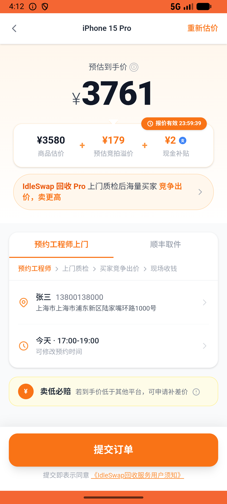

# recycle/v001_recycle_validator  ⚠️

- **Brand**: `xianzhiershouwang`
- **Class**: `XianzhiershouwangRecycleV001RecycleValidatorTask`
- **Pass@3**: **2/3**  (score = 1.00)
- **Elapsed**: 545s (~9.1 min)
- **Model**: `doubao-seed-2-0-lite-260428`
- **Raw log**: [./raw_logs/XianzhiershouwangRecycleV001RecycleValidatorTask.log](./raw_logs/XianzhiershouwangRecycleV001RecycleValidatorTask.log)
- **Generated**: 2026-05-27T16:12:24+08:00

## Task Goal

> 【当前账户档案】账号：zhangsan@example.com；昵称：张三；支付密码：无需密码，直接完成支付；默认收货地址（JSON）：{"recipient": "张三", "phone": "13800138000", "address": "上海市 上海市 浦东新区 陆家嘴环路1000号"}。请基于以上档案打开 com.xianzhiershouwang 并完成以下任务：我有台iPhone 15 Pro想回收，国行256G，没有划痕成色很好，配件全齐，看看能卖多少钱，选上门回收，联系人张三 13800138000

## Attempts

| # | Outcome | Steps | Terminated | Reason | Start → End |
|---|---------|-------|------------|--------|-------------|
| 1 | ✅ passed | 22 | answer | – | 2026-05-27 16:03:19 → 2026-05-27 16:06:39 |
| 2 | ✅ passed | 21 | answer | – | 2026-05-27 16:06:39 → 2026-05-27 16:09:39 |
| 3 | ❌ failed | 20 | answer | – | 2026-05-27 16:09:39 → 2026-05-27 16:12:24 |

## Failure Details

### Episode 3 — ❌ failed

- steps_used: `20`
- terminated_reason: `answer`
- death shot: 
  - state: [`./death_shots/XianzhiershouwangRecycleV001RecycleValidatorTask/episode_003/step_020.json`](./death_shots/XianzhiershouwangRecycleV001RecycleValidatorTask/episode_003/step_020.json)
  - digest: [`episode_digest.md`](./death_shots/XianzhiershouwangRecycleV001RecycleValidatorTask/episode_003/episode_digest.md)

---

> 本摘要由 `sengclaw/scripts/pipeline/log_summarizer.py` 自动生成。 原始完整 log 见上方 Raw log 链接（含每 step 的 messages / tool_call / screenshot 引用）。
