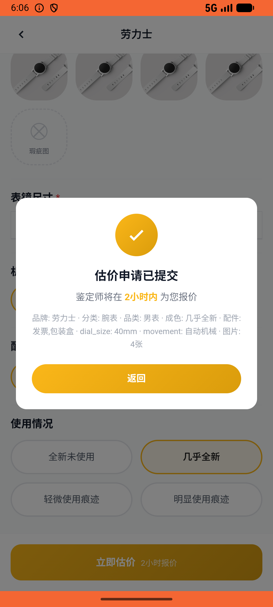

# recycle/v019_recycle_validator  ⚠️

- **Brand**: `xianzhiershouwang`
- **Class**: `XianzhiershouwangRecycleV019RecycleValidatorTask`
- **Pass@3**: **2/3**  (score = 1.00)
- **Elapsed**: 638s (~10.6 min)
- **Model**: `doubao-seed-2-0-lite-260428`
- **Raw log**: [./raw_logs/XianzhiershouwangRecycleV019RecycleValidatorTask.log](./raw_logs/XianzhiershouwangRecycleV019RecycleValidatorTask.log)
- **Generated**: 2026-05-27T18:09:30+08:00

## Task Goal

> 【当前账户档案】账号：zhangsan@example.com；昵称：张三；支付密码：无需密码，直接完成支付；默认收货地址（JSON）：{"recipient": "张三", "phone": "13800138000", "address": "上海市 上海市 浦东新区 陆家嘴环路1000号"}。请基于以上档案打开 com.xianzhiershouwang 并完成以下任务：我有块劳力士男表想估个价，40mm自动机械，几乎全新，有发票和包装盒，上传照片帮我提交看看

## Attempts

| # | Outcome | Steps | Terminated | Reason | Start → End |
|---|---------|-------|------------|--------|-------------|
| 1 | ✅ passed | 26 | answer | – | 2026-05-27 17:58:52 → 2026-05-27 18:02:59 |
| 2 | ❌ failed | 30 | answer | – | 2026-05-27 18:02:59 → 2026-05-27 18:06:58 |
| 3 | ✅ passed | 19 | answer | – | 2026-05-27 18:06:58 → 2026-05-27 18:09:30 |

## Failure Details

### Episode 2 — ❌ failed

- steps_used: `30`
- terminated_reason: `answer`
- death shot: 
  - state: [`./death_shots/XianzhiershouwangRecycleV019RecycleValidatorTask/episode_002/step_030.json`](./death_shots/XianzhiershouwangRecycleV019RecycleValidatorTask/episode_002/step_030.json)
  - digest: [`episode_digest.md`](./death_shots/XianzhiershouwangRecycleV019RecycleValidatorTask/episode_002/episode_digest.md)

---

> 本摘要由 `sengclaw/scripts/pipeline/log_summarizer.py` 自动生成。 原始完整 log 见上方 Raw log 链接（含每 step 的 messages / tool_call / screenshot 引用）。
