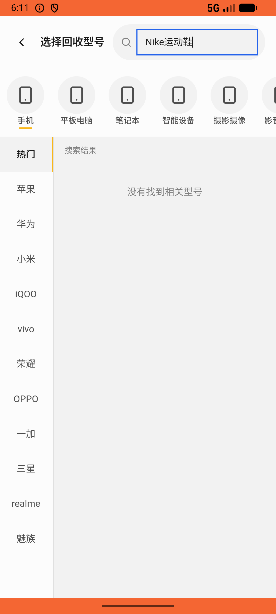
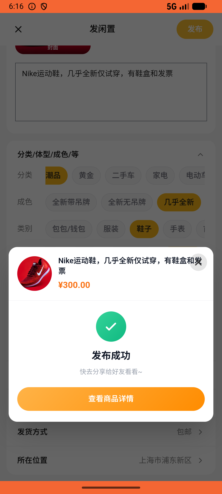
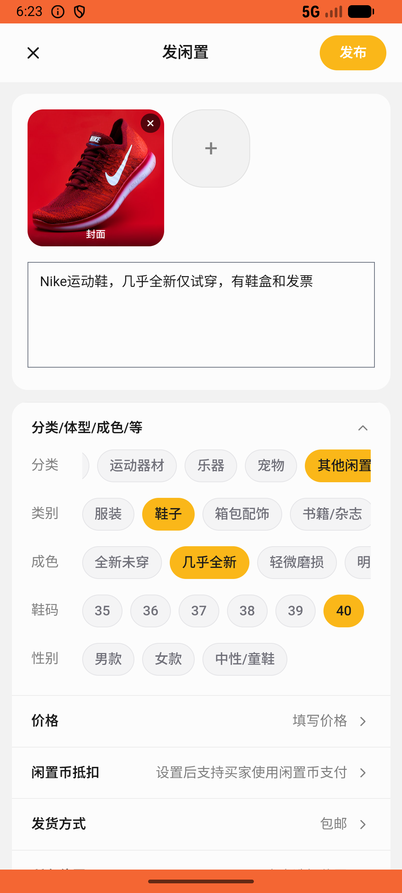

# recycle/v020_recycle_validator  ❌

- **Brand**: `xianzhiershouwang`
- **Class**: `XianzhiershouwangRecycleV020RecycleValidatorTask`
- **Pass@3**: **0/3**  (score = 0.00)
- **Elapsed**: 808s (~13.5 min)
- **Model**: `doubao-seed-2-0-lite-260428`
- **Raw log**: [./raw_logs/XianzhiershouwangRecycleV020RecycleValidatorTask.log](./raw_logs/XianzhiershouwangRecycleV020RecycleValidatorTask.log)
- **Generated**: 2026-05-27T18:24:02+08:00

## Task Goal

> 【当前账户档案】账号：zhangsan@example.com；昵称：张三；支付密码：无需密码，直接完成支付；默认收货地址（JSON）：{"recipient": "张三", "phone": "13800138000", "address": "上海市 上海市 浦东新区 陆家嘴环路1000号"}。请基于以上档案打开 com.xianzhiershouwang 并完成以下任务：我有双Nike运动鞋想估个价，几乎全新仅试穿，有鞋盒和发票，上传照片帮我提交看看能卖多少

## Attempts

| # | Outcome | Steps | Terminated | Reason | Start → End |
|---|---------|-------|------------|--------|-------------|
| 1 | ❌ failed | 6 | answer | – | 2026-05-27 18:10:35 → 2026-05-27 18:11:20 |
| 2 | ❌ failed | 37 | answer | – | 2026-05-27 18:11:20 → 2026-05-27 18:16:40 |
| 3 | ⏰ timeout | 50 | max_steps | – | 2026-05-27 18:16:40 → 2026-05-27 18:24:02 |

## Failure Details

### Episode 1 — ❌ failed

- steps_used: `6`
- terminated_reason: `answer`
- death shot: 
  - state: [`./death_shots/XianzhiershouwangRecycleV020RecycleValidatorTask/episode_001/step_006.json`](./death_shots/XianzhiershouwangRecycleV020RecycleValidatorTask/episode_001/step_006.json)
  - digest: [`episode_digest.md`](./death_shots/XianzhiershouwangRecycleV020RecycleValidatorTask/episode_001/episode_digest.md)

### Episode 2 — ❌ failed

- steps_used: `37`
- terminated_reason: `answer`
- death shot: 
  - state: [`./death_shots/XianzhiershouwangRecycleV020RecycleValidatorTask/episode_002/step_037.json`](./death_shots/XianzhiershouwangRecycleV020RecycleValidatorTask/episode_002/step_037.json)
  - digest: [`episode_digest.md`](./death_shots/XianzhiershouwangRecycleV020RecycleValidatorTask/episode_002/episode_digest.md)

### Episode 3 — ⏰ timeout

- steps_used: `50`
- terminated_reason: `max_steps`
- death shot: 
  - state: [`./death_shots/XianzhiershouwangRecycleV020RecycleValidatorTask/episode_003/step_050.json`](./death_shots/XianzhiershouwangRecycleV020RecycleValidatorTask/episode_003/step_050.json)
  - digest: [`episode_digest.md`](./death_shots/XianzhiershouwangRecycleV020RecycleValidatorTask/episode_003/episode_digest.md)

---

> 本摘要由 `sengclaw/scripts/pipeline/log_summarizer.py` 自动生成。 原始完整 log 见上方 Raw log 链接（含每 step 的 messages / tool_call / screenshot 引用）。
