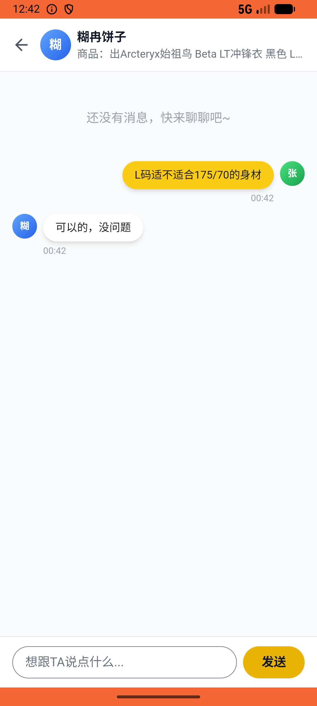

# like/v005_like_validator  ⚠️

- **Brand**: `xianzhiershouwang`
- **Class**: `XianzhiershouwangLikeV005LikeValidatorTask`
- **Pass@3**: **2/3**  (score = 1.00)
- **Elapsed**: 615s (~10.2 min)
- **Model**: `doubao-seed-2-0-lite-260428`
- **Raw log**: [./raw_logs/XianzhiershouwangLikeV005LikeValidatorTask.log](./raw_logs/XianzhiershouwangLikeV005LikeValidatorTask.log)
- **Generated**: 2026-05-28T00:46:01+08:00

## Task Goal

> 【当前账户档案】账号：zhangsan@example.com；昵称：张三；支付密码：无需密码，直接完成支付；默认收货地址（JSON）：{"recipient": "张三", "phone": "13800138000", "address": "上海市 上海市 浦东新区 陆家嘴环路1000号"}。请基于以上档案打开 com.xianzhiershouwang 并完成以下任务：搜一下始祖鸟冲锋衣，找到那个Beta LT黑色L码的，蹲蹲设1800，顺便私信问一下L码适不适合175/70的身材

## Attempts

| # | Outcome | Steps | Terminated | Reason | Start → End |
|---|---------|-------|------------|--------|-------------|
| 1 | ✅ passed | 24 | answer | – | 2026-05-28 00:35:46 → 2026-05-28 00:38:41 |
| 2 | ❌ failed | 38 | answer | – | 2026-05-28 00:38:41 → 2026-05-28 00:43:03 |
| 3 | ✅ passed | 23 | answer | – | 2026-05-28 00:43:03 → 2026-05-28 00:46:01 |

## Failure Details

### Episode 2 — ❌ failed

- steps_used: `38`
- terminated_reason: `answer`
- death shot: 
  - state: [`./death_shots/XianzhiershouwangLikeV005LikeValidatorTask/episode_002/step_038.json`](./death_shots/XianzhiershouwangLikeV005LikeValidatorTask/episode_002/step_038.json)
  - digest: [`episode_digest.md`](./death_shots/XianzhiershouwangLikeV005LikeValidatorTask/episode_002/episode_digest.md)

---

> 本摘要由 `sengclaw/scripts/pipeline/log_summarizer.py` 自动生成。 原始完整 log 见上方 Raw log 链接（含每 step 的 messages / tool_call / screenshot 引用）。
