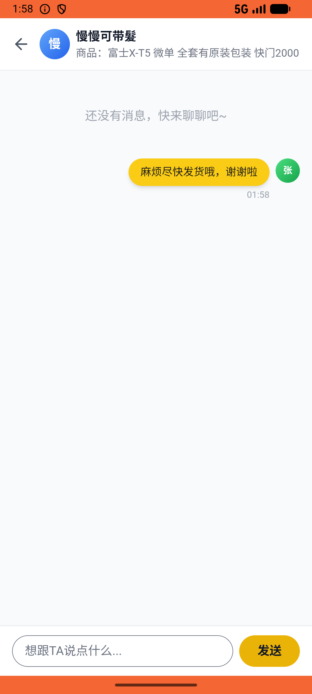

# message/v010_message_validator  ⚠️

- **Brand**: `xianzhiershouwang`
- **Class**: `XianzhiershouwangMessageV010MessageValidatorTask`
- **Pass@3**: **2/3**  (score = 1.00)
- **Elapsed**: 437s (~7.3 min)
- **Model**: `doubao-seed-2-0-lite-260428`
- **Raw log**: [./raw_logs/XianzhiershouwangMessageV010MessageValidatorTask.log](./raw_logs/XianzhiershouwangMessageV010MessageValidatorTask.log)
- **Generated**: 2026-05-28T02:00:07+08:00

## Task Goal

> 【当前账户档案】账号：zhangsan@example.com；昵称：张三；支付密码：无需密码，直接完成支付；默认收货地址（JSON）：{"recipient": "张三", "phone": "13800138000", "address": "上海市 上海市 浦东新区 陆家嘴环路1000号"}。请基于以上档案打开 com.xianzhiershouwang 并完成以下任务：那个富士X-T5全套有原装包装快门2000的帮我支付宝买了，买完私信卖家催一下尽快发货

## Attempts

| # | Outcome | Steps | Terminated | Reason | Start → End |
|---|---------|-------|------------|--------|-------------|
| 1 | ✅ passed | 32 | answer | – | 2026-05-28 01:52:49 → 2026-05-28 01:56:39 |
| 2 | ❌ failed | 14 | answer | – | 2026-05-28 01:56:39 → 2026-05-28 01:58:20 |
| 3 | ✅ passed | 15 | answer | – | 2026-05-28 01:58:20 → 2026-05-28 02:00:07 |

## Failure Details

### Episode 2 — ❌ failed

- steps_used: `14`
- terminated_reason: `answer`
- death shot: 
  - state: [`./death_shots/XianzhiershouwangMessageV010MessageValidatorTask/episode_002/step_014.json`](./death_shots/XianzhiershouwangMessageV010MessageValidatorTask/episode_002/step_014.json)
  - digest: [`episode_digest.md`](./death_shots/XianzhiershouwangMessageV010MessageValidatorTask/episode_002/episode_digest.md)

---

> 本摘要由 `sengclaw/scripts/pipeline/log_summarizer.py` 自动生成。 原始完整 log 见上方 Raw log 链接（含每 step 的 messages / tool_call / screenshot 引用）。
