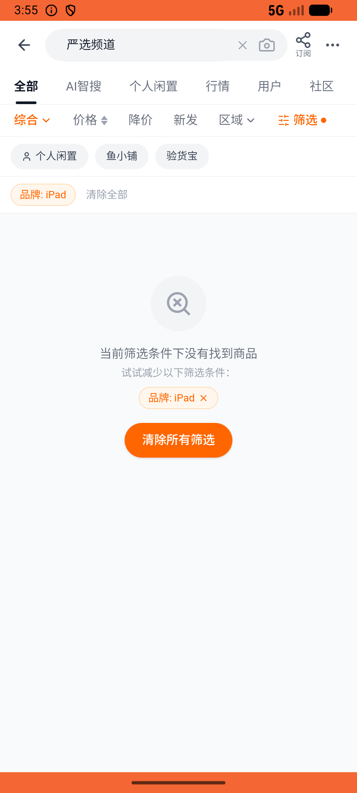
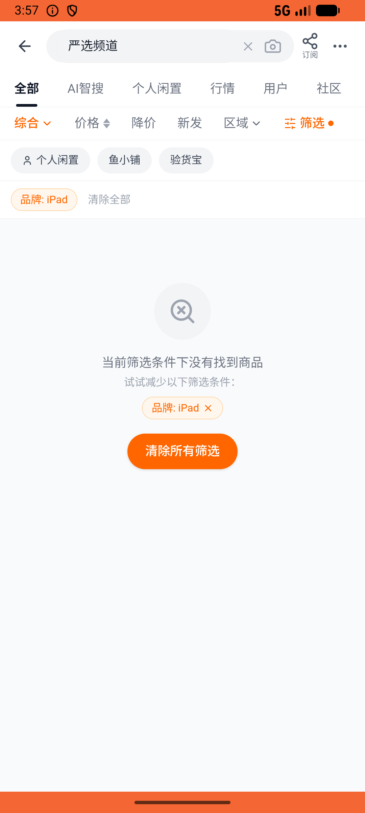

# recycle/v010_recycle_validator  ❌

- **Brand**: `xianzhiershouwang`
- **Class**: `XianzhiershouwangRecycleV010RecycleValidatorTask`
- **Pass@3**: **0/3**  (score = 0.00)
- **Elapsed**: 357s (~6.0 min)
- **Model**: `doubao-seed-2-0-lite-260428`
- **Raw log**: [./raw_logs/XianzhiershouwangRecycleV010RecycleValidatorTask.log](./raw_logs/XianzhiershouwangRecycleV010RecycleValidatorTask.log)
- **Generated**: 2026-05-28T03:57:07+08:00

## Task Goal

> 【当前账户档案】账号：zhangsan@example.com；昵称：张三；支付密码：无需密码，直接完成支付；默认收货地址（JSON）：{"recipient": "张三", "phone": "13800138000", "address": "上海市 上海市 浦东新区 陆家嘴环路1000号"}。请基于以上档案打开 com.xianzhiershouwang 并完成以下任务：去严选频道平板电脑分类找个苹果品牌最便宜的iPad，帮我微信买了

## Attempts

| # | Outcome | Steps | Terminated | Reason | Start → End |
|---|---------|-------|------------|--------|-------------|
| 1 | ❌ failed | 24 | answer | – | 2026-05-28 03:51:10 → 2026-05-28 03:54:07 |
| 2 | ❌ failed | 14 | answer | – | 2026-05-28 03:54:07 → 2026-05-28 03:55:52 |
| 3 | ❌ failed | 11 | answer | – | 2026-05-28 03:55:52 → 2026-05-28 03:57:07 |

## Failure Details

### Episode 1 — ❌ failed

- steps_used: `24`
- terminated_reason: `answer`
- death shot: 
  - state: [`./death_shots/XianzhiershouwangRecycleV010RecycleValidatorTask/episode_001/step_024.json`](./death_shots/XianzhiershouwangRecycleV010RecycleValidatorTask/episode_001/step_024.json)
  - digest: [`episode_digest.md`](./death_shots/XianzhiershouwangRecycleV010RecycleValidatorTask/episode_001/episode_digest.md)

### Episode 2 — ❌ failed

- steps_used: `14`
- terminated_reason: `answer`
- death shot: 
  - state: [`./death_shots/XianzhiershouwangRecycleV010RecycleValidatorTask/episode_002/step_014.json`](./death_shots/XianzhiershouwangRecycleV010RecycleValidatorTask/episode_002/step_014.json)
  - digest: [`episode_digest.md`](./death_shots/XianzhiershouwangRecycleV010RecycleValidatorTask/episode_002/episode_digest.md)

### Episode 3 — ❌ failed

- steps_used: `11`
- terminated_reason: `answer`
- death shot: 
  - state: [`./death_shots/XianzhiershouwangRecycleV010RecycleValidatorTask/episode_003/step_011.json`](./death_shots/XianzhiershouwangRecycleV010RecycleValidatorTask/episode_003/step_011.json)
  - digest: [`episode_digest.md`](./death_shots/XianzhiershouwangRecycleV010RecycleValidatorTask/episode_003/episode_digest.md)

---

> 本摘要由 `sengclaw/scripts/pipeline/log_summarizer.py` 自动生成。 原始完整 log 见上方 Raw log 链接（含每 step 的 messages / tool_call / screenshot 引用）。
