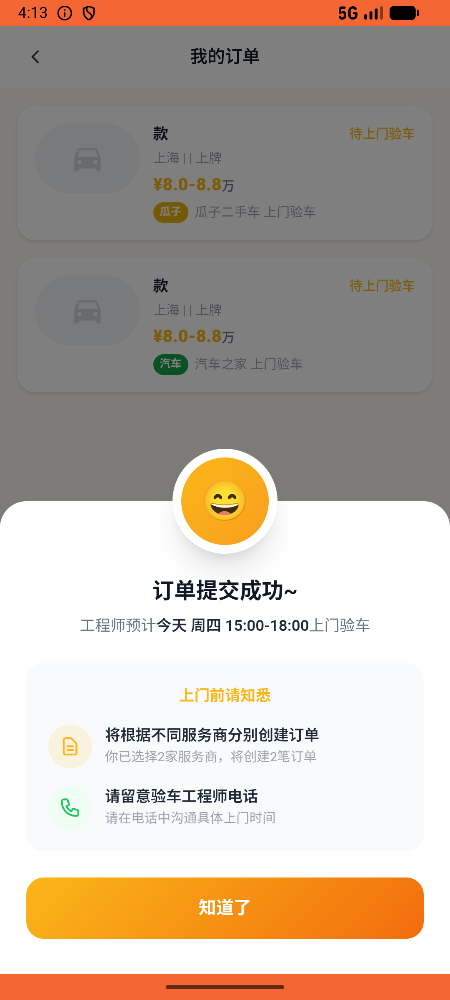

# recycle/v012_recycle_validator  ❌

- **Brand**: `xianzhiershouwang`
- **Class**: `XianzhiershouwangRecycleV012RecycleValidatorTask`
- **Pass@3**: **0/3**  (score = 0.00)
- **Elapsed**: 600s (~10.0 min)
- **Model**: `doubao-seed-2-0-lite-260428`
- **Raw log**: [./raw_logs/XianzhiershouwangRecycleV012RecycleValidatorTask.log](./raw_logs/XianzhiershouwangRecycleV012RecycleValidatorTask.log)
- **Generated**: 2026-05-28T04:16:53+08:00

## Task Goal

> 【当前账户档案】账号：zhangsan@example.com；昵称：张三；支付密码：无需密码，直接完成支付；默认收货地址（JSON）：{"recipient": "张三", "phone": "13800138000", "address": "上海市 上海市 浦东新区 陆家嘴环路1000号"}。请基于以上档案打开 com.xianzhiershouwang 并完成以下任务：我那台丰田凯美瑞2020年的想估个价，跑了5万公里，2020年3月上的牌，帮我预约一下看看值多少

## Attempts

| # | Outcome | Steps | Terminated | Reason | Start → End |
|---|---------|-------|------------|--------|-------------|
| 1 | ❌ failed | 47 | answer | – | 2026-05-28 04:06:53 → 2026-05-28 04:13:07 |
| 2 | ❌ failed | 16 | answer | – | 2026-05-28 04:13:07 → 2026-05-28 04:15:12 |
| 3 | ❌ failed | 14 | answer | – | 2026-05-28 04:15:12 → 2026-05-28 04:16:53 |

## Failure Details

### Episode 1 — ❌ failed

- steps_used: `47`
- terminated_reason: `answer`
- death shot: 
  - state: [`./death_shots/XianzhiershouwangRecycleV012RecycleValidatorTask/episode_001/step_047.json`](./death_shots/XianzhiershouwangRecycleV012RecycleValidatorTask/episode_001/step_047.json)
  - digest: [`episode_digest.md`](./death_shots/XianzhiershouwangRecycleV012RecycleValidatorTask/episode_001/episode_digest.md)

### Episode 2 — ❌ failed

- steps_used: `16`
- terminated_reason: `answer`
- death shot: 
  - state: [`./death_shots/XianzhiershouwangRecycleV012RecycleValidatorTask/episode_002/step_016.json`](./death_shots/XianzhiershouwangRecycleV012RecycleValidatorTask/episode_002/step_016.json)
  - digest: [`episode_digest.md`](./death_shots/XianzhiershouwangRecycleV012RecycleValidatorTask/episode_002/episode_digest.md)

### Episode 3 — ❌ failed

- steps_used: `14`
- terminated_reason: `answer`
- death shot: 
  - state: [`./death_shots/XianzhiershouwangRecycleV012RecycleValidatorTask/episode_003/step_014.json`](./death_shots/XianzhiershouwangRecycleV012RecycleValidatorTask/episode_003/step_014.json)
  - digest: [`episode_digest.md`](./death_shots/XianzhiershouwangRecycleV012RecycleValidatorTask/episode_003/episode_digest.md)

---

> 本摘要由 `sengclaw/scripts/pipeline/log_summarizer.py` 自动生成。 原始完整 log 见上方 Raw log 链接（含每 step 的 messages / tool_call / screenshot 引用）。
