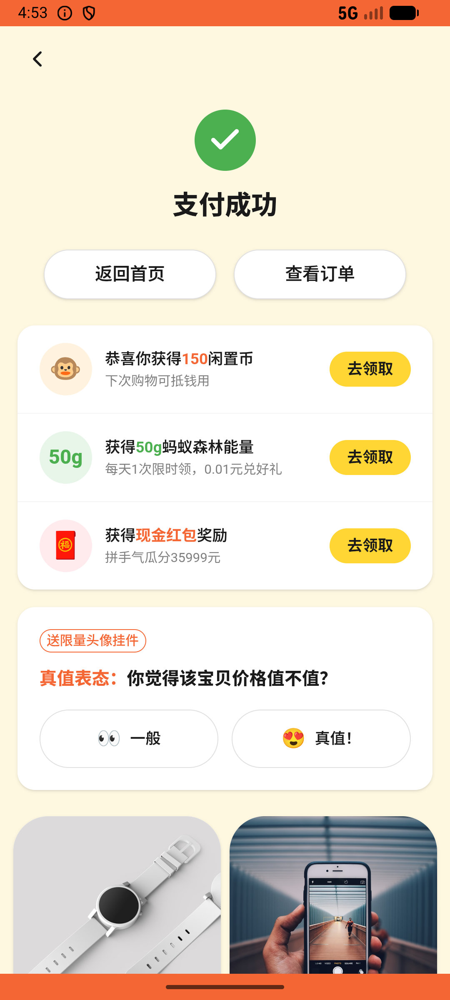

# order/v018_order_validator  ⚠️

- **Brand**: `xianzhiershouwang`
- **Class**: `XianzhiershouwangOrderV018OrderValidatorTask`
- **Pass@3**: **2/3**  (score = 1.00)
- **Elapsed**: 173s (~2.9 min)
- **Model**: `doubao-seed-2-0-lite-260428`
- **Raw log**: [./raw_logs/XianzhiershouwangOrderV018OrderValidatorTask.log](./raw_logs/XianzhiershouwangOrderV018OrderValidatorTask.log)
- **Generated**: 2026-05-28T04:54:22+08:00

## Task Goal

> 【当前账户档案】账号：zhangsan@example.com；昵称：张三；支付密码：无需密码，直接完成支付；默认收货地址（JSON）：{"recipient": "张三", "phone": "13800138000", "address": "上海市 上海市 浦东新区 陆家嘴环路1000号"}。请基于以上档案打开 com.xianzhiershouwang 并完成以下任务：我有笔订单还没付款，帮我微信付掉

## Attempts

| # | Outcome | Steps | Terminated | Reason | Start → End |
|---|---------|-------|------------|--------|-------------|
| 1 | ✅ passed | 9 | answer | – | 2026-05-28 04:51:29 → 2026-05-28 04:52:24 |
| 2 | ❌ failed | 9 | answer | – | 2026-05-28 04:52:24 → 2026-05-28 04:53:28 |
| 3 | ✅ passed | 9 | answer | – | 2026-05-28 04:53:28 → 2026-05-28 04:54:21 |

## Failure Details

### Episode 2 — ❌ failed

- steps_used: `9`
- terminated_reason: `answer`
- death shot: 
  - state: [`./death_shots/XianzhiershouwangOrderV018OrderValidatorTask/episode_002/step_009.json`](./death_shots/XianzhiershouwangOrderV018OrderValidatorTask/episode_002/step_009.json)
  - digest: [`episode_digest.md`](./death_shots/XianzhiershouwangOrderV018OrderValidatorTask/episode_002/episode_digest.md)

---

> 本摘要由 `sengclaw/scripts/pipeline/log_summarizer.py` 自动生成。 原始完整 log 见上方 Raw log 链接（含每 step 的 messages / tool_call / screenshot 引用）。
