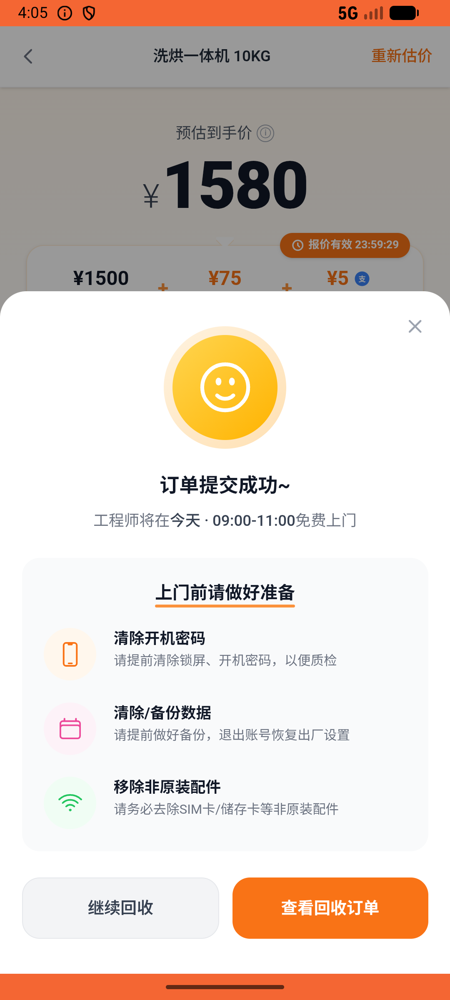

# recycle/v011_recycle_validator  ⚠️

- **Brand**: `xianzhiershouwang`
- **Class**: `XianzhiershouwangRecycleV011RecycleValidatorTask`
- **Pass@3**: **2/3**  (score = 1.00)
- **Elapsed**: 468s (~7.8 min)
- **Model**: `doubao-seed-2-0-lite-260428`
- **Raw log**: [./raw_logs/XianzhiershouwangRecycleV011RecycleValidatorTask.log](./raw_logs/XianzhiershouwangRecycleV011RecycleValidatorTask.log)
- **Generated**: 2026-05-28T10:39:30+08:00

## Task Goal

> 【当前账户档案】账号：zhangsan@example.com；昵称：张三；支付密码：无需密码，直接完成支付；默认收货地址（JSON）：{"recipient": "张三", "phone": "13800138000", "address": "上海市 上海市 浦东新区 陆家嘴环路1000号"}。请基于以上档案打开 com.xianzhiershouwang 并完成以下任务：家里那台洗烘一体机想回收，买了不到三年基本全新，功能正常就外壳有点痕迹，帮我提交一下，联系人张三 13800138000

## Attempts

| # | Outcome | Steps | Terminated | Reason | Start → End |
|---|---------|-------|------------|--------|-------------|
| 1 | ✅ passed | 17 | answer | – | 2026-05-28 03:58:06 → 2026-05-28 04:00:01 |
| 2 | ✅ passed | 17 | answer | – | 2026-05-28 04:00:01 → 2026-05-28 04:04:03 |
| 3 | ❌ failed | 17 | answer | – | 2026-05-28 04:04:03 → 2026-05-28 04:05:54 |

## Failure Details

### Episode 3 — ❌ failed

- steps_used: `17`
- terminated_reason: `answer`
- death shot: 
  - state: [`./death_shots/XianzhiershouwangRecycleV011RecycleValidatorTask/episode_003/step_017.json`](./death_shots/XianzhiershouwangRecycleV011RecycleValidatorTask/episode_003/step_017.json)
  - digest: [`episode_digest.md`](./death_shots/XianzhiershouwangRecycleV011RecycleValidatorTask/episode_003/episode_digest.md)

---

> 本摘要由 `sengclaw/scripts/pipeline/log_summarizer.py` 自动生成。 原始完整 log 见上方 Raw log 链接（含每 step 的 messages / tool_call / screenshot 引用）。
