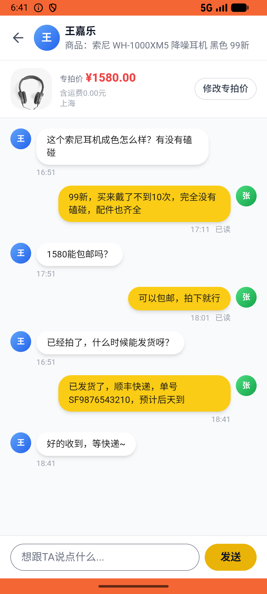

# message/v012_message_validator  ⚠️

- **Brand**: `xianzhiershouwang`
- **Class**: `XianzhiershouwangMessageV012MessageValidatorTask`
- **Pass@3**: **1/3**  (score = 1.00)
- **Elapsed**: 239s (~4.0 min)
- **Model**: `doubao-seed-2-0-lite-260428`
- **Raw log**: [./raw_logs/XianzhiershouwangMessageV012MessageValidatorTask.log](./raw_logs/XianzhiershouwangMessageV012MessageValidatorTask.log)
- **Generated**: 2026-05-29T18:43:14+08:00

## Task Goal

> 【当前账户档案】账号：zhangsan@example.com；昵称：张三；支付密码：无需密码，如需支付直接确认即可；默认收货地址（JSON）：{"recipient": "张三", "phone": "13800138000", "address": "上海市 上海市 浦东新区 陆家嘴环路1000号"}。请基于以上档案打开 com.xianzhiershouwang 并完成以下任务：我卖出的那个索尼XM5耳机待发货了，帮我联系买家说已发货了，顺丰快递，单号SF9876543210，预计后天到

## Attempts

| # | Outcome | Steps | Terminated | Reason | Start → End |
|---|---------|-------|------------|--------|-------------|
| 1 | ✅ passed | 8 | answer | – | 2026-05-29 18:39:15 → 2026-05-29 18:40:19 |
| 2 | ❌ failed | 8 | answer | 张三给「索尼XM5」的买家发了消息: 未找到张三发送的消息 | 2026-05-29 18:40:19 → 2026-05-29 18:41:22 |
| 3 | ❌ failed | 7 | answer | 消息发送给了正确的买家（王嘉乐）: 预期对话双方为张三和王嘉乐，实际 buyer=18 seller=1 | 2026-05-29 18:41:22 → 2026-05-29 18:43:14 |

## Failure Details

### Episode 2 — ❌ failed

- steps_used: `8`
- terminated_reason: `answer`
- reason:

  ```
  张三给「索尼XM5」的买家发了消息: 未找到张三发送的消息
  ```
- death shot: 
  - state: [`./death_shots/XianzhiershouwangMessageV012MessageValidatorTask/episode_002/step_008.json`](./death_shots/XianzhiershouwangMessageV012MessageValidatorTask/episode_002/step_008.json)
  - digest: [`episode_digest.md`](./death_shots/XianzhiershouwangMessageV012MessageValidatorTask/episode_002/episode_digest.md)

### Episode 3 — ❌ failed

- steps_used: `7`
- terminated_reason: `answer`
- reason:

  ```
  消息发送给了正确的买家（王嘉乐）: 预期对话双方为张三和王嘉乐，实际 buyer=18 seller=1
  ```
- death shot: 
  - state: [`./death_shots/XianzhiershouwangMessageV012MessageValidatorTask/episode_003/step_007.json`](./death_shots/XianzhiershouwangMessageV012MessageValidatorTask/episode_003/step_007.json)
  - digest: [`episode_digest.md`](./death_shots/XianzhiershouwangMessageV012MessageValidatorTask/episode_003/episode_digest.md)

---

> 本摘要由 `sengclaw/scripts/pipeline/log_summarizer.py` 自动生成。 原始完整 log 见上方 Raw log 链接（含每 step 的 messages / tool_call / screenshot 引用）。
