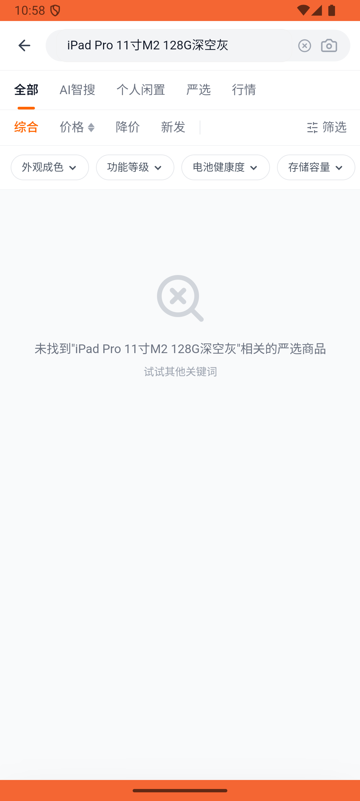
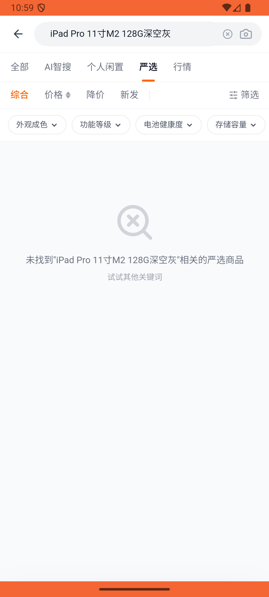

# digital_market/v004_digital_market_validator  ⚠️

- **Brand**: `xianzhiershouwang`
- **Class**: `XianzhiershouwangDigitalMarketV004DigitalMarketValidatorTask`
- **Pass@3**: **1/3**  (score = 1.00)
- **Elapsed**: 421s (~7.0 min)
- **Model**: `doubao-seed-2-0-lite-260428`
- **Raw log**: [./raw_logs/XianzhiershouwangDigitalMarketV004DigitalMarketValidatorTask.log](./raw_logs/XianzhiershouwangDigitalMarketV004DigitalMarketValidatorTask.log)
- **Generated**: 2026-05-30T15:08:18+08:00

## Task Goal

> 【当前账户档案】账号：zhangsan@example.com；昵称：张三；支付密码：无需密码，如需支付直接确认即可；默认收货地址（JSON）：{"recipient": "张三", "phone": "13800138000", "address": "上海市 上海市 浦东新区 陆家嘴环路1000号"}。请基于以上档案打开 com.xianzhiershouwang 并完成以下任务：严选频道平板电脑里那个iPad Pro 11寸M2 128G深空灰的不错，帮我微信买了

## Attempts

| # | Outcome | Steps | Terminated | Reason | Start → End |
|---|---------|-------|------------|--------|-------------|
| 1 | ✅ passed | 30 | answer | – | 2026-05-30 10:52:21 → 2026-05-30 10:56:50 |
| 2 | ❌ failed | 11 | answer | 订单已创建: 未找到张三创建的订单 | 2026-05-30 10:56:50 → 2026-05-30 10:58:09 |
| 3 | ❌ failed | 9 | answer | 订单已创建: 未找到张三创建的订单 | 2026-05-30 10:58:10 → 2026-05-30 10:59:22 |

## Failure Details

### Episode 2 — ❌ failed

- steps_used: `11`
- terminated_reason: `answer`
- reason:

  ```
  订单已创建: 未找到张三创建的订单
  ```
- death shot: 
  - state: [`./death_shots/XianzhiershouwangDigitalMarketV004DigitalMarketValidatorTask/episode_002/step_011.json`](./death_shots/XianzhiershouwangDigitalMarketV004DigitalMarketValidatorTask/episode_002/step_011.json)
  - digest: [`episode_digest.md`](./death_shots/XianzhiershouwangDigitalMarketV004DigitalMarketValidatorTask/episode_002/episode_digest.md)

### Episode 3 — ❌ failed

- steps_used: `9`
- terminated_reason: `answer`
- reason:

  ```
  订单已创建: 未找到张三创建的订单
  ```
- death shot: 
  - state: [`./death_shots/XianzhiershouwangDigitalMarketV004DigitalMarketValidatorTask/episode_003/step_009.json`](./death_shots/XianzhiershouwangDigitalMarketV004DigitalMarketValidatorTask/episode_003/step_009.json)
  - digest: [`episode_digest.md`](./death_shots/XianzhiershouwangDigitalMarketV004DigitalMarketValidatorTask/episode_003/episode_digest.md)

---

> 本摘要由 `sengclaw/scripts/pipeline/log_summarizer.py` 自动生成。 原始完整 log 见上方 Raw log 链接（含每 step 的 messages / tool_call / screenshot 引用）。
