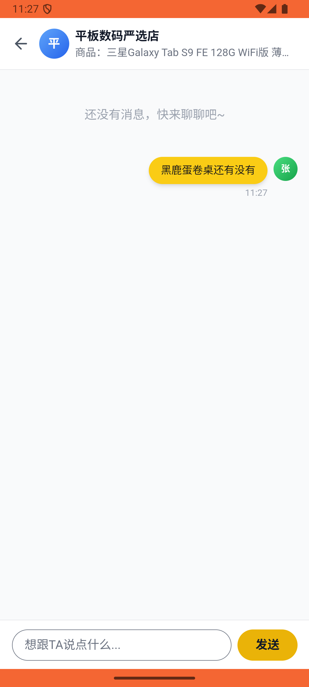
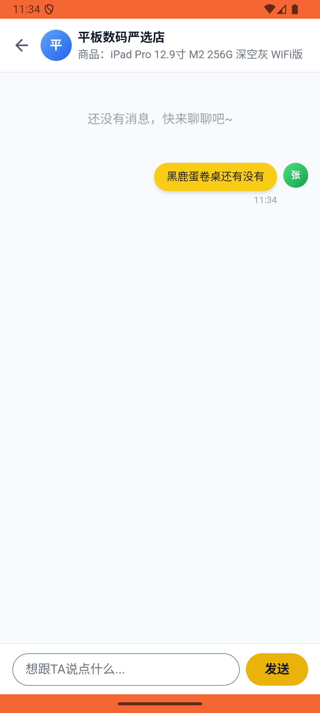

# follow/v002_follow_validator  ⚠️

- **Brand**: `xianzhiershouwang`
- **Class**: `XianzhiershouwangFollowV002FollowValidatorTask`
- **Pass@3**: **1/3**  (score = 1.00)
- **Elapsed**: 937s (~15.6 min)
- **Model**: `doubao-seed-2-0-lite-260428`
- **Raw log**: [./raw_logs/XianzhiershouwangFollowV002FollowValidatorTask.log](./raw_logs/XianzhiershouwangFollowV002FollowValidatorTask.log)
- **Generated**: 2026-05-30T15:08:18+08:00

## Task Goal

> 【当前账户档案】账号：zhangsan@example.com；昵称：张三；支付密码：无需密码，如需支付直接确认即可；默认收货地址（JSON）：{"recipient": "张三", "phone": "13800138000", "address": "上海市 上海市 浦东新区 陆家嘴环路1000号"}。请基于以上档案打开 com.xianzhiershouwang 并完成以下任务：看看我关注了谁，那个相机馆好像也卖露营装备的，私信他问黑鹿蛋卷桌还有没有

## Attempts

| # | Outcome | Steps | Terminated | Reason | Start → End |
|---|---------|-------|------------|--------|-------------|
| 1 | ❌ failed | 57 | answer | 对话关联蛋卷桌帖子: 对话未关联蛋卷桌帖子，且消息中未提及蛋卷桌 Diff: @@ -1 +1 @@ -true +false ; 消息内容问"还有"或提到"蛋卷桌": 对话中未找到张三发送的消息 | 2026-05-30 11:18:34 → 2026-05-30 11:27:21 |
| 2 | ✅ passed | 25 | answer | – | 2026-05-30 11:27:21 → 2026-05-30 11:30:39 |
| 3 | ❌ failed | 25 | answer | 给正确卖家（相机馆）发了私信: 未找到与「闲置严选相机馆」的对话 | 2026-05-30 11:30:39 → 2026-05-30 11:34:11 |

## Failure Details

### Episode 1 — ❌ failed

- steps_used: `57`
- terminated_reason: `answer`
- reason:

  ```
  对话关联蛋卷桌帖子: 对话未关联蛋卷桌帖子，且消息中未提及蛋卷桌
  Diff:
  @@ -1 +1 @@
  -true
  +false
  ; 消息内容问"还有"或提到"蛋卷桌": 对话中未找到张三发送的消息
  ```
- death shot: 
  - state: [`./death_shots/XianzhiershouwangFollowV002FollowValidatorTask/episode_001/step_057.json`](./death_shots/XianzhiershouwangFollowV002FollowValidatorTask/episode_001/step_057.json)
  - digest: [`episode_digest.md`](./death_shots/XianzhiershouwangFollowV002FollowValidatorTask/episode_001/episode_digest.md)

### Episode 3 — ❌ failed

- steps_used: `25`
- terminated_reason: `answer`
- reason:

  ```
  给正确卖家（相机馆）发了私信: 未找到与「闲置严选相机馆」的对话
  ```
- death shot: 
  - state: [`./death_shots/XianzhiershouwangFollowV002FollowValidatorTask/episode_003/step_025.json`](./death_shots/XianzhiershouwangFollowV002FollowValidatorTask/episode_003/step_025.json)
  - digest: [`episode_digest.md`](./death_shots/XianzhiershouwangFollowV002FollowValidatorTask/episode_003/episode_digest.md)

---

> 本摘要由 `sengclaw/scripts/pipeline/log_summarizer.py` 自动生成。 原始完整 log 见上方 Raw log 链接（含每 step 的 messages / tool_call / screenshot 引用）。
