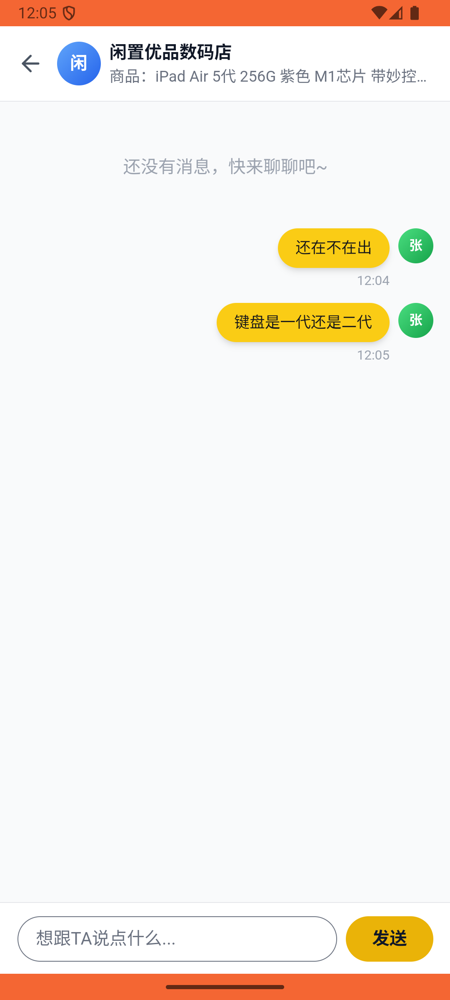

# message/v003_message_validator  ❌

- **Brand**: `xianzhiershouwang`
- **Class**: `XianzhiershouwangMessageV003MessageValidatorTask`
- **Pass@3**: **0/3**  (score = 0.00)
- **Elapsed**: 1301s (~21.7 min)
- **Model**: `doubao-seed-2-0-lite-260428`
- **Raw log**: [./raw_logs/XianzhiershouwangMessageV003MessageValidatorTask.log](./raw_logs/XianzhiershouwangMessageV003MessageValidatorTask.log)
- **Generated**: 2026-05-30T15:08:18+08:00

## Task Goal

> 【当前账户档案】账号：zhangsan@example.com；昵称：张三；支付密码：无需密码，如需支付直接确认即可；默认收货地址（JSON）：{"recipient": "张三", "phone": "13800138000", "address": "上海市 上海市 浦东新区 陆家嘴环路1000号"}。请基于以上档案打开 com.xianzhiershouwang 并完成以下任务：那个iPad Air 5代紫色带妙控键盘的帖子，帮我私信卖家先问还在不在出，再问键盘是一代还是二代

## Attempts

| # | Outcome | Steps | Terminated | Reason | Start → End |
|---|---------|-------|------------|--------|-------------|
| 1 | ❌ failed | 26 | answer | 至少发送了一条消息: 未找到张三发送的消息 | 2026-05-30 12:02:10 → 2026-05-30 12:05:33 |
| 2 | ⏰ timeout | 80 | max_steps | 第二条消息询问键盘代数: 预期至少2条消息，实际只有 1 条 | 2026-05-30 12:05:33 → 2026-05-30 12:15:40 |
| 3 | ❌ failed | 62 | answer | 至少发送了一条消息: 未找到张三发送的消息 | 2026-05-30 12:15:40 → 2026-05-30 12:23:51 |

## Failure Details

### Episode 1 — ❌ failed

- steps_used: `26`
- terminated_reason: `answer`
- reason:

  ```
  至少发送了一条消息: 未找到张三发送的消息
  ```
- death shot: 
  - state: [`./death_shots/XianzhiershouwangMessageV003MessageValidatorTask/episode_001/step_026.json`](./death_shots/XianzhiershouwangMessageV003MessageValidatorTask/episode_001/step_026.json)
  - digest: [`episode_digest.md`](./death_shots/XianzhiershouwangMessageV003MessageValidatorTask/episode_001/episode_digest.md)

### Episode 2 — ⏰ timeout

- steps_used: `80`
- terminated_reason: `max_steps`
- reason:

  ```
  第二条消息询问键盘代数: 预期至少2条消息，实际只有 1 条
  ```
- death shot: 
  - state: [`./death_shots/XianzhiershouwangMessageV003MessageValidatorTask/episode_002/step_080.json`](./death_shots/XianzhiershouwangMessageV003MessageValidatorTask/episode_002/step_080.json)
  - digest: [`episode_digest.md`](./death_shots/XianzhiershouwangMessageV003MessageValidatorTask/episode_002/episode_digest.md)

### Episode 3 — ❌ failed

- steps_used: `62`
- terminated_reason: `answer`
- reason:

  ```
  至少发送了一条消息: 未找到张三发送的消息
  ```
- death shot: 
  - state: [`./death_shots/XianzhiershouwangMessageV003MessageValidatorTask/episode_003/step_062.json`](./death_shots/XianzhiershouwangMessageV003MessageValidatorTask/episode_003/step_062.json)
  - digest: [`episode_digest.md`](./death_shots/XianzhiershouwangMessageV003MessageValidatorTask/episode_003/episode_digest.md)

---

> 本摘要由 `sengclaw/scripts/pipeline/log_summarizer.py` 自动生成。 原始完整 log 见上方 Raw log 链接（含每 step 的 messages / tool_call / screenshot 引用）。
