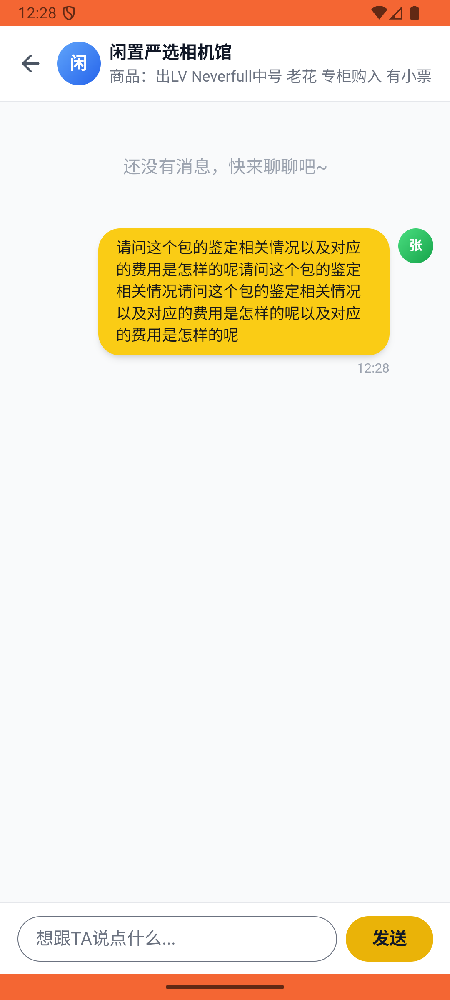

# message/v006_message_validator  ⚠️

- **Brand**: `xianzhiershouwang`
- **Class**: `XianzhiershouwangMessageV006MessageValidatorTask`
- **Pass@3**: **2/3**  (score = 1.00)
- **Elapsed**: 408s (~6.8 min)
- **Model**: `doubao-seed-2-0-lite-260428`
- **Raw log**: [./raw_logs/XianzhiershouwangMessageV006MessageValidatorTask.log](./raw_logs/XianzhiershouwangMessageV006MessageValidatorTask.log)
- **Generated**: 2026-05-30T15:08:18+08:00

## Task Goal

> 【当前账户档案】账号：zhangsan@example.com；昵称：张三；支付密码：无需密码，如需支付直接确认即可；默认收货地址（JSON）：{"recipient": "张三", "phone": "13800138000", "address": "上海市 上海市 浦东新区 陆家嘴环路1000号"}。请基于以上档案打开 com.xianzhiershouwang 并完成以下任务：搜LV Neverfull老花，找有小票的那个中号包，私信卖家问鉴定和费用

## Attempts

| # | Outcome | Steps | Terminated | Reason | Start → End |
|---|---------|-------|------------|--------|-------------|
| 1 | ✅ passed | 19 | answer | – | 2026-05-30 12:24:37 → 2026-05-30 12:26:47 |
| 2 | ❌ failed | 15 | answer | 有「LV Neverfull 老花」搜索记录: 未找到包含「LV」的搜索记录; 私信会话已创建: 未找到与卖家的私信会话 | 2026-05-30 12:26:47 → 2026-05-30 12:28:46 |
| 3 | ✅ passed | 22 | answer | – | 2026-05-30 12:28:46 → 2026-05-30 12:31:25 |

## Failure Details

### Episode 2 — ❌ failed

- steps_used: `15`
- terminated_reason: `answer`
- reason:

  ```
  有「LV Neverfull 老花」搜索记录: 未找到包含「LV」的搜索记录; 私信会话已创建: 未找到与卖家的私信会话
  ```
- death shot: 
  - state: [`./death_shots/XianzhiershouwangMessageV006MessageValidatorTask/episode_002/step_015.json`](./death_shots/XianzhiershouwangMessageV006MessageValidatorTask/episode_002/step_015.json)
  - digest: [`episode_digest.md`](./death_shots/XianzhiershouwangMessageV006MessageValidatorTask/episode_002/episode_digest.md)

---

> 本摘要由 `sengclaw/scripts/pipeline/log_summarizer.py` 自动生成。 原始完整 log 见上方 Raw log 链接（含每 step 的 messages / tool_call / screenshot 引用）。
