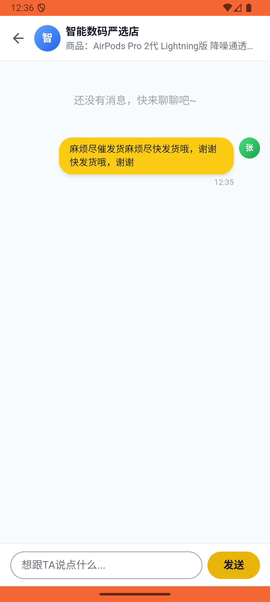
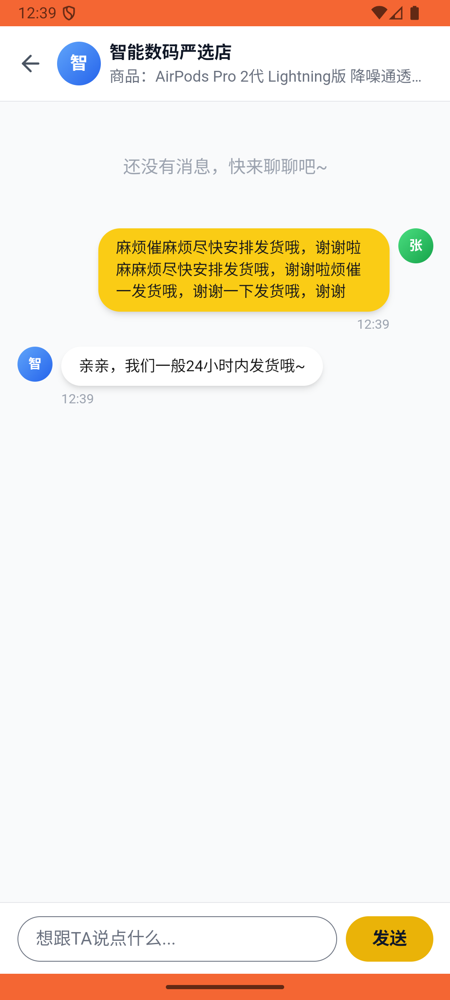
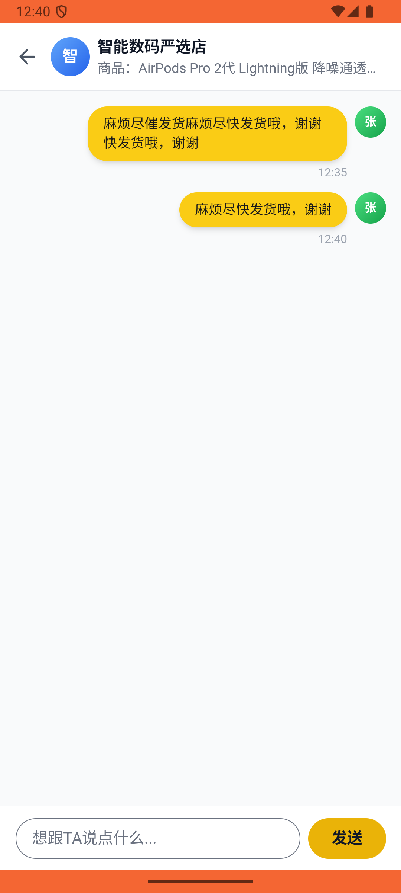

# message/v008_message_validator  ❌

- **Brand**: `xianzhiershouwang`
- **Class**: `XianzhiershouwangMessageV008MessageValidatorTask`
- **Pass@3**: **0/3**  (score = 0.00)
- **Elapsed**: 522s (~8.7 min)
- **Model**: `doubao-seed-2-0-lite-260428`
- **Raw log**: [./raw_logs/XianzhiershouwangMessageV008MessageValidatorTask.log](./raw_logs/XianzhiershouwangMessageV008MessageValidatorTask.log)
- **Generated**: 2026-05-30T15:08:18+08:00

## Task Goal

> 【当前账户档案】账号：zhangsan@example.com；昵称：张三；支付密码：无需密码，如需支付直接确认即可；默认收货地址（JSON）：{"recipient": "张三", "phone": "13800138000", "address": "上海市 上海市 浦东新区 陆家嘴环路1000号"}。请基于以上档案打开 com.xianzhiershouwang 并完成以下任务：那个全新未拆的AirPods Pro 2代帮我用支付宝买了，买完私信卖家催一下发货

## Attempts

| # | Outcome | Steps | Terminated | Reason | Start → End |
|---|---------|-------|------------|--------|-------------|
| 1 | ❌ failed | 31 | answer | 张三购买了「AirPods Pro 2代」: 未找到张三的订单; 张三给「AirPods Pro 2代」卖家发了催发货私信: 未找到与卖家的私信会话 | 2026-05-30 12:32:12 → 2026-05-30 12:36:07 |
| 2 | ❌ failed | 25 | answer | 订单关联「AirPods Pro 2代」帖子: 预期商品ID 1299，实际 1615 | 2026-05-30 12:36:08 → 2026-05-30 12:39:09 |
| 3 | ❌ failed | 14 | answer | 张三购买了「AirPods Pro 2代」: 未找到张三的订单; 张三给「AirPods Pro 2代」卖家发了催发货私信: 未找到与卖家的私信会话 | 2026-05-30 12:39:09 → 2026-05-30 12:40:54 |

## Failure Details

### Episode 1 — ❌ failed

- steps_used: `31`
- terminated_reason: `answer`
- reason:

  ```
  张三购买了「AirPods Pro 2代」: 未找到张三的订单; 张三给「AirPods Pro 2代」卖家发了催发货私信: 未找到与卖家的私信会话
  ```
- death shot: 
  - state: [`./death_shots/XianzhiershouwangMessageV008MessageValidatorTask/episode_001/step_031.json`](./death_shots/XianzhiershouwangMessageV008MessageValidatorTask/episode_001/step_031.json)
  - digest: [`episode_digest.md`](./death_shots/XianzhiershouwangMessageV008MessageValidatorTask/episode_001/episode_digest.md)

### Episode 2 — ❌ failed

- steps_used: `25`
- terminated_reason: `answer`
- reason:

  ```
  订单关联「AirPods Pro 2代」帖子: 预期商品ID 1299，实际 1615
  ```
- death shot: 
  - state: [`./death_shots/XianzhiershouwangMessageV008MessageValidatorTask/episode_002/step_025.json`](./death_shots/XianzhiershouwangMessageV008MessageValidatorTask/episode_002/step_025.json)
  - digest: [`episode_digest.md`](./death_shots/XianzhiershouwangMessageV008MessageValidatorTask/episode_002/episode_digest.md)

### Episode 3 — ❌ failed

- steps_used: `14`
- terminated_reason: `answer`
- reason:

  ```
  张三购买了「AirPods Pro 2代」: 未找到张三的订单; 张三给「AirPods Pro 2代」卖家发了催发货私信: 未找到与卖家的私信会话
  ```
- death shot: 
  - state: [`./death_shots/XianzhiershouwangMessageV008MessageValidatorTask/episode_003/step_014.json`](./death_shots/XianzhiershouwangMessageV008MessageValidatorTask/episode_003/step_014.json)
  - digest: [`episode_digest.md`](./death_shots/XianzhiershouwangMessageV008MessageValidatorTask/episode_003/episode_digest.md)

---

> 本摘要由 `sengclaw/scripts/pipeline/log_summarizer.py` 自动生成。 原始完整 log 见上方 Raw log 链接（含每 step 的 messages / tool_call / screenshot 引用）。
