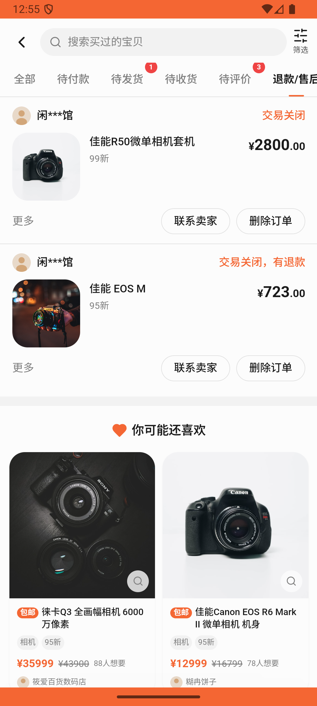
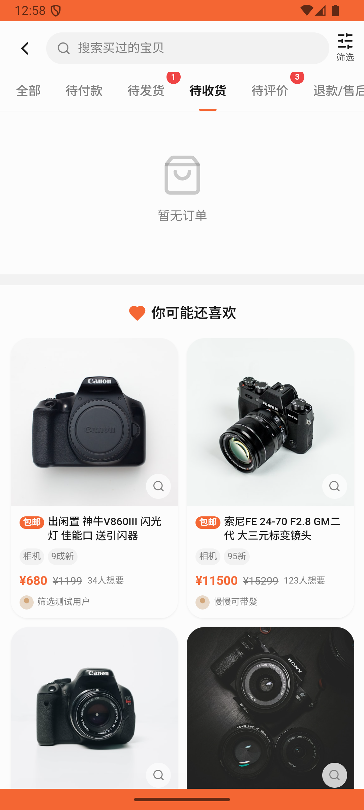

# order/v025_order_validator  ⚠️

- **Brand**: `xianzhiershouwang`
- **Class**: `XianzhiershouwangOrderV025OrderValidatorTask`
- **Pass@3**: **1/3**  (score = 1.00)
- **Elapsed**: 207s (~3.5 min)
- **Model**: `doubao-seed-2-0-lite-260428`
- **Raw log**: [./raw_logs/XianzhiershouwangOrderV025OrderValidatorTask.log](./raw_logs/XianzhiershouwangOrderV025OrderValidatorTask.log)
- **Generated**: 2026-05-30T15:08:18+08:00

## Task Goal

> 【当前账户档案】账号：zhangsan@example.com；昵称：张三；支付密码：无需密码，如需支付直接确认即可；默认收货地址（JSON）：{"recipient": "张三", "phone": "13800138000", "address": "上海市 上海市 浦东新区 陆家嘴环路1000号"}。请基于以上档案打开 com.xianzhiershouwang 并完成以下任务：帮我看看我买到的订单，已发货的帮我确认收货，没付款的都取消掉

## Attempts

| # | Outcome | Steps | Terminated | Reason | Start → End |
|---|---------|-------|------------|--------|-------------|
| 1 | ❌ failed | 11 | answer | 已发货订单(Nikon D90)确认收货成功: 预期已发货订单状态为 completed，实际为 'shipped'; 待付款订单(佳能R50)取消成功: 预期待付款订单状态为 cancelled，实际为 'pending' | 2026-05-30 12:54:35 → 2026-05-30 12:55:54 |
| 2 | ✅ passed | 11 | answer | – | 2026-05-30 12:55:54 → 2026-05-30 12:57:23 |
| 3 | ❌ failed | 6 | answer | 已发货订单(Nikon D90)确认收货成功: 预期已发货订单状态为 completed，实际为 'shipped'; 待付款订单(佳能R50)取消成功: 预期待付款订单状态为 cancelled，实际为 'pending' | 2026-05-30 12:57:23 → 2026-05-30 12:58:02 |

## Failure Details

### Episode 1 — ❌ failed

- steps_used: `11`
- terminated_reason: `answer`
- reason:

  ```
  已发货订单(Nikon D90)确认收货成功: 预期已发货订单状态为 completed，实际为 'shipped'; 待付款订单(佳能R50)取消成功: 预期待付款订单状态为 cancelled，实际为 'pending'
  ```
- death shot: 
  - state: [`./death_shots/XianzhiershouwangOrderV025OrderValidatorTask/episode_001/step_011.json`](./death_shots/XianzhiershouwangOrderV025OrderValidatorTask/episode_001/step_011.json)
  - digest: [`episode_digest.md`](./death_shots/XianzhiershouwangOrderV025OrderValidatorTask/episode_001/episode_digest.md)

### Episode 3 — ❌ failed

- steps_used: `6`
- terminated_reason: `answer`
- reason:

  ```
  已发货订单(Nikon D90)确认收货成功: 预期已发货订单状态为 completed，实际为 'shipped'; 待付款订单(佳能R50)取消成功: 预期待付款订单状态为 cancelled，实际为 'pending'
  ```
- death shot: 
  - state: [`./death_shots/XianzhiershouwangOrderV025OrderValidatorTask/episode_003/step_006.json`](./death_shots/XianzhiershouwangOrderV025OrderValidatorTask/episode_003/step_006.json)
  - digest: [`episode_digest.md`](./death_shots/XianzhiershouwangOrderV025OrderValidatorTask/episode_003/episode_digest.md)

---

> 本摘要由 `sengclaw/scripts/pipeline/log_summarizer.py` 自动生成。 原始完整 log 见上方 Raw log 链接（含每 step 的 messages / tool_call / screenshot 引用）。
