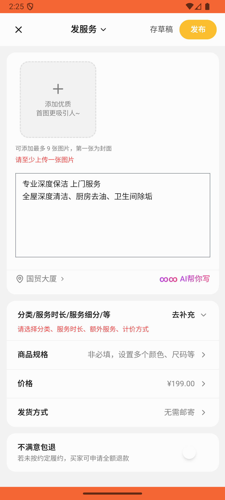

# recycle/v003_recycle_validator  ❌

- **Brand**: `xianzhiershouwang`
- **Class**: `XianzhiershouwangRecycleV003RecycleValidatorTask`
- **Pass@3**: **0/3**  (score = 0.00)
- **Elapsed**: 973s (~16.2 min)
- **Model**: `doubao-seed-2-0-lite-260428`
- **Raw log**: [./raw_logs/XianzhiershouwangRecycleV003RecycleValidatorTask.log](./raw_logs/XianzhiershouwangRecycleV003RecycleValidatorTask.log)
- **Generated**: 2026-05-30T15:08:18+08:00

## Task Goal

> 【当前账户档案】账号：zhangsan@example.com；昵称：张三；支付密码：无需密码，如需支付直接确认即可；默认收货地址（JSON）：{"recipient": "张三", "phone": "13800138000", "address": "上海市 上海市 浦东新区 陆家嘴环路1000号"}。请基于以上档案打开 com.xianzhiershouwang 并完成以下任务：帮我发个家政服务帖子，标题「专业深度保洁 上门服务」，写上全屋深度清洁、厨房去油、卫生间除垢，定价199，服务地点北京

## Attempts

| # | Outcome | Steps | Terminated | Reason | Start → End |
|---|---------|-------|------------|--------|-------------|
| 1 | ❌ failed | 55 | answer | 服务地点为北京: 服务地点应包含'北京'，实际location='国贸大厦' | 2026-05-30 14:15:04 → 2026-05-30 14:22:29 |
| 2 | ❌ failed | 23 | answer | 张三发布了「专业深度保洁 上门服务」帖子: 未找到包含"保洁"关键词的服务帖子（标题/描述/分类均未匹配） | 2026-05-30 14:22:29 → 2026-05-30 14:25:19 |
| 3 | ❌ failed | 47 | answer | 服务地点为北京: 服务地点应包含'北京'，实际location='国贸大厦' Diff: @@ -1 +1,3 @@ -北京 +国贸大厦 专业深度保洁 上门服务 +全屋深度清洁、厨房去油、卫生间除垢 专业深度保洁 上门服务 +全屋深度清洁、厨房去油、卫生间除垢 | 2026-05-30 14:25:19 → 2026-05-30 14:31:17 |

## Failure Details

### Episode 1 — ❌ failed

- steps_used: `55`
- terminated_reason: `answer`
- reason:

  ```
  服务地点为北京: 服务地点应包含'北京'，实际location='国贸大厦'
  ```
- death shot: 
  - state: [`./death_shots/XianzhiershouwangRecycleV003RecycleValidatorTask/episode_001/step_055.json`](./death_shots/XianzhiershouwangRecycleV003RecycleValidatorTask/episode_001/step_055.json)
  - digest: [`episode_digest.md`](./death_shots/XianzhiershouwangRecycleV003RecycleValidatorTask/episode_001/episode_digest.md)

### Episode 2 — ❌ failed

- steps_used: `23`
- terminated_reason: `answer`
- reason:

  ```
  张三发布了「专业深度保洁 上门服务」帖子: 未找到包含"保洁"关键词的服务帖子（标题/描述/分类均未匹配）
  ```
- death shot: 
  - state: [`./death_shots/XianzhiershouwangRecycleV003RecycleValidatorTask/episode_002/step_023.json`](./death_shots/XianzhiershouwangRecycleV003RecycleValidatorTask/episode_002/step_023.json)
  - digest: [`episode_digest.md`](./death_shots/XianzhiershouwangRecycleV003RecycleValidatorTask/episode_002/episode_digest.md)

### Episode 3 — ❌ failed

- steps_used: `47`
- terminated_reason: `answer`
- reason:

  ```
  服务地点为北京: 服务地点应包含'北京'，实际location='国贸大厦'
  Diff:
  @@ -1 +1,3 @@
  -北京
  +国贸大厦 专业深度保洁 上门服务
  +全屋深度清洁、厨房去油、卫生间除垢 专业深度保洁 上门服务
  +全屋深度清洁、厨房去油、卫生间除垢
  ```
- death shot: 
  - state: [`./death_shots/XianzhiershouwangRecycleV003RecycleValidatorTask/episode_003/step_047.json`](./death_shots/XianzhiershouwangRecycleV003RecycleValidatorTask/episode_003/step_047.json)
  - digest: [`episode_digest.md`](./death_shots/XianzhiershouwangRecycleV003RecycleValidatorTask/episode_003/episode_digest.md)

---

> 本摘要由 `sengclaw/scripts/pipeline/log_summarizer.py` 自动生成。 原始完整 log 见上方 Raw log 链接（含每 step 的 messages / tool_call / screenshot 引用）。
