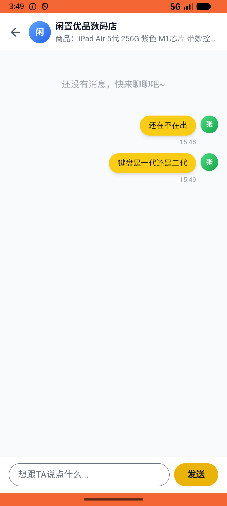

# message/v003_message_validator  ⚠️

- **Brand**: `xianzhiershouwang`
- **Class**: `XianzhiershouwangMessageV003MessageValidatorTask`
- **Pass@3**: **2/3**  (score = 1.00)
- **Elapsed**: 282s (~4.7 min)
- **Model**: `doubao-seed-2-0-lite-260428`
- **Raw log**: [./raw_logs/XianzhiershouwangMessageV003MessageValidatorTask.log](./raw_logs/XianzhiershouwangMessageV003MessageValidatorTask.log)
- **Generated**: 2026-05-30T15:50:53+08:00

## Task Goal

> 【当前账户档案】账号：zhangsan@example.com；昵称：张三；支付密码：无需密码，如需支付直接确认即可；默认收货地址（JSON）：{"recipient": "张三", "phone": "13800138000", "address": "上海市 上海市 浦东新区 陆家嘴环路1000号"}。请基于以上档案打开 com.xianzhiershouwang 并完成以下任务：那个iPad Air 5代紫色带妙控键盘的帖子，帮我私信卖家先问还在不在出，再问键盘是一代还是二代

## Attempts

| # | Outcome | Steps | Terminated | Reason | Start → End |
|---|---------|-------|------------|--------|-------------|
| 1 | ✅ passed | 13 | answer | – | 2026-05-30 15:46:11 → 2026-05-30 15:47:47 |
| 2 | ❌ failed | 13 | answer | 对话已创建: 未找到张三与卖家的对话记录 | 2026-05-30 15:47:47 → 2026-05-30 15:49:19 |
| 3 | ✅ passed | 13 | answer | – | 2026-05-30 15:49:19 → 2026-05-30 15:50:53 |

## Failure Details

### Episode 2 — ❌ failed

- steps_used: `13`
- terminated_reason: `answer`
- reason:

  ```
  对话已创建: 未找到张三与卖家的对话记录
  ```
- death shot: 
  - state: [`./death_shots/XianzhiershouwangMessageV003MessageValidatorTask/episode_002/step_013.json`](./death_shots/XianzhiershouwangMessageV003MessageValidatorTask/episode_002/step_013.json)
  - digest: [`episode_digest.md`](./death_shots/XianzhiershouwangMessageV003MessageValidatorTask/episode_002/episode_digest.md)

---

> 本摘要由 `sengclaw/scripts/pipeline/log_summarizer.py` 自动生成。 原始完整 log 见上方 Raw log 链接（含每 step 的 messages / tool_call / screenshot 引用）。
