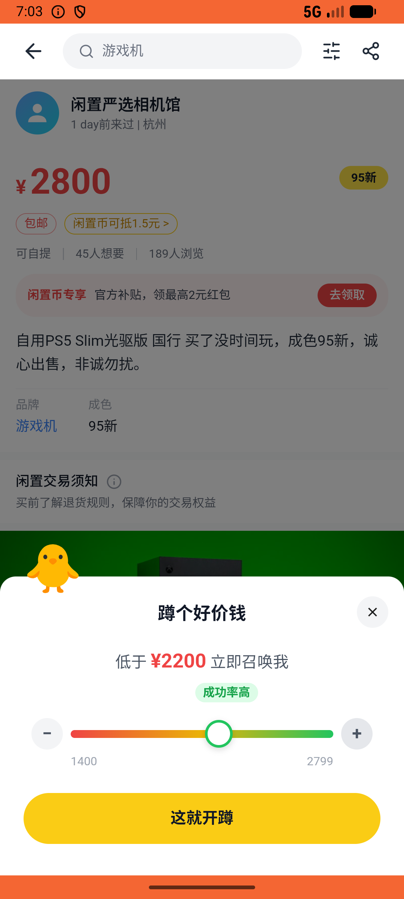

# like/v007_like_validator  ⚠️

- **Brand**: `xianzhiershouwang`
- **Class**: `XianzhiershouwangLikeV007LikeValidatorTask`
- **Pass@3**: **2/3**  (score = 1.00)
- **Elapsed**: 1689s (~28.1 min)
- **Model**: `doubao-seed-2-0-lite-260428`
- **Raw log**: [./raw_logs/XianzhiershouwangLikeV007LikeValidatorTask.log](./raw_logs/XianzhiershouwangLikeV007LikeValidatorTask.log)
- **Generated**: 2026-05-30T19:03:37+08:00

## Task Goal

> 【当前账户档案】账号：zhangsan@example.com；昵称：张三；支付密码：无需密码，如需支付直接确认即可；默认收货地址（JSON）：{"recipient": "张三", "phone": "13800138000", "address": "上海市 上海市 浦东新区 陆家嘴环路1000号"}。请基于以上档案打开 com.xianzhiershouwang 并完成以下任务：搜PS5，找到港版光驱带双手柄的蹲蹲设2500，再找到国行Slim光驱版的蹲蹲设2200

## Attempts

| # | Outcome | Steps | Terminated | Reason | Start → End |
|---|---------|-------|------------|--------|-------------|
| 1 | ✅ passed | 73 | answer | – | 2026-05-30 18:35:28 → 2026-05-30 18:44:08 |
| 2 | ✅ passed | 62 | answer | – | 2026-05-30 18:44:08 → 2026-05-30 18:52:58 |
| 3 | ⏰ timeout | 80 | max_steps | 第一个蹲蹲已创建（期望价格2500）: 未找到对「出PS5光驱版 港版 带双手柄+充电底座 送3张碟」的蹲蹲记录; 第二个蹲蹲已创建（期望价格2200）: 未找到对「自用PS5 Slim光驱版 国行 买了没时间玩」的蹲蹲记录; 两个蹲蹲的帖子不同: 预期至少2个蹲蹲，实际0个 | 2026-05-30 18:52:58 → 2026-05-30 19:03:37 |

## Failure Details

### Episode 3 — ⏰ timeout

- steps_used: `80`
- terminated_reason: `max_steps`
- reason:

  ```
  第一个蹲蹲已创建（期望价格2500）: 未找到对「出PS5光驱版 港版 带双手柄+充电底座 送3张碟」的蹲蹲记录; 第二个蹲蹲已创建（期望价格2200）: 未找到对「自用PS5 Slim光驱版 国行 买了没时间玩」的蹲蹲记录; 两个蹲蹲的帖子不同: 预期至少2个蹲蹲，实际0个
  ```
- death shot: 
  - state: [`./death_shots/XianzhiershouwangLikeV007LikeValidatorTask/episode_003/step_080.json`](./death_shots/XianzhiershouwangLikeV007LikeValidatorTask/episode_003/step_080.json)
  - digest: [`episode_digest.md`](./death_shots/XianzhiershouwangLikeV007LikeValidatorTask/episode_003/episode_digest.md)

---

> 本摘要由 `sengclaw/scripts/pipeline/log_summarizer.py` 自动生成。 原始完整 log 见上方 Raw log 链接（含每 step 的 messages / tool_call / screenshot 引用）。
