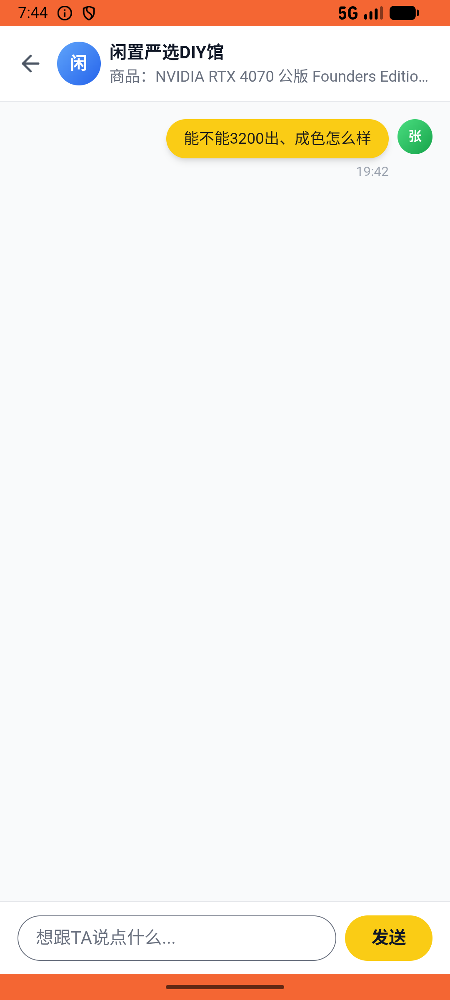

# order/v017_order_validator  ⚠️

- **Brand**: `xianzhiershouwang`
- **Class**: `XianzhiershouwangOrderV017OrderValidatorTask`
- **Pass@3**: **2/3**  (score = 1.00)
- **Elapsed**: 1277s (~21.3 min)
- **Model**: `doubao-seed-2-0-lite-260428`
- **Raw log**: [./raw_logs/XianzhiershouwangOrderV017OrderValidatorTask.log](./raw_logs/XianzhiershouwangOrderV017OrderValidatorTask.log)
- **Generated**: 2026-05-30T19:52:58+08:00

## Task Goal

> 【当前账户档案】账号：zhangsan@example.com；昵称：张三；支付密码：无需密码，如需支付直接确认即可；默认收货地址（JSON）：{"recipient": "张三", "phone": "13800138000", "address": "上海市 上海市 浦东新区 陆家嘴环路1000号"}。请基于以上档案打开 com.xianzhiershouwang 并完成以下任务：搜一下RTX 4070，那个公版FE 12G自用的帮我蹲蹲设3200，再私信卖家问能不能3200出、成色怎么样，聊完帮我支付宝买了

## Attempts

| # | Outcome | Steps | Terminated | Reason | Start → End |
|---|---------|-------|------------|--------|-------------|
| 1 | ✅ passed | 30 | answer | – | 2026-05-30 19:31:41 → 2026-05-30 19:35:41 |
| 2 | ❌ failed | 59 | answer | 张三蹲蹲了「RTX 4070」帖子: 未找到蹲蹲记录; 张三给「RTX 4070」卖家发了私信: 未找到私信; 订单已创建且已支付: 未找到已支付的订单; 操作都针对同一个帖子: 所有操作应针对同一帖子，实际 like_post= order_post= msg_post= | 2026-05-30 19:35:41 → 2026-05-30 19:44:04 |
| 3 | ✅ passed | 73 | answer | – | 2026-05-30 19:44:04 → 2026-05-30 19:52:58 |

## Failure Details

### Episode 2 — ❌ failed

- steps_used: `59`
- terminated_reason: `answer`
- reason:

  ```
  张三蹲蹲了「RTX 4070」帖子: 未找到蹲蹲记录; 张三给「RTX 4070」卖家发了私信: 未找到私信; 订单已创建且已支付: 未找到已支付的订单; 操作都针对同一个帖子: 所有操作应针对同一帖子，实际 like_post= order_post= msg_post=
  ```
- death shot: 
  - state: [`./death_shots/XianzhiershouwangOrderV017OrderValidatorTask/episode_002/step_059.json`](./death_shots/XianzhiershouwangOrderV017OrderValidatorTask/episode_002/step_059.json)
  - digest: [`episode_digest.md`](./death_shots/XianzhiershouwangOrderV017OrderValidatorTask/episode_002/episode_digest.md)

---

> 本摘要由 `sengclaw/scripts/pipeline/log_summarizer.py` 自动生成。 原始完整 log 见上方 Raw log 链接（含每 step 的 messages / tool_call / screenshot 引用）。
