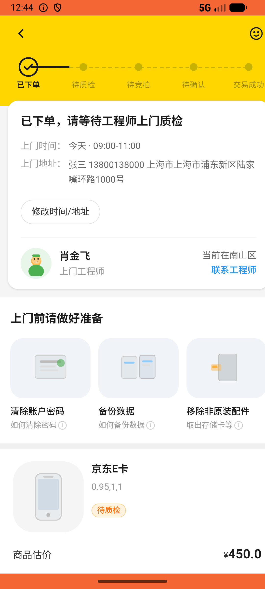
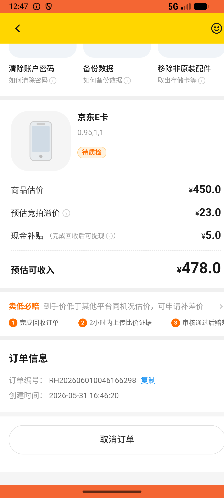
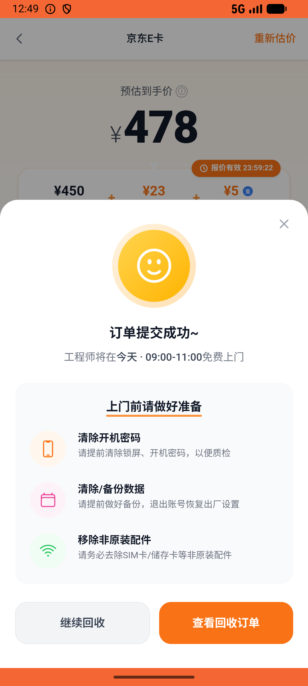

# recycle/v015_recycle_validator  ❌

- **Brand**: `xianzhiershouwang`
- **Class**: `XianzhiershouwangRecycleV015RecycleValidatorTask`
- **Pass@3**: **0/3**  (score = 0.00)
- **Elapsed**: 535s (~8.9 min)
- **Model**: `doubao-seed-2-0-lite-260428`
- **Raw log**: [./raw_logs/XianzhiershouwangRecycleV015RecycleValidatorTask.log](./raw_logs/XianzhiershouwangRecycleV015RecycleValidatorTask.log)
- **Generated**: 2026-06-01T01:35:38+08:00

## Task Goal

> 【当前账户档案】账号：zhangsan@example.com；昵称：张三；支付密码：无需密码，如需支付直接确认即可；默认收货地址（JSON）：{"recipient": "张三", "phone": "13800138000", "address": "上海市 上海市 浦东新区 陆家嘴环路1000号"}。请基于以上档案打开 com.xianzhiershouwang 并完成以下任务：我有张京东E卡500面值想回收，卡号6221806000000000001，卡密RY2RF55C8J3H4NAM，帮我提交

## Attempts

| # | Outcome | Steps | Terminated | Reason | Start → End |
|---|---------|-------|------------|--------|-------------|
| 1 | ❌ failed | 17 | answer | 卡券回收订单已创建且关联京东E卡: 未找到京东E卡的卡券回收订单（order_type=card_voucher） | 2026-06-01 00:40:41 → 2026-06-01 00:45:01 |
| 2 | ❌ failed | 26 | answer | 卡券回收订单已创建且关联京东E卡: 未找到京东E卡的卡券回收订单（order_type=card_voucher） | 2026-06-01 00:45:01 → 2026-06-01 00:47:49 |
| 3 | ❌ failed | 16 | answer | 卡券回收订单已创建且关联京东E卡: 未找到京东E卡的卡券回收订单（order_type=card_voucher） | 2026-06-01 00:47:49 → 2026-06-01 00:49:35 |

## Failure Details

### Episode 1 — ❌ failed

- steps_used: `17`
- terminated_reason: `answer`
- reason:

  ```
  卡券回收订单已创建且关联京东E卡: 未找到京东E卡的卡券回收订单（order_type=card_voucher）
  ```
- death shot: 
  - state: [`./death_shots/XianzhiershouwangRecycleV015RecycleValidatorTask/episode_001/step_017.json`](./death_shots/XianzhiershouwangRecycleV015RecycleValidatorTask/episode_001/step_017.json)
  - digest: [`episode_digest.md`](./death_shots/XianzhiershouwangRecycleV015RecycleValidatorTask/episode_001/episode_digest.md)

### Episode 2 — ❌ failed

- steps_used: `26`
- terminated_reason: `answer`
- reason:

  ```
  卡券回收订单已创建且关联京东E卡: 未找到京东E卡的卡券回收订单（order_type=card_voucher）
  ```
- death shot: 
  - state: [`./death_shots/XianzhiershouwangRecycleV015RecycleValidatorTask/episode_002/step_026.json`](./death_shots/XianzhiershouwangRecycleV015RecycleValidatorTask/episode_002/step_026.json)
  - digest: [`episode_digest.md`](./death_shots/XianzhiershouwangRecycleV015RecycleValidatorTask/episode_002/episode_digest.md)

### Episode 3 — ❌ failed

- steps_used: `16`
- terminated_reason: `answer`
- reason:

  ```
  卡券回收订单已创建且关联京东E卡: 未找到京东E卡的卡券回收订单（order_type=card_voucher）
  ```
- death shot: 
  - state: [`./death_shots/XianzhiershouwangRecycleV015RecycleValidatorTask/episode_003/step_016.json`](./death_shots/XianzhiershouwangRecycleV015RecycleValidatorTask/episode_003/step_016.json)
  - digest: [`episode_digest.md`](./death_shots/XianzhiershouwangRecycleV015RecycleValidatorTask/episode_003/episode_digest.md)

---

> 本摘要由 `sengclaw/scripts/pipeline/log_summarizer.py` 自动生成。 原始完整 log 见上方 Raw log 链接（含每 step 的 messages / tool_call / screenshot 引用）。
