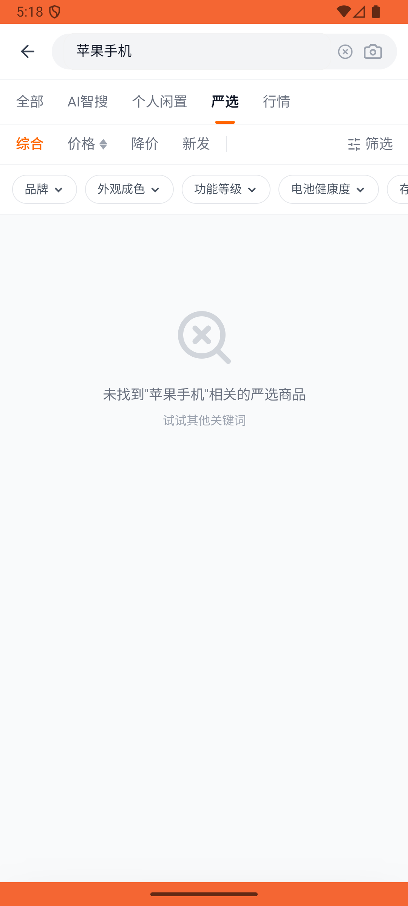
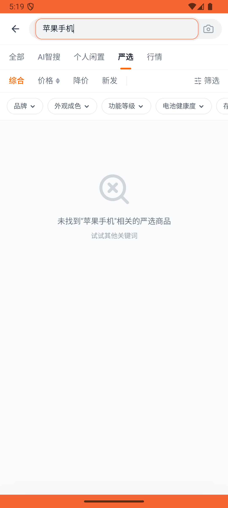

# digital_market/v005_digital_market_validator  ⚠️

- **Brand**: `xianzhiershouwang`
- **Class**: `XianzhiershouwangDigitalMarketV005DigitalMarketValidatorTask`
- **Pass@3**: **1/3**  (score = 1.00)
- **Elapsed**: 433s (~7.2 min)
- **Model**: `doubao-seed-2-0-lite-260428`
- **Raw log**: [./raw_logs/XianzhiershouwangDigitalMarketV005DigitalMarketValidatorTask.log](./raw_logs/XianzhiershouwangDigitalMarketV005DigitalMarketValidatorTask.log)
- **Generated**: 2026-06-01T05:56:44+08:00

## Task Goal

> 【当前账户档案】账号：zhangsan@example.com；昵称：张三；支付密码：无需密码，如需支付直接确认即可；默认收货地址（JSON）：{"recipient": "张三", "phone": "13800138000", "address": "上海市 上海市 浦东新区 陆家嘴环路1000号"}。请基于以上档案打开 com.xianzhiershouwang 并完成以下任务：帮我看看苹果手机最贵的是哪个，在官方严选那边找，收藏一下我想看看顶配啥价位

## Attempts

| # | Outcome | Steps | Terminated | Reason | Start → End |
|---|---------|-------|------------|--------|-------------|
| 1 | ❌ failed | 17 | answer | 收藏记录已创建: 未找到张三的收藏记录 | 2026-06-01 05:16:46 → 2026-06-01 05:18:43 |
| 2 | ❌ failed | 10 | answer | 收藏记录已创建: 未找到张三的收藏记录 | 2026-06-01 05:18:43 → 2026-06-01 05:19:53 |
| 3 | ✅ passed | 27 | answer | – | 2026-06-01 05:19:53 → 2026-06-01 05:23:58 |

## Failure Details

### Episode 1 — ❌ failed

- steps_used: `17`
- terminated_reason: `answer`
- reason:

  ```
  收藏记录已创建: 未找到张三的收藏记录
  ```
- death shot: 
  - state: [`./death_shots/XianzhiershouwangDigitalMarketV005DigitalMarketValidatorTask/episode_001/step_017.json`](./death_shots/XianzhiershouwangDigitalMarketV005DigitalMarketValidatorTask/episode_001/step_017.json)
  - digest: [`episode_digest.md`](./death_shots/XianzhiershouwangDigitalMarketV005DigitalMarketValidatorTask/episode_001/episode_digest.md)

### Episode 2 — ❌ failed

- steps_used: `10`
- terminated_reason: `answer`
- reason:

  ```
  收藏记录已创建: 未找到张三的收藏记录
  ```
- death shot: 
  - state: [`./death_shots/XianzhiershouwangDigitalMarketV005DigitalMarketValidatorTask/episode_002/step_010.json`](./death_shots/XianzhiershouwangDigitalMarketV005DigitalMarketValidatorTask/episode_002/step_010.json)
  - digest: [`episode_digest.md`](./death_shots/XianzhiershouwangDigitalMarketV005DigitalMarketValidatorTask/episode_002/episode_digest.md)

---

> 本摘要由 `sengclaw/scripts/pipeline/log_summarizer.py` 自动生成。 原始完整 log 见上方 Raw log 链接（含每 step 的 messages / tool_call / screenshot 引用）。
