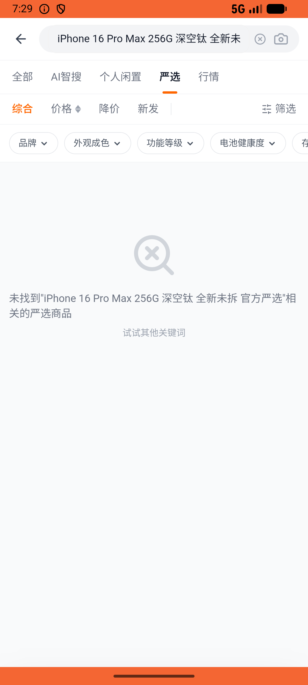

# digital_market/v001_digital_market_validator  ⚠️

- **Brand**: `xianzhiershouwang`
- **Class**: `XianzhiershouwangDigitalMarketV001DigitalMarketValidatorTask`
- **Pass@3**: **2/3**  (score = 1.00)
- **Elapsed**: 268s (~4.5 min)
- **Model**: `doubao-seed-2-0-lite-260428`
- **Raw log**: [./raw_logs/XianzhiershouwangDigitalMarketV001DigitalMarketValidatorTask.log](./raw_logs/XianzhiershouwangDigitalMarketV001DigitalMarketValidatorTask.log)
- **Generated**: 2026-06-02T09:44:46+08:00

## Task Goal

> 【当前账户档案】账号：zhangsan@example.com；昵称：张三；支付密码：无需密码，如需支付直接确认即可；默认收货地址（JSON）：{"recipient": "张三", "phone": "13800138000", "address": "上海市 上海市 浦东新区 陆家嘴环路1000号"}。请基于以上档案打开 com.xianzhiershouwang 并完成以下任务：我要购买iPhone 16系，在官方严选筛选那个Pro Max 256G深空钛全新未拆的，帮我支付宝买了

## Attempts

| # | Outcome | Steps | Terminated | Reason | Start → End |
|---|---------|-------|------------|--------|-------------|
| 1 | ✅ passed | 19 | answer | – | 2026-06-02 07:25:50 → 2026-06-02 07:28:31 |
| 2 | ❌ failed | 6 | answer | 订单已创建: 未找到张三创建的订单 | 2026-06-02 07:28:31 → 2026-06-02 07:29:10 |
| 3 | ✅ passed | 10 | answer | – | 2026-06-02 07:29:10 → 2026-06-02 07:30:17 |

## Failure Details

### Episode 2 — ❌ failed

- steps_used: `6`
- terminated_reason: `answer`
- reason:

  ```
  订单已创建: 未找到张三创建的订单
  ```
- death shot: 
  - state: [`./death_shots/XianzhiershouwangDigitalMarketV001DigitalMarketValidatorTask/episode_002/step_006.json`](./death_shots/XianzhiershouwangDigitalMarketV001DigitalMarketValidatorTask/episode_002/step_006.json)
  - digest: [`episode_digest.md`](./death_shots/XianzhiershouwangDigitalMarketV001DigitalMarketValidatorTask/episode_002/episode_digest.md)

---

> 本摘要由 `sengclaw/scripts/pipeline/log_summarizer.py` 自动生成。 原始完整 log 见上方 Raw log 链接（含每 step 的 messages / tool_call / screenshot 引用）。
