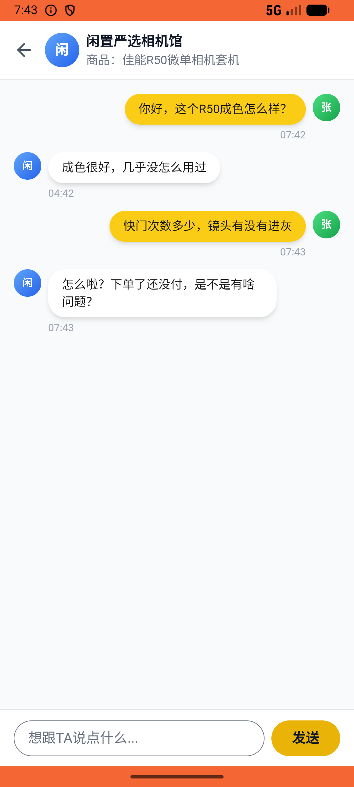

# message/v009_message_validator  ❌

- **Brand**: `xianzhiershouwang`
- **Class**: `XianzhiershouwangMessageV009MessageValidatorTask`
- **Pass@3**: **0/3**  (score = 0.00)
- **Elapsed**: 202s (~3.4 min)
- **Model**: `doubao-seed-2-0-lite-260428`
- **Raw log**: [./raw_logs/XianzhiershouwangMessageV009MessageValidatorTask.log](./raw_logs/XianzhiershouwangMessageV009MessageValidatorTask.log)
- **Generated**: 2026-06-02T09:44:46+08:00

## Task Goal

> 【当前账户档案】账号：zhangsan@example.com；昵称：张三；支付密码：无需密码，如需支付直接确认即可；默认收货地址（JSON）：{"recipient": "张三", "phone": "13800138000", "address": "上海市 上海市 浦东新区 陆家嘴环路1000号"}。请基于以上档案打开 com.xianzhiershouwang 并完成以下任务：之前跟佳能R50套机那个卖家聊过，帮我再问两个问题：快门次数多少，镜头有没有进灰

## Attempts

| # | Outcome | Steps | Terminated | Reason | Start → End |
|---|---------|-------|------------|--------|-------------|
| 1 | ❌ failed | 10 | answer | 发送了至少两条消息: 预期至少2条消息，实际1条 | 2026-06-02 07:42:46 → 2026-06-02 07:43:49 |
| 2 | ❌ failed | 10 | answer | 发送了至少两条消息: 预期至少2条消息，实际1条 | 2026-06-02 07:43:49 → 2026-06-02 07:44:55 |
| 3 | ❌ failed | 10 | answer | 发送了至少两条消息: 预期至少2条消息，实际1条 | 2026-06-02 07:44:56 → 2026-06-02 07:46:08 |

## Failure Details

### Episode 1 — ❌ failed

- steps_used: `10`
- terminated_reason: `answer`
- reason:

  ```
  发送了至少两条消息: 预期至少2条消息，实际1条
  ```
- death shot: 
  - state: [`./death_shots/XianzhiershouwangMessageV009MessageValidatorTask/episode_001/step_010.json`](./death_shots/XianzhiershouwangMessageV009MessageValidatorTask/episode_001/step_010.json)
  - digest: [`episode_digest.md`](./death_shots/XianzhiershouwangMessageV009MessageValidatorTask/episode_001/episode_digest.md)

### Episode 2 — ❌ failed

- steps_used: `10`
- terminated_reason: `answer`
- reason:

  ```
  发送了至少两条消息: 预期至少2条消息，实际1条
  ```
- death shot: 
  - state: [`./death_shots/XianzhiershouwangMessageV009MessageValidatorTask/episode_002/step_010.json`](./death_shots/XianzhiershouwangMessageV009MessageValidatorTask/episode_002/step_010.json)
  - digest: [`episode_digest.md`](./death_shots/XianzhiershouwangMessageV009MessageValidatorTask/episode_002/episode_digest.md)

### Episode 3 — ❌ failed

- steps_used: `10`
- terminated_reason: `answer`
- reason:

  ```
  发送了至少两条消息: 预期至少2条消息，实际1条
  ```
- death shot: 
  - state: [`./death_shots/XianzhiershouwangMessageV009MessageValidatorTask/episode_003/step_010.json`](./death_shots/XianzhiershouwangMessageV009MessageValidatorTask/episode_003/step_010.json)
  - digest: [`episode_digest.md`](./death_shots/XianzhiershouwangMessageV009MessageValidatorTask/episode_003/episode_digest.md)

---

> 本摘要由 `sengclaw/scripts/pipeline/log_summarizer.py` 自动生成。 原始完整 log 见上方 Raw log 链接（含每 step 的 messages / tool_call / screenshot 引用）。
