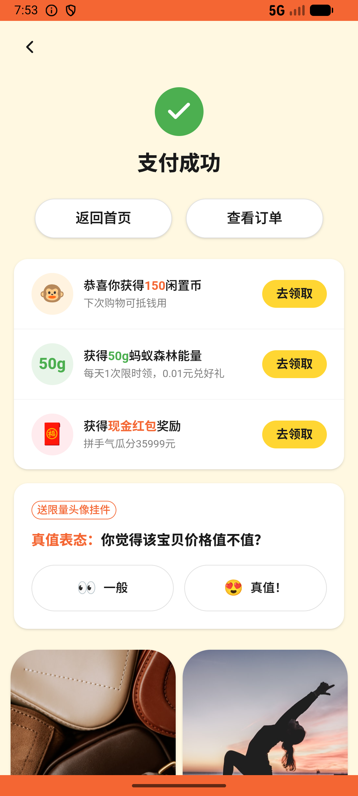
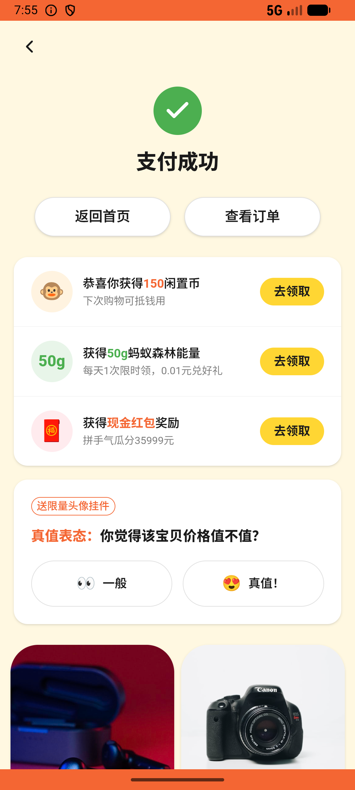

# order/v021_order_validator  ❌

- **Brand**: `xianzhiershouwang`
- **Class**: `XianzhiershouwangOrderV021OrderValidatorTask`
- **Pass@3**: **0/3**  (score = 0.00)
- **Elapsed**: 354s (~5.9 min)
- **Model**: `doubao-seed-2-0-lite-260428`
- **Raw log**: [./raw_logs/XianzhiershouwangOrderV021OrderValidatorTask.log](./raw_logs/XianzhiershouwangOrderV021OrderValidatorTask.log)
- **Generated**: 2026-06-02T09:44:46+08:00

## Task Goal

> 【当前账户档案】账号：zhangsan@example.com；昵称：张三；支付密码：无需密码，如需支付直接确认即可；默认收货地址（JSON）：{"recipient": "张三", "phone": "13800138000", "address": "上海市 上海市 浦东新区 陆家嘴环路1000号"}。请基于以上档案打开 com.xianzhiershouwang 并完成以下任务：那个PS5光驱版国行带2手柄有充电器的，别直接买，先私信卖家砍砍价，等他给优惠价了再微信买

## Attempts

| # | Outcome | Steps | Terminated | Reason | Start → End |
|---|---------|-------|------------|--------|-------------|
| 1 | ❌ failed | 16 | answer | 存在放弃付款的订单痕迹（pending或cancelled）: 未找到放弃付款产生的 pending/cancelled 订单; 对话中有系统通知（放弃付款事件）: 未找到放弃付款的系统通知消息 | 2026-06-02 07:51:46 → 2026-06-02 07:53:43 |
| 2 | ❌ failed | 16 | answer | 存在放弃付款的订单痕迹（pending或cancelled）: 未找到放弃付款产生的 pending/cancelled 订单; 对话中有系统通知（放弃付款事件）: 未找到放弃付款的系统通知消息 | 2026-06-02 07:53:43 → 2026-06-02 07:55:43 |
| 3 | ❌ failed | 16 | answer | 存在放弃付款的订单痕迹（pending或cancelled）: 未找到放弃付款产生的 pending/cancelled 订单; 对话中有系统通知（放弃付款事件）: 未找到放弃付款的系统通知消息 | 2026-06-02 07:55:43 → 2026-06-02 07:57:40 |

## Failure Details

### Episode 1 — ❌ failed

- steps_used: `16`
- terminated_reason: `answer`
- reason:

  ```
  存在放弃付款的订单痕迹（pending或cancelled）: 未找到放弃付款产生的 pending/cancelled 订单; 对话中有系统通知（放弃付款事件）: 未找到放弃付款的系统通知消息
  ```
- death shot: 
  - state: [`./death_shots/XianzhiershouwangOrderV021OrderValidatorTask/episode_001/step_016.json`](./death_shots/XianzhiershouwangOrderV021OrderValidatorTask/episode_001/step_016.json)
  - digest: [`episode_digest.md`](./death_shots/XianzhiershouwangOrderV021OrderValidatorTask/episode_001/episode_digest.md)

### Episode 2 — ❌ failed

- steps_used: `16`
- terminated_reason: `answer`
- reason:

  ```
  存在放弃付款的订单痕迹（pending或cancelled）: 未找到放弃付款产生的 pending/cancelled 订单; 对话中有系统通知（放弃付款事件）: 未找到放弃付款的系统通知消息
  ```
- death shot: 
  - state: [`./death_shots/XianzhiershouwangOrderV021OrderValidatorTask/episode_002/step_016.json`](./death_shots/XianzhiershouwangOrderV021OrderValidatorTask/episode_002/step_016.json)
  - digest: [`episode_digest.md`](./death_shots/XianzhiershouwangOrderV021OrderValidatorTask/episode_002/episode_digest.md)

### Episode 3 — ❌ failed

- steps_used: `16`
- terminated_reason: `answer`
- reason:

  ```
  存在放弃付款的订单痕迹（pending或cancelled）: 未找到放弃付款产生的 pending/cancelled 订单; 对话中有系统通知（放弃付款事件）: 未找到放弃付款的系统通知消息
  ```
- death shot: 
  - state: [`./death_shots/XianzhiershouwangOrderV021OrderValidatorTask/episode_003/step_016.json`](./death_shots/XianzhiershouwangOrderV021OrderValidatorTask/episode_003/step_016.json)
  - digest: [`episode_digest.md`](./death_shots/XianzhiershouwangOrderV021OrderValidatorTask/episode_003/episode_digest.md)

---

> 本摘要由 `sengclaw/scripts/pipeline/log_summarizer.py` 自动生成。 原始完整 log 见上方 Raw log 链接（含每 step 的 messages / tool_call / screenshot 引用）。
