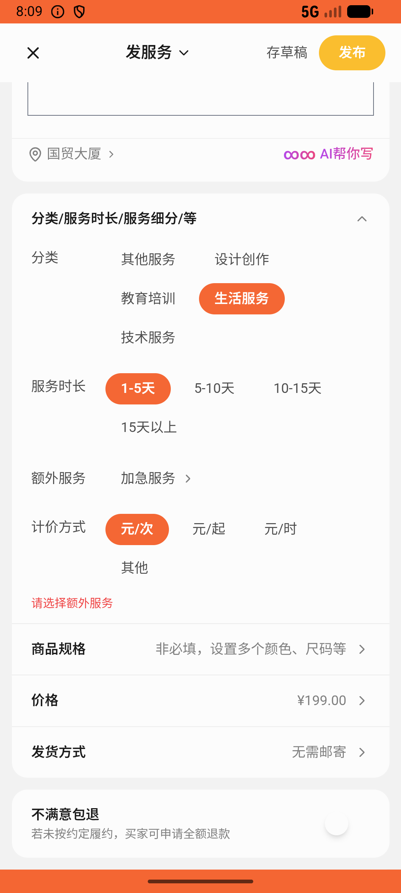

# recycle/v003_recycle_validator  ⚠️

- **Brand**: `xianzhiershouwang`
- **Class**: `XianzhiershouwangRecycleV003RecycleValidatorTask`
- **Pass@3**: **2/3**  (score = 1.00)
- **Elapsed**: 833s (~13.9 min)
- **Model**: `doubao-seed-2-0-lite-260428`
- **Raw log**: [./raw_logs/XianzhiershouwangRecycleV003RecycleValidatorTask.log](./raw_logs/XianzhiershouwangRecycleV003RecycleValidatorTask.log)
- **Generated**: 2026-06-02T09:44:47+08:00

## Task Goal

> 【当前账户档案】账号：zhangsan@example.com；昵称：张三；支付密码：无需密码，如需支付直接确认即可；默认收货地址（JSON）：{"recipient": "张三", "phone": "13800138000", "address": "上海市 上海市 浦东新区 陆家嘴环路1000号"}。请基于以上档案打开 com.xianzhiershouwang 并完成以下任务：帮我发个家政服务帖子，标题「专业深度保洁 上门服务」，写上全屋深度清洁、厨房去油、卫生间除垢，定价199，服务地点北京

## Attempts

| # | Outcome | Steps | Terminated | Reason | Start → End |
|---|---------|-------|------------|--------|-------------|
| 1 | ❌ failed | 44 | answer | 张三发布了「专业深度保洁 上门服务」帖子: 未找到包含"保洁"关键词的服务帖子（标题/描述/分类均未匹配） | 2026-06-02 08:04:23 → 2026-06-02 08:09:06 |
| 2 | ✅ passed | 41 | answer | – | 2026-06-02 08:09:06 → 2026-06-02 08:13:48 |
| 3 | ✅ passed | 39 | answer | – | 2026-06-02 08:13:48 → 2026-06-02 08:18:16 |

## Failure Details

### Episode 1 — ❌ failed

- steps_used: `44`
- terminated_reason: `answer`
- reason:

  ```
  张三发布了「专业深度保洁 上门服务」帖子: 未找到包含"保洁"关键词的服务帖子（标题/描述/分类均未匹配）
  ```
- death shot: 
  - state: [`./death_shots/XianzhiershouwangRecycleV003RecycleValidatorTask/episode_001/step_044.json`](./death_shots/XianzhiershouwangRecycleV003RecycleValidatorTask/episode_001/step_044.json)
  - digest: [`episode_digest.md`](./death_shots/XianzhiershouwangRecycleV003RecycleValidatorTask/episode_001/episode_digest.md)

---

> 本摘要由 `sengclaw/scripts/pipeline/log_summarizer.py` 自动生成。 原始完整 log 见上方 Raw log 链接（含每 step 的 messages / tool_call / screenshot 引用）。
