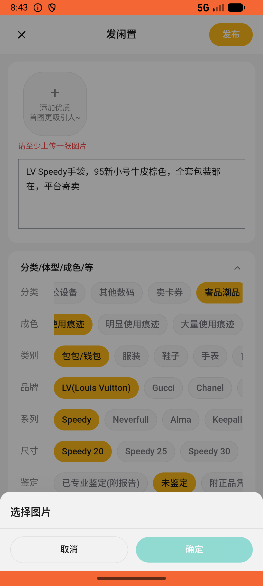
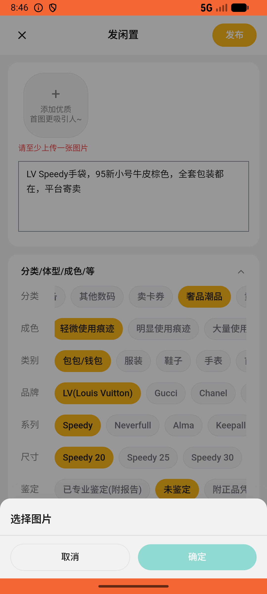

# recycle/v013_recycle_validator  ⚠️

- **Brand**: `xianzhiershouwang`
- **Class**: `XianzhiershouwangRecycleV013RecycleValidatorTask`
- **Pass@3**: **1/3**  (score = 1.00)
- **Elapsed**: 875s (~14.6 min)
- **Model**: `doubao-seed-2-0-lite-260428`
- **Raw log**: [./raw_logs/XianzhiershouwangRecycleV013RecycleValidatorTask.log](./raw_logs/XianzhiershouwangRecycleV013RecycleValidatorTask.log)
- **Generated**: 2026-06-02T09:44:47+08:00

## Task Goal

> 【当前账户档案】账号：zhangsan@example.com；昵称：张三；支付密码：无需密码，如需支付直接确认即可；默认收货地址（JSON）：{"recipient": "张三", "phone": "13800138000", "address": "上海市 上海市 浦东新区 陆家嘴环路1000号"}。请基于以上档案打开 com.xianzhiershouwang 并完成以下任务：我有个LV Speedy手袋想放平台寄卖，95新小号牛皮棕色，全套包装都在，帮我提交一下

## Attempts

| # | Outcome | Steps | Terminated | Reason | Start → End |
|---|---------|-------|------------|--------|-------------|
| 1 | ❌ failed | 34 | answer | 寄卖订单已创建且关联Louis Vuitton Speedy: 未找到 Louis Vuitton Speedy 的寄卖订单 | 2026-06-02 08:39:11 → 2026-06-02 08:43:36 |
| 2 | ❌ failed | 28 | answer | 寄卖订单已创建且关联Louis Vuitton Speedy: 未找到 Louis Vuitton Speedy 的寄卖订单 | 2026-06-02 08:43:36 → 2026-06-02 08:46:57 |
| 3 | ✅ passed | 48 | answer | – | 2026-06-02 08:46:57 → 2026-06-02 08:53:46 |

## Failure Details

### Episode 1 — ❌ failed

- steps_used: `34`
- terminated_reason: `answer`
- reason:

  ```
  寄卖订单已创建且关联Louis Vuitton Speedy: 未找到 Louis Vuitton Speedy 的寄卖订单
  ```
- death shot: 
  - state: [`./death_shots/XianzhiershouwangRecycleV013RecycleValidatorTask/episode_001/step_034.json`](./death_shots/XianzhiershouwangRecycleV013RecycleValidatorTask/episode_001/step_034.json)
  - digest: [`episode_digest.md`](./death_shots/XianzhiershouwangRecycleV013RecycleValidatorTask/episode_001/episode_digest.md)

### Episode 2 — ❌ failed

- steps_used: `28`
- terminated_reason: `answer`
- reason:

  ```
  寄卖订单已创建且关联Louis Vuitton Speedy: 未找到 Louis Vuitton Speedy 的寄卖订单
  ```
- death shot: 
  - state: [`./death_shots/XianzhiershouwangRecycleV013RecycleValidatorTask/episode_002/step_028.json`](./death_shots/XianzhiershouwangRecycleV013RecycleValidatorTask/episode_002/step_028.json)
  - digest: [`episode_digest.md`](./death_shots/XianzhiershouwangRecycleV013RecycleValidatorTask/episode_002/episode_digest.md)

---

> 本摘要由 `sengclaw/scripts/pipeline/log_summarizer.py` 自动生成。 原始完整 log 见上方 Raw log 链接（含每 step 的 messages / tool_call / screenshot 引用）。
