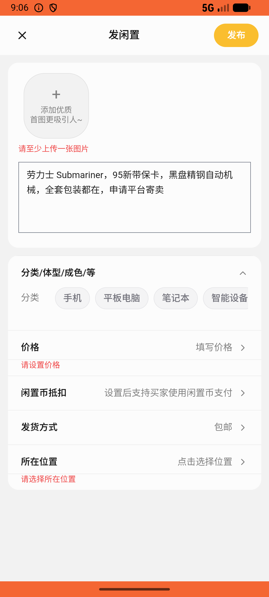
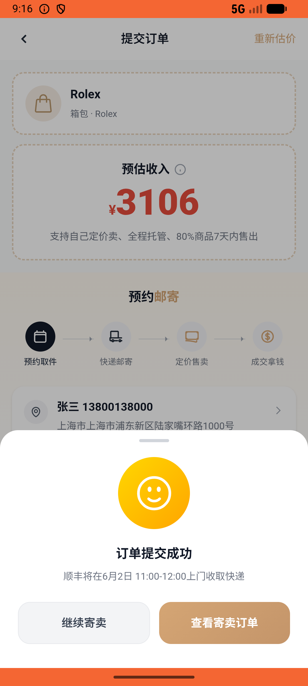

# recycle/v016_recycle_validator  ⚠️

- **Brand**: `xianzhiershouwang`
- **Class**: `XianzhiershouwangRecycleV016RecycleValidatorTask`
- **Pass@3**: **1/3**  (score = 1.00)
- **Elapsed**: 647s (~10.8 min)
- **Model**: `doubao-seed-2-0-lite-260428`
- **Raw log**: [./raw_logs/XianzhiershouwangRecycleV016RecycleValidatorTask.log](./raw_logs/XianzhiershouwangRecycleV016RecycleValidatorTask.log)
- **Generated**: 2026-06-02T09:44:47+08:00

## Task Goal

> 【当前账户档案】账号：zhangsan@example.com；昵称：张三；支付密码：无需密码，如需支付直接确认即可；默认收货地址（JSON）：{"recipient": "张三", "phone": "13800138000", "address": "上海市 上海市 浦东新区 陆家嘴环路1000号"}。请基于以上档案打开 com.xianzhiershouwang 并完成以下任务：我有块劳力士 Submariner 想平台寄卖，95新带保卡，黑盘精钢自动机械的，全套包装都在，帮我提交一下

## Attempts

| # | Outcome | Steps | Terminated | Reason | Start → End |
|---|---------|-------|------------|--------|-------------|
| 1 | ❌ failed | 9 | answer | 寄卖订单已创建且关联劳力士 Submariner: 未找到劳力士 Submariner 的寄卖订单 | 2026-06-02 09:05:33 → 2026-06-02 09:06:42 |
| 2 | ✅ passed | 28 | answer | – | 2026-06-02 09:06:42 → 2026-06-02 09:10:14 |
| 3 | ❌ failed | 39 | answer | 寄卖订单已创建且关联劳力士 Submariner: 未找到劳力士 Submariner 的寄卖订单 | 2026-06-02 09:10:14 → 2026-06-02 09:16:20 |

## Failure Details

### Episode 1 — ❌ failed

- steps_used: `9`
- terminated_reason: `answer`
- reason:

  ```
  寄卖订单已创建且关联劳力士 Submariner: 未找到劳力士 Submariner 的寄卖订单
  ```
- death shot: 
  - state: [`./death_shots/XianzhiershouwangRecycleV016RecycleValidatorTask/episode_001/step_009.json`](./death_shots/XianzhiershouwangRecycleV016RecycleValidatorTask/episode_001/step_009.json)
  - digest: [`episode_digest.md`](./death_shots/XianzhiershouwangRecycleV016RecycleValidatorTask/episode_001/episode_digest.md)

### Episode 3 — ❌ failed

- steps_used: `39`
- terminated_reason: `answer`
- reason:

  ```
  寄卖订单已创建且关联劳力士 Submariner: 未找到劳力士 Submariner 的寄卖订单
  ```
- death shot: 
  - state: [`./death_shots/XianzhiershouwangRecycleV016RecycleValidatorTask/episode_003/step_039.json`](./death_shots/XianzhiershouwangRecycleV016RecycleValidatorTask/episode_003/step_039.json)
  - digest: [`episode_digest.md`](./death_shots/XianzhiershouwangRecycleV016RecycleValidatorTask/episode_003/episode_digest.md)

---

> 本摘要由 `sengclaw/scripts/pipeline/log_summarizer.py` 自动生成。 原始完整 log 见上方 Raw log 链接（含每 step 的 messages / tool_call / screenshot 引用）。
