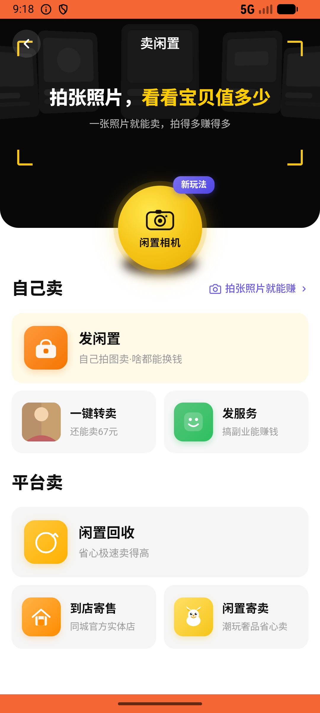
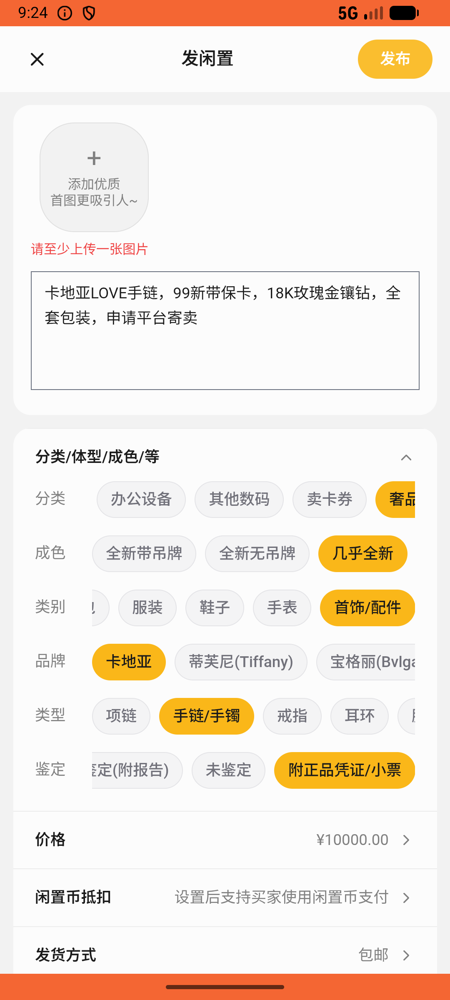
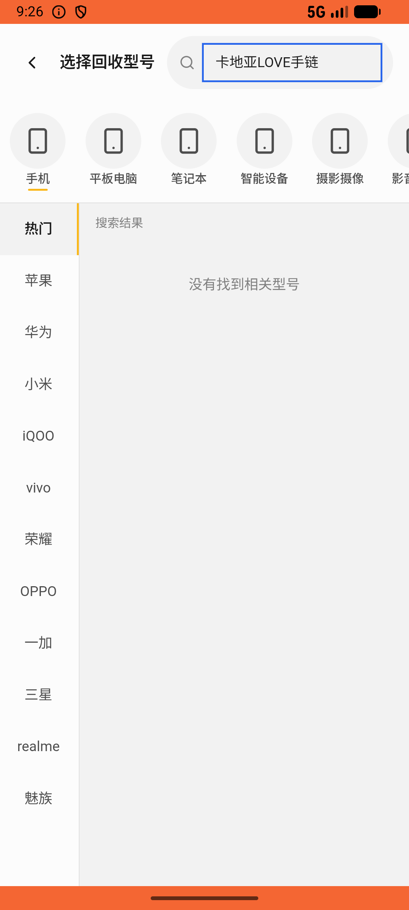

# recycle/v017_recycle_validator  ❌

- **Brand**: `xianzhiershouwang`
- **Class**: `XianzhiershouwangRecycleV017RecycleValidatorTask`
- **Pass@3**: **0/3**  (score = 0.00)
- **Elapsed**: 551s (~9.2 min)
- **Model**: `doubao-seed-2-0-lite-260428`
- **Raw log**: [./raw_logs/XianzhiershouwangRecycleV017RecycleValidatorTask.log](./raw_logs/XianzhiershouwangRecycleV017RecycleValidatorTask.log)
- **Generated**: 2026-06-02T09:44:47+08:00

## Task Goal

> 【当前账户档案】账号：zhangsan@example.com；昵称：张三；支付密码：无需密码，如需支付直接确认即可；默认收货地址（JSON）：{"recipient": "张三", "phone": "13800138000", "address": "上海市 上海市 浦东新区 陆家嘴环路1000号"}。请基于以上档案打开 com.xianzhiershouwang 并完成以下任务：我有条卡地亚LOVE手链想平台寄卖，99新带保卡，18K玫瑰金镶钻的，全套包装，帮我提交一下

## Attempts

| # | Outcome | Steps | Terminated | Reason | Start → End |
|---|---------|-------|------------|--------|-------------|
| 1 | ❌ failed | 12 | answer | 寄卖订单已创建且关联卡地亚 LOVE: 未找到卡地亚 LOVE 的寄卖订单 | 2026-06-02 09:17:01 → 2026-06-02 09:18:40 |
| 2 | ❌ failed | 39 | answer | 寄卖订单已创建且关联卡地亚 LOVE: 未找到卡地亚 LOVE 的寄卖订单 | 2026-06-02 09:18:40 → 2026-06-02 09:24:13 |
| 3 | ❌ failed | 14 | answer | 寄卖订单已创建且关联卡地亚 LOVE: 未找到卡地亚 LOVE 的寄卖订单 | 2026-06-02 09:24:14 → 2026-06-02 09:26:12 |

## Failure Details

### Episode 1 — ❌ failed

- steps_used: `12`
- terminated_reason: `answer`
- reason:

  ```
  寄卖订单已创建且关联卡地亚 LOVE: 未找到卡地亚 LOVE 的寄卖订单
  ```
- death shot: 
  - state: [`./death_shots/XianzhiershouwangRecycleV017RecycleValidatorTask/episode_001/step_012.json`](./death_shots/XianzhiershouwangRecycleV017RecycleValidatorTask/episode_001/step_012.json)
  - digest: [`episode_digest.md`](./death_shots/XianzhiershouwangRecycleV017RecycleValidatorTask/episode_001/episode_digest.md)

### Episode 2 — ❌ failed

- steps_used: `39`
- terminated_reason: `answer`
- reason:

  ```
  寄卖订单已创建且关联卡地亚 LOVE: 未找到卡地亚 LOVE 的寄卖订单
  ```
- death shot: 
  - state: [`./death_shots/XianzhiershouwangRecycleV017RecycleValidatorTask/episode_002/step_039.json`](./death_shots/XianzhiershouwangRecycleV017RecycleValidatorTask/episode_002/step_039.json)
  - digest: [`episode_digest.md`](./death_shots/XianzhiershouwangRecycleV017RecycleValidatorTask/episode_002/episode_digest.md)

### Episode 3 — ❌ failed

- steps_used: `14`
- terminated_reason: `answer`
- reason:

  ```
  寄卖订单已创建且关联卡地亚 LOVE: 未找到卡地亚 LOVE 的寄卖订单
  ```
- death shot: 
  - state: [`./death_shots/XianzhiershouwangRecycleV017RecycleValidatorTask/episode_003/step_014.json`](./death_shots/XianzhiershouwangRecycleV017RecycleValidatorTask/episode_003/step_014.json)
  - digest: [`episode_digest.md`](./death_shots/XianzhiershouwangRecycleV017RecycleValidatorTask/episode_003/episode_digest.md)

---

> 本摘要由 `sengclaw/scripts/pipeline/log_summarizer.py` 自动生成。 原始完整 log 见上方 Raw log 链接（含每 step 的 messages / tool_call / screenshot 引用）。
