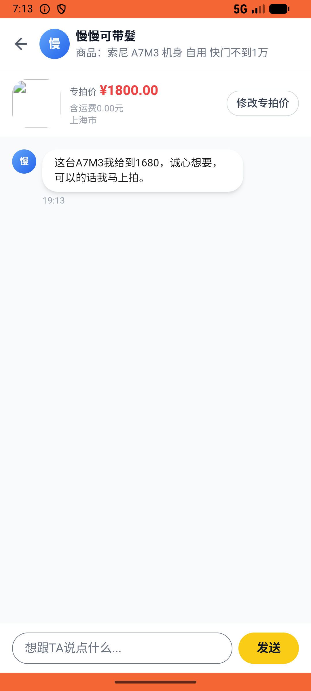
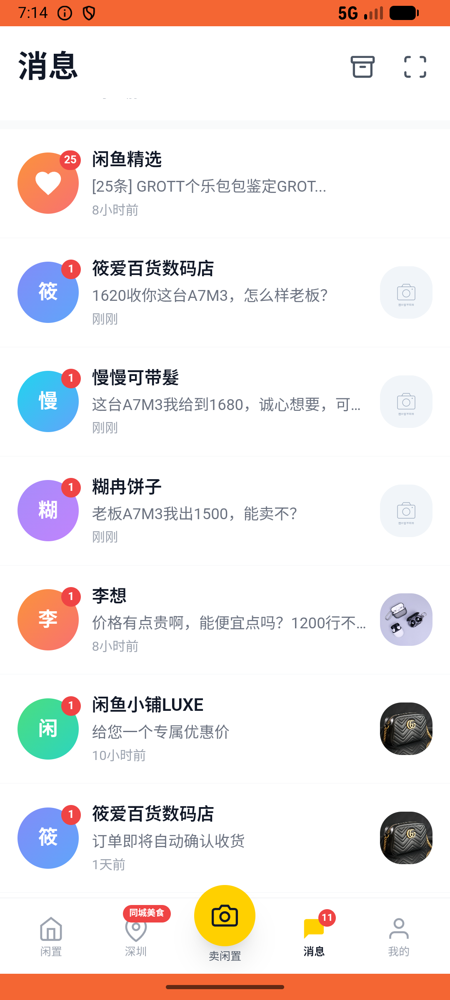
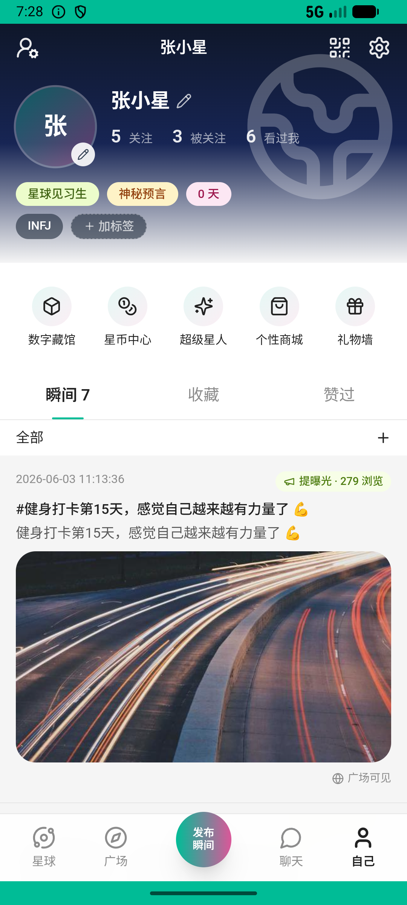

# message/v017_message_validator  ❌

- **Brand**: `xianzhiershouwang`
- **Class**: `XianzhiershouwangMessageV017MessageValidatorTask`
- **Pass@3**: **0/3**  (score = 0.00)
- **Elapsed**: 924s (~15.4 min)
- **Model**: `doubao-seed-2-0-lite-260428`
- **Raw log**: [./raw_logs/XianzhiershouwangMessageV017MessageValidatorTask.log](./raw_logs/XianzhiershouwangMessageV017MessageValidatorTask.log)
- **Generated**: 2026-06-05T02:06:05+08:00

## Task Goal

> 【当前账户档案】账号：zhangsan@example.com；昵称：张三；支付密码：无需密码，如需支付直接确认即可；默认收货地址（JSON）：{"recipient": "张三", "phone": "13800138000", "address": "上海市 上海市 浦东新区 陆家嘴环路1000号"}。请基于以上档案打开 com.xianzhiershouwang 并完成以下任务：我那台索尼A7M3有三个人来问价了，谁出得最高就卖给谁，帮我回复那个人说按他的价成交让他下单

> 🔴 **基建重试记录**：本 task 发生 1 次基建重试（原因：ep2:Connection aborted, ep3:Connection aborted + fullrerun_after_incremental），重试后仍全部失败，**建议排查 infra 而非 Agent 能力**。

## Attempts

| # | Outcome | Steps | Terminated | Reason | Start → End |
|---|---------|-------|------------|--------|-------------|
| 1 | 💥 error | 0 | exception | exception: ('Connection aborted.', RemoteDisconnected('Remote end closed connection without response')) | 2026-06-04 19:13:08 → 2026-06-04 19:13:46 |
| 2 | 💥 error | 0 | exception | exception: 404 Not Found for url: http://localhost:6800/step \\| detail: No available devices found | 2026-06-04 19:13:51 → 2026-06-04 19:14:29 |
| 3 | ⏰ timeout | 80 | max_steps | task 'XianzhiershouwangMessageV017MessageValidatorTask' was not initialized; current initialized task is 'XingqiushejiaowangChatV004Unfol... | 2026-06-04 19:14:59 → 2026-06-04 19:28:31 |

## Failure Details

### Episode 1 — 💥 error

- steps_used: `0`
- terminated_reason: `exception`
- reason:

  ```
  exception: ('Connection aborted.', RemoteDisconnected('Remote end closed connection without response'))
  ```
- death shot: 
  - state: [`./death_shots/XianzhiershouwangMessageV017MessageValidatorTask/episode_001/step_004.json`](./death_shots/XianzhiershouwangMessageV017MessageValidatorTask/episode_001/step_004.json)
  - digest: [`episode_digest.md`](./death_shots/XianzhiershouwangMessageV017MessageValidatorTask/episode_001/episode_digest.md)

### Episode 2 — 💥 error

- steps_used: `0`
- terminated_reason: `exception`
- reason:

  ```
  exception: 404 Not Found for url: http://localhost:6800/step | detail: No available devices found
  ```
- death shot: 
  - state: [`./death_shots/XianzhiershouwangMessageV017MessageValidatorTask/episode_002/step_003.json`](./death_shots/XianzhiershouwangMessageV017MessageValidatorTask/episode_002/step_003.json)
  - digest: [`episode_digest.md`](./death_shots/XianzhiershouwangMessageV017MessageValidatorTask/episode_002/episode_digest.md)

### Episode 3 — ⏰ timeout

- steps_used: `80`
- terminated_reason: `max_steps`
- reason:

  ```
  task 'XianzhiershouwangMessageV017MessageValidatorTask' was not initialized; current initialized task is 'XingqiushejiaowangChatV004UnfollowTask'
  ```
- death shot: 
  - state: [`./death_shots/XianzhiershouwangMessageV017MessageValidatorTask/episode_003/step_080.json`](./death_shots/XianzhiershouwangMessageV017MessageValidatorTask/episode_003/step_080.json)
  - digest: [`episode_digest.md`](./death_shots/XianzhiershouwangMessageV017MessageValidatorTask/episode_003/episode_digest.md)

---

> 本摘要由 `sengclaw/scripts/pipeline/log_summarizer.py` 自动生成。 原始完整 log 见上方 Raw log 链接（含每 step 的 messages / tool_call / screenshot 引用）。
