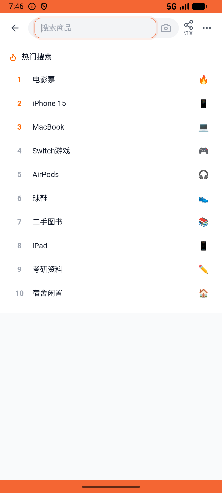
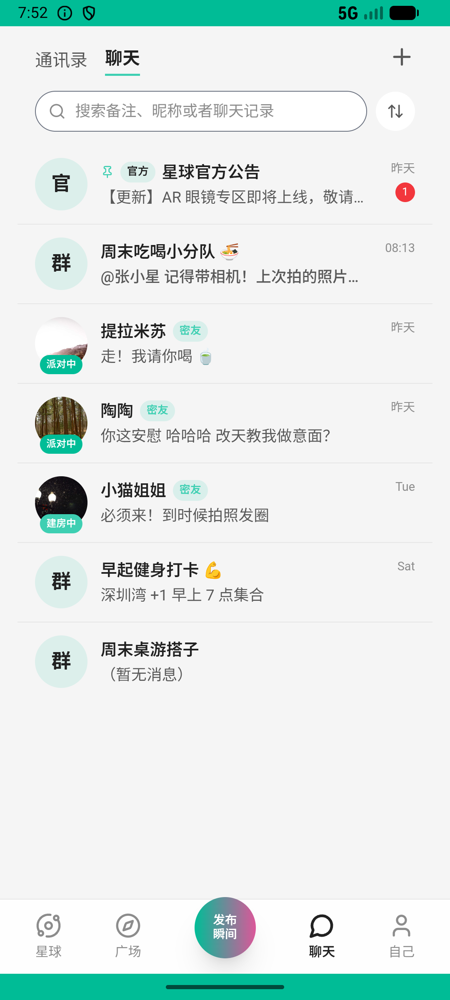

# order/v022_order_validator  ❌

- **Brand**: `xianzhiershouwang`
- **Class**: `XianzhiershouwangOrderV022OrderValidatorTask`
- **Pass@3**: **0/3**  (score = 0.00)
- **Elapsed**: 834s (~13.9 min)
- **Model**: `doubao-seed-2-0-lite-260428`
- **Raw log**: [./raw_logs/XianzhiershouwangOrderV022OrderValidatorTask.log](./raw_logs/XianzhiershouwangOrderV022OrderValidatorTask.log)
- **Generated**: 2026-06-05T02:06:05+08:00

## Task Goal

> 【当前账户档案】账号：zhangsan@example.com；昵称：张三；支付密码：无需密码，如需支付直接确认即可；默认收货地址（JSON）：{"recipient": "张三", "phone": "13800138000", "address": "上海市 上海市 浦东新区 陆家嘴环路1000号"}。请基于以上档案打开 com.xianzhiershouwang 并完成以下任务：我那个双立人火锅锅具套装到货了，帮我去确认收货

## Attempts

| # | Outcome | Steps | Terminated | Reason | Start → End |
|---|---------|-------|------------|--------|-------------|
| 1 | ❌ failed | 16 | answer | 订单状态不再是 shipped（已处理确认收货）: 订单仍为 shipped 状态，未执行确认收货操作; 订单最终状态为 completed: 预期 completed，实际 'shipped' | 2026-06-04 19:44:33 → 2026-06-04 19:46:56 |
| 2 | ❌ failed | 34 | answer | 订单状态不再是 shipped（已处理确认收货）: 订单仍为 shipped 状态，未执行确认收货操作; 订单最终状态为 completed: 预期 completed，实际 'shipped' | 2026-06-04 19:46:56 → 2026-06-04 19:52:26 |
| 3 | 💥 error | 0 | exception | exception: 404 Not Found for url: http://localhost:6800/screenshot?return_b64=True \\| detail: No available devices found | 2026-06-04 19:52:27 → 2026-06-04 19:58:27 |

## Failure Details

### Episode 1 — ❌ failed

- steps_used: `16`
- terminated_reason: `answer`
- reason:

  ```
  订单状态不再是 shipped（已处理确认收货）: 订单仍为 shipped 状态，未执行确认收货操作; 订单最终状态为 completed: 预期 completed，实际 'shipped'
  ```
- death shot: 
  - state: [`./death_shots/XianzhiershouwangOrderV022OrderValidatorTask/episode_001/step_016.json`](./death_shots/XianzhiershouwangOrderV022OrderValidatorTask/episode_001/step_016.json)
  - digest: [`episode_digest.md`](./death_shots/XianzhiershouwangOrderV022OrderValidatorTask/episode_001/episode_digest.md)

### Episode 2 — ❌ failed

- steps_used: `34`
- terminated_reason: `answer`
- reason:

  ```
  订单状态不再是 shipped（已处理确认收货）: 订单仍为 shipped 状态，未执行确认收货操作; 订单最终状态为 completed: 预期 completed，实际 'shipped'
  ```
- death shot: 
  - state: [`./death_shots/XianzhiershouwangOrderV022OrderValidatorTask/episode_002/step_034.json`](./death_shots/XianzhiershouwangOrderV022OrderValidatorTask/episode_002/step_034.json)
  - digest: [`episode_digest.md`](./death_shots/XianzhiershouwangOrderV022OrderValidatorTask/episode_002/episode_digest.md)

### Episode 3 — 💥 error

- steps_used: `0`
- terminated_reason: `exception`
- reason:

  ```
  exception: 404 Not Found for url: http://localhost:6800/screenshot?return_b64=True | detail: No available devices found
  ```
- death shot: 
  - state: [`./death_shots/XianzhiershouwangOrderV022OrderValidatorTask/episode_003/step_026.json`](./death_shots/XianzhiershouwangOrderV022OrderValidatorTask/episode_003/step_026.json)
  - digest: [`episode_digest.md`](./death_shots/XianzhiershouwangOrderV022OrderValidatorTask/episode_003/episode_digest.md)

---

> 本摘要由 `sengclaw/scripts/pipeline/log_summarizer.py` 自动生成。 原始完整 log 见上方 Raw log 链接（含每 step 的 messages / tool_call / screenshot 引用）。
