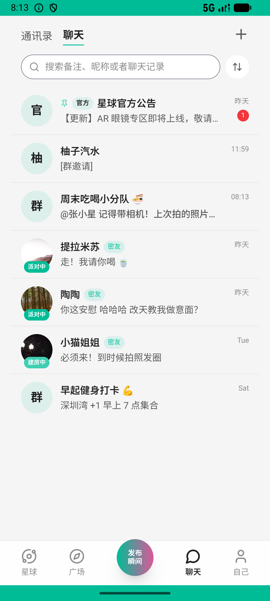
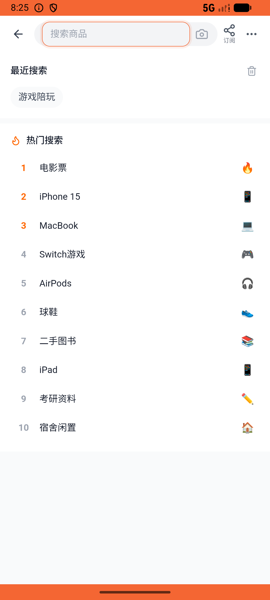
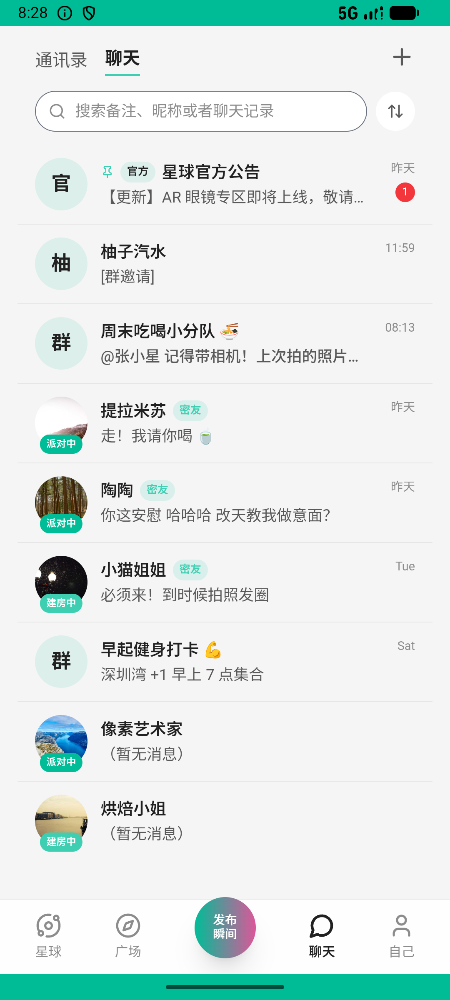

# order/v027_order_validator  ❌

- **Brand**: `xianzhiershouwang`
- **Class**: `XianzhiershouwangOrderV027OrderValidatorTask`
- **Pass@3**: **0/3**  (score = 0.00)
- **Elapsed**: 1769s (~29.5 min)
- **Model**: `doubao-seed-2-0-lite-260428`
- **Raw log**: [./raw_logs/XianzhiershouwangOrderV027OrderValidatorTask.log](./raw_logs/XianzhiershouwangOrderV027OrderValidatorTask.log)
- **Generated**: 2026-06-05T02:06:05+08:00

## Task Goal

> 【当前账户档案】账号：zhangsan@example.com；昵称：张三；支付密码：无需密码，如需支付直接确认即可；默认收货地址（JSON）：{"recipient": "张三", "phone": "13800138000", "address": "上海市 上海市 浦东新区 陆家嘴环路1000号"}。请基于以上档案打开 com.xianzhiershouwang 并完成以下任务：我想在神奇副业里的官方职业找个游戏陪玩，预算20以内，要那个热销的，买2小时，微信付

## Attempts

| # | Outcome | Steps | Terminated | Reason | Start → End |
|---|---------|-------|------------|--------|-------------|
| 1 | ⏰ timeout | 80 | max_steps | 订单商品为「王者荣耀陪玩上分1小时」: 未找到包含「王者荣耀陪玩」的订单。Agent 需要在预算20以内的产品中选择有「热销」标签的那个（王者荣耀¥15，而非和平精英¥12） | 2026-06-04 19:59:08 → 2026-06-04 20:13:53 |
| 2 | ❌ failed | 72 | answer | task 'XianzhiershouwangOrderV027OrderValidatorTask' was not initialized; current initialized task is 'XingqiushejiaowangGroupV002JoinNoAp... | 2026-06-04 20:13:53 → 2026-06-04 20:25:19 |
| 3 | ❌ failed | 21 | answer | 订单商品为「王者荣耀陪玩上分1小时」: 未找到包含「王者荣耀陪玩」的订单。Agent 需要在预算20以内的产品中选择有「热销」标签的那个（王者荣耀¥15，而非和平精英¥12） | 2026-06-04 20:25:19 → 2026-06-04 20:28:36 |

## Failure Details

### Episode 1 — ⏰ timeout

- steps_used: `80`
- terminated_reason: `max_steps`
- reason:

  ```
  订单商品为「王者荣耀陪玩上分1小时」: 未找到包含「王者荣耀陪玩」的订单。Agent 需要在预算20以内的产品中选择有「热销」标签的那个（王者荣耀¥15，而非和平精英¥12）
  ```
- death shot: 
  - state: [`./death_shots/XianzhiershouwangOrderV027OrderValidatorTask/episode_001/step_080.json`](./death_shots/XianzhiershouwangOrderV027OrderValidatorTask/episode_001/step_080.json)
  - digest: [`episode_digest.md`](./death_shots/XianzhiershouwangOrderV027OrderValidatorTask/episode_001/episode_digest.md)

### Episode 2 — ❌ failed

- steps_used: `72`
- terminated_reason: `answer`
- reason:

  ```
  task 'XianzhiershouwangOrderV027OrderValidatorTask' was not initialized; current initialized task is 'XingqiushejiaowangGroupV002JoinNoApprovalTask'
  ```
- death shot: 
  - state: [`./death_shots/XianzhiershouwangOrderV027OrderValidatorTask/episode_002/step_072.json`](./death_shots/XianzhiershouwangOrderV027OrderValidatorTask/episode_002/step_072.json)
  - digest: [`episode_digest.md`](./death_shots/XianzhiershouwangOrderV027OrderValidatorTask/episode_002/episode_digest.md)

### Episode 3 — ❌ failed

- steps_used: `21`
- terminated_reason: `answer`
- reason:

  ```
  订单商品为「王者荣耀陪玩上分1小时」: 未找到包含「王者荣耀陪玩」的订单。Agent 需要在预算20以内的产品中选择有「热销」标签的那个（王者荣耀¥15，而非和平精英¥12）
  ```
- death shot: 
  - state: [`./death_shots/XianzhiershouwangOrderV027OrderValidatorTask/episode_003/step_021.json`](./death_shots/XianzhiershouwangOrderV027OrderValidatorTask/episode_003/step_021.json)
  - digest: [`episode_digest.md`](./death_shots/XianzhiershouwangOrderV027OrderValidatorTask/episode_003/episode_digest.md)

---

> 本摘要由 `sengclaw/scripts/pipeline/log_summarizer.py` 自动生成。 原始完整 log 见上方 Raw log 链接（含每 step 的 messages / tool_call / screenshot 引用）。
