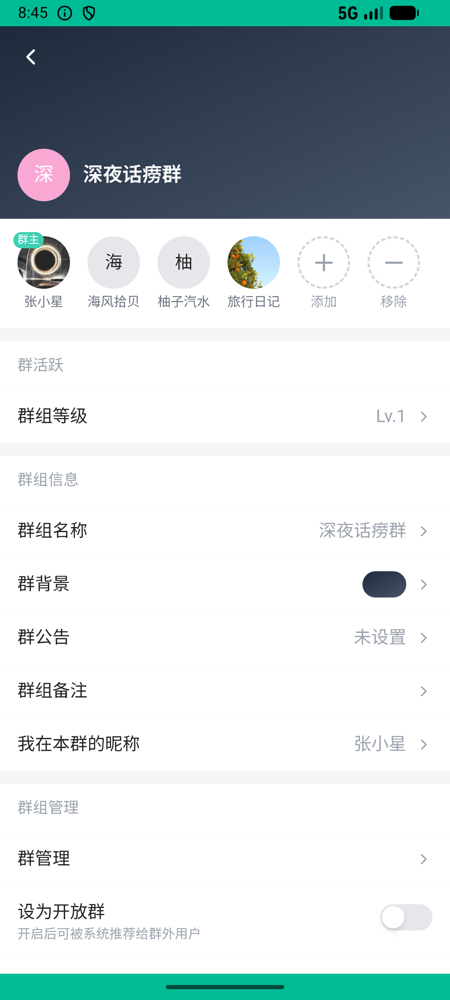

# order/v030_order_validator  ❌

- **Brand**: `xianzhiershouwang`
- **Class**: `XianzhiershouwangOrderV030OrderValidatorTask`
- **Pass@3**: **0/3**  (score = 0.00)
- **Elapsed**: 1141s (~19.0 min)
- **Model**: `doubao-seed-2-0-lite-260428`
- **Raw log**: [./raw_logs/XianzhiershouwangOrderV030OrderValidatorTask.log](./raw_logs/XianzhiershouwangOrderV030OrderValidatorTask.log)
- **Generated**: 2026-06-05T02:06:05+08:00

## Task Goal

> 【当前账户档案】账号：zhangsan@example.com；昵称：张三；支付密码：无需密码，如需支付直接确认即可；默认收货地址（JSON）：{"recipient": "张三", "phone": "13800138000", "address": "上海市 上海市 浦东新区 陆家嘴环路1000号"}。请基于以上档案打开 com.xianzhiershouwang 并完成以下任务：帮我搜个红米Turbo 4 Pro，我只敢买已验证卖家、要支持质保的，这里面挑最便宜那个支付宝下单

## Attempts

| # | Outcome | Steps | Terminated | Reason | Start → End |
|---|---------|-------|------------|--------|-------------|
| 1 | ❌ failed | 21 | answer | 订单关联到正解帖子（已验证+有质保中最便宜，¥3450）: 未找到对正解帖子(¥3450.0，已验证+180天质保)的订单。合格集为 ¥3450 与 ¥3800，应选最便宜的 ¥3450；最低价 ¥2999.0 未验证是陷阱。 | 2026-06-04 20:42:29 → 2026-06-04 20:45:30 |
| 2 | ❌ failed | 64 | answer | task 'XianzhiershouwangOrderV030OrderValidatorTask' was not initialized; current initialized task is 'XingqiushejiaowangGroupV003ToggleAp... | 2026-06-04 20:45:30 → 2026-06-04 20:55:35 |
| 3 | 💥 error | 0 | exception | exception: 404 Not Found for url: http://localhost:6800/step \\| detail: No available devices found | 2026-06-04 20:55:35 → 2026-06-04 21:01:29 |

## Failure Details

### Episode 1 — ❌ failed

- steps_used: `21`
- terminated_reason: `answer`
- reason:

  ```
  订单关联到正解帖子（已验证+有质保中最便宜，¥3450）: 未找到对正解帖子(¥3450.0，已验证+180天质保)的订单。合格集为 ¥3450 与 ¥3800，应选最便宜的 ¥3450；最低价 ¥2999.0 未验证是陷阱。
  ```
- death shot: 
  - state: [`./death_shots/XianzhiershouwangOrderV030OrderValidatorTask/episode_001/step_021.json`](./death_shots/XianzhiershouwangOrderV030OrderValidatorTask/episode_001/step_021.json)
  - digest: [`episode_digest.md`](./death_shots/XianzhiershouwangOrderV030OrderValidatorTask/episode_001/episode_digest.md)

### Episode 2 — ❌ failed

- steps_used: `64`
- terminated_reason: `answer`
- reason:

  ```
  task 'XianzhiershouwangOrderV030OrderValidatorTask' was not initialized; current initialized task is 'XingqiushejiaowangGroupV003ToggleApprovalTask'
  ```
- death shot: 
  - state: [`./death_shots/XianzhiershouwangOrderV030OrderValidatorTask/episode_002/step_064.json`](./death_shots/XianzhiershouwangOrderV030OrderValidatorTask/episode_002/step_064.json)
  - digest: [`episode_digest.md`](./death_shots/XianzhiershouwangOrderV030OrderValidatorTask/episode_002/episode_digest.md)

### Episode 3 — 💥 error

- steps_used: `0`
- terminated_reason: `exception`
- reason:

  ```
  exception: 404 Not Found for url: http://localhost:6800/step | detail: No available devices found
  ```
- death shot: 
  - state: [`./death_shots/XianzhiershouwangOrderV030OrderValidatorTask/episode_003/step_037.json`](./death_shots/XianzhiershouwangOrderV030OrderValidatorTask/episode_003/step_037.json)
  - digest: [`episode_digest.md`](./death_shots/XianzhiershouwangOrderV030OrderValidatorTask/episode_003/episode_digest.md)

---

> 本摘要由 `sengclaw/scripts/pipeline/log_summarizer.py` 自动生成。 原始完整 log 见上方 Raw log 链接（含每 step 的 messages / tool_call / screenshot 引用）。
