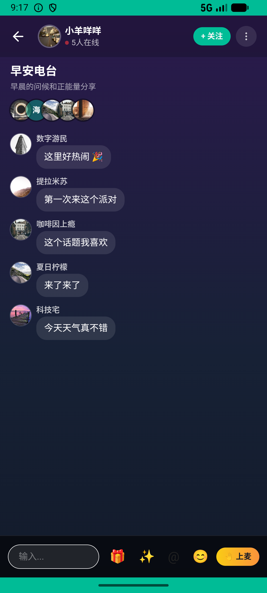

# post/v028_post_validator  ❌

- **Brand**: `xianzhiershouwang`
- **Class**: `XianzhiershouwangPostV028PostValidatorTask`
- **Pass@3**: **0/3**  (score = 0.00)
- **Elapsed**: 1190s (~19.8 min)
- **Model**: `doubao-seed-2-0-lite-260428`
- **Raw log**: [./raw_logs/XianzhiershouwangPostV028PostValidatorTask.log](./raw_logs/XianzhiershouwangPostV028PostValidatorTask.log)
- **Generated**: 2026-06-05T02:06:05+08:00

## Task Goal

> 【当前账户档案】账号：zhangsan@example.com；昵称：张三；支付密码：无需密码，如需支付直接确认即可；默认收货地址（JSON）：{"recipient": "张三", "phone": "13800138000", "address": "上海市 上海市 浦东新区 陆家嘴环路1000号"}。请基于以上档案打开 com.xianzhiershouwang 并完成以下任务：帮我发个闲置帖，出一副雷蛇黑鲨V2 X游戏耳机，7.1声道的自用一年九成新，图片我拍好了你帮我传上去，卖180块，分类放智能设备，不包邮。发完帮我在次元优惠开启5%折扣，开完后又不想卖了帮我下架了

## Attempts

| # | Outcome | Steps | Terminated | Reason | Start → End |
|---|---------|-------|------------|--------|-------------|
| 1 | ⏰ timeout | 80 | max_steps | task 'XianzhiershouwangPostV028PostValidatorTask' was not initialized; current initialized task is 'XingqiushejiaowangGroupV004ApplyWithR... | 2026-06-04 21:02:10 → 2026-06-04 21:14:22 |
| 2 | ❌ failed | 18 | answer | 帖子已创建（标题含「雷蛇黑鲨V2 X」）: 未找到标题含「雷蛇黑鲨V2 X」的帖子 | 2026-06-04 21:14:22 → 2026-06-04 21:17:35 |
| 3 | ❌ failed | 27 | answer | 帖子已创建（标题含「雷蛇黑鲨V2 X」）: 未找到标题含「雷蛇黑鲨V2 X」的帖子 | 2026-06-04 21:17:35 → 2026-06-04 21:22:00 |

## Failure Details

### Episode 1 — ⏰ timeout

- steps_used: `80`
- terminated_reason: `max_steps`
- reason:

  ```
  task 'XianzhiershouwangPostV028PostValidatorTask' was not initialized; current initialized task is 'XingqiushejiaowangGroupV004ApplyWithReasonTask'
  ```
- death shot: 
  - state: [`./death_shots/XianzhiershouwangPostV028PostValidatorTask/episode_001/step_080.json`](./death_shots/XianzhiershouwangPostV028PostValidatorTask/episode_001/step_080.json)
  - digest: [`episode_digest.md`](./death_shots/XianzhiershouwangPostV028PostValidatorTask/episode_001/episode_digest.md)

### Episode 2 — ❌ failed

- steps_used: `18`
- terminated_reason: `answer`
- reason:

  ```
  帖子已创建（标题含「雷蛇黑鲨V2 X」）: 未找到标题含「雷蛇黑鲨V2 X」的帖子
  ```
- death shot: 
  - state: [`./death_shots/XianzhiershouwangPostV028PostValidatorTask/episode_002/step_018.json`](./death_shots/XianzhiershouwangPostV028PostValidatorTask/episode_002/step_018.json)
  - digest: [`episode_digest.md`](./death_shots/XianzhiershouwangPostV028PostValidatorTask/episode_002/episode_digest.md)

### Episode 3 — ❌ failed

- steps_used: `27`
- terminated_reason: `answer`
- reason:

  ```
  帖子已创建（标题含「雷蛇黑鲨V2 X」）: 未找到标题含「雷蛇黑鲨V2 X」的帖子
  ```
- death shot: 
  - state: [`./death_shots/XianzhiershouwangPostV028PostValidatorTask/episode_003/step_027.json`](./death_shots/XianzhiershouwangPostV028PostValidatorTask/episode_003/step_027.json)
  - digest: [`episode_digest.md`](./death_shots/XianzhiershouwangPostV028PostValidatorTask/episode_003/episode_digest.md)

---

> 本摘要由 `sengclaw/scripts/pipeline/log_summarizer.py` 自动生成。 原始完整 log 见上方 Raw log 链接（含每 step 的 messages / tool_call / screenshot 引用）。
