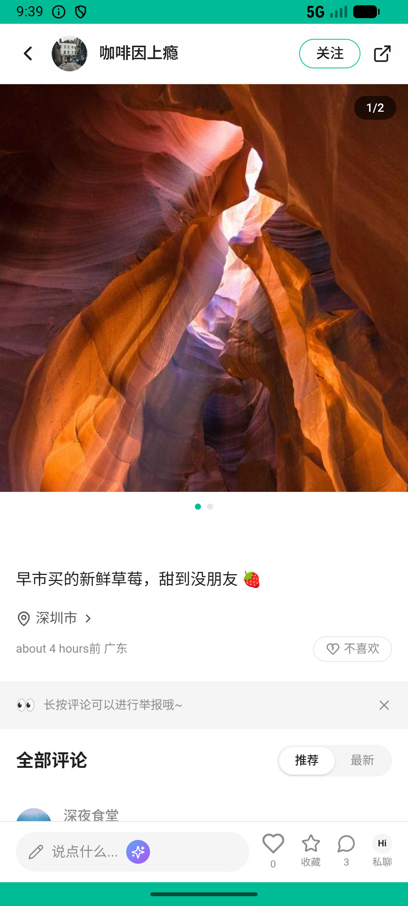

# post/v032_post_validator  ❌

- **Brand**: `xianzhiershouwang`
- **Class**: `XianzhiershouwangPostV032PostValidatorTask`
- **Pass@3**: **0/3**  (score = 0.00)
- **Elapsed**: 504s (~8.4 min)
- **Model**: `doubao-seed-2-0-lite-260428`
- **Raw log**: [./raw_logs/XianzhiershouwangPostV032PostValidatorTask.log](./raw_logs/XianzhiershouwangPostV032PostValidatorTask.log)
- **Generated**: 2026-06-05T02:06:05+08:00

## Task Goal

> 【当前账户档案】账号：zhangsan@example.com；昵称：张三；支付密码：无需密码，如需支付直接确认即可；默认收货地址（JSON）：{"recipient": "张三", "phone": "13800138000", "address": "上海市 上海市 浦东新区 陆家嘴环路1000号"}。请基于以上档案打开 com.xianzhiershouwang 并完成以下任务：索尼XM5帮我下架——算了先别，打个8折试试看能不能卖

## Attempts

| # | Outcome | Steps | Terminated | Reason | Start → End |
|---|---------|-------|------------|--------|-------------|
| 1 | ❌ failed | 18 | answer | 索尼XM5帖子折扣设为 20%（打8折）: 预期 discount_percent=20，实际为 0; 帖子原始价格未被直接修改: 帖子 price 被修改为 799.0，应保持 1580.0（折扣通过 discount_percent 实现） | 2026-06-04 21:34:58 → 2026-06-04 21:37:42 |
| 2 | ❌ failed | 15 | answer | 索尼XM5帖子折扣设为 20%（打8折）: 预期 discount_percent=20，实际为 0; 帖子原始价格未被直接修改: 帖子 price 被修改为 799.0，应保持 1580.0（折扣通过 discount_percent 实现） | 2026-06-04 21:37:42 → 2026-06-04 21:39:43 |
| 3 | ❌ failed | 24 | answer | 索尼XM5帖子折扣设为 20%（打8折）: 预期 discount_percent=20，实际为 0; 帖子原始价格未被直接修改: 帖子 price 被修改为 799.0，应保持 1580.0（折扣通过 discount_percent 实现） | 2026-06-04 21:39:43 → 2026-06-04 21:43:22 |

## Failure Details

### Episode 1 — ❌ failed

- steps_used: `18`
- terminated_reason: `answer`
- reason:

  ```
  索尼XM5帖子折扣设为 20%（打8折）: 预期 discount_percent=20，实际为 0; 帖子原始价格未被直接修改: 帖子 price 被修改为 799.0，应保持 1580.0（折扣通过 discount_percent 实现）
  ```
- death shot: 
  - state: [`./death_shots/XianzhiershouwangPostV032PostValidatorTask/episode_001/step_018.json`](./death_shots/XianzhiershouwangPostV032PostValidatorTask/episode_001/step_018.json)
  - digest: [`episode_digest.md`](./death_shots/XianzhiershouwangPostV032PostValidatorTask/episode_001/episode_digest.md)

### Episode 2 — ❌ failed

- steps_used: `15`
- terminated_reason: `answer`
- reason:

  ```
  索尼XM5帖子折扣设为 20%（打8折）: 预期 discount_percent=20，实际为 0; 帖子原始价格未被直接修改: 帖子 price 被修改为 799.0，应保持 1580.0（折扣通过 discount_percent 实现）
  ```
- death shot: 
  - state: [`./death_shots/XianzhiershouwangPostV032PostValidatorTask/episode_002/step_015.json`](./death_shots/XianzhiershouwangPostV032PostValidatorTask/episode_002/step_015.json)
  - digest: [`episode_digest.md`](./death_shots/XianzhiershouwangPostV032PostValidatorTask/episode_002/episode_digest.md)

### Episode 3 — ❌ failed

- steps_used: `24`
- terminated_reason: `answer`
- reason:

  ```
  索尼XM5帖子折扣设为 20%（打8折）: 预期 discount_percent=20，实际为 0; 帖子原始价格未被直接修改: 帖子 price 被修改为 799.0，应保持 1580.0（折扣通过 discount_percent 实现）
  ```
- death shot: 
  - state: [`./death_shots/XianzhiershouwangPostV032PostValidatorTask/episode_003/step_024.json`](./death_shots/XianzhiershouwangPostV032PostValidatorTask/episode_003/step_024.json)
  - digest: [`episode_digest.md`](./death_shots/XianzhiershouwangPostV032PostValidatorTask/episode_003/episode_digest.md)

---

> 本摘要由 `sengclaw/scripts/pipeline/log_summarizer.py` 自动生成。 原始完整 log 见上方 Raw log 链接（含每 step 的 messages / tool_call / screenshot 引用）。
