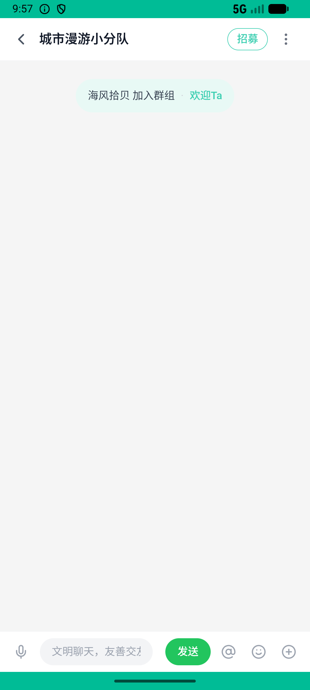
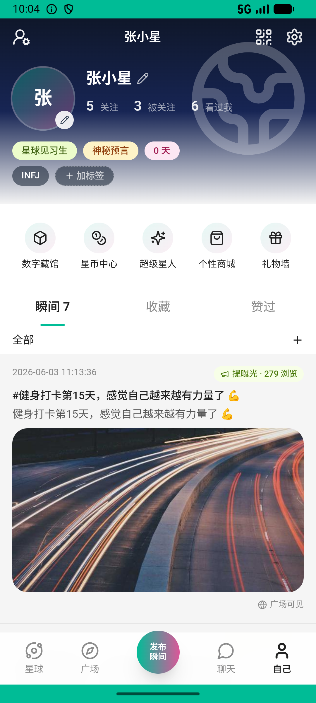

# post/v033_post_validator  ❌

- **Brand**: `xianzhiershouwang`
- **Class**: `XianzhiershouwangPostV033PostValidatorTask`
- **Pass@3**: **0/3**  (score = 0.00)
- **Elapsed**: 1229s (~20.5 min)
- **Model**: `doubao-seed-2-0-lite-260428`
- **Raw log**: [./raw_logs/XianzhiershouwangPostV033PostValidatorTask.log](./raw_logs/XianzhiershouwangPostV033PostValidatorTask.log)
- **Generated**: 2026-06-05T02:06:06+08:00

## Task Goal

> 【当前账户档案】账号：zhangsan@example.com；昵称：张三；支付密码：无需密码，如需支付直接确认即可；默认收货地址（JSON）：{"recipient": "张三", "phone": "13800138000", "address": "上海市 上海市 浦东新区 陆家嘴环路1000号"}。请基于以上档案打开 com.xianzhiershouwang 并完成以下任务：帮我挂个索尼 WH-1000XM5 头戴降噪耳机，银色的，买了半年 9成新，卖1200包邮，放智能设备分类

## Attempts

| # | Outcome | Steps | Terminated | Reason | Start → End |
|---|---------|-------|------------|--------|-------------|
| 1 | ⏰ timeout | 80 | max_steps | task 'XianzhiershouwangPostV033PostValidatorTask' was not initialized; current initialized task is 'XingqiushejiaowangGroupV007WelcomeNew... | 2026-06-04 21:44:12 → 2026-06-04 21:57:57 |
| 2 | ❌ failed | 20 | answer | task 'XianzhiershouwangPostV033PostValidatorTask' was not initialized; current initialized task is 'XingqiushejiaowangGroupV007WelcomeNew... | 2026-06-04 21:57:57 → 2026-06-04 22:01:12 |
| 3 | ❌ failed | 23 | answer | 发布了新帖子: 未找到张三发布的帖子 | 2026-06-04 22:01:12 → 2026-06-04 22:04:41 |

## Failure Details

### Episode 1 — ⏰ timeout

- steps_used: `80`
- terminated_reason: `max_steps`
- reason:

  ```
  task 'XianzhiershouwangPostV033PostValidatorTask' was not initialized; current initialized task is 'XingqiushejiaowangGroupV007WelcomeNewcomerTask'
  ```
- death shot: 
  - state: [`./death_shots/XianzhiershouwangPostV033PostValidatorTask/episode_001/step_080.json`](./death_shots/XianzhiershouwangPostV033PostValidatorTask/episode_001/step_080.json)
  - digest: [`episode_digest.md`](./death_shots/XianzhiershouwangPostV033PostValidatorTask/episode_001/episode_digest.md)

### Episode 2 — ❌ failed

- steps_used: `20`
- terminated_reason: `answer`
- reason:

  ```
  task 'XianzhiershouwangPostV033PostValidatorTask' was not initialized; current initialized task is 'XingqiushejiaowangGroupV007WelcomeNewcomerTask'
  ```
- death shot: 
  - state: [`./death_shots/XianzhiershouwangPostV033PostValidatorTask/episode_002/step_020.json`](./death_shots/XianzhiershouwangPostV033PostValidatorTask/episode_002/step_020.json)
  - digest: [`episode_digest.md`](./death_shots/XianzhiershouwangPostV033PostValidatorTask/episode_002/episode_digest.md)

### Episode 3 — ❌ failed

- steps_used: `23`
- terminated_reason: `answer`
- reason:

  ```
  发布了新帖子: 未找到张三发布的帖子
  ```
- death shot: 
  - state: [`./death_shots/XianzhiershouwangPostV033PostValidatorTask/episode_003/step_023.json`](./death_shots/XianzhiershouwangPostV033PostValidatorTask/episode_003/step_023.json)
  - digest: [`episode_digest.md`](./death_shots/XianzhiershouwangPostV033PostValidatorTask/episode_003/episode_digest.md)

---

> 本摘要由 `sengclaw/scripts/pipeline/log_summarizer.py` 自动生成。 原始完整 log 见上方 Raw log 链接（含每 step 的 messages / tool_call / screenshot 引用）。
