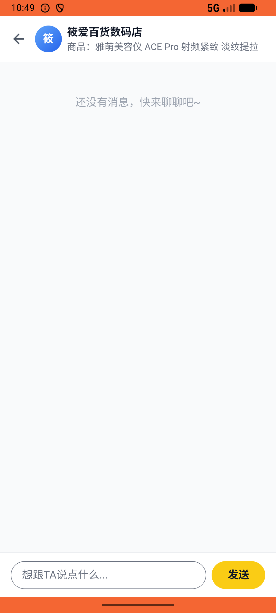
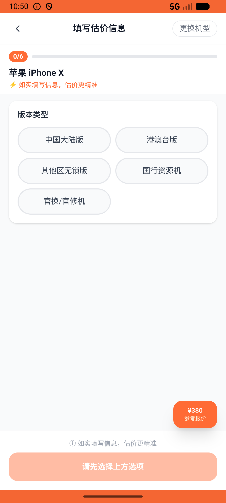
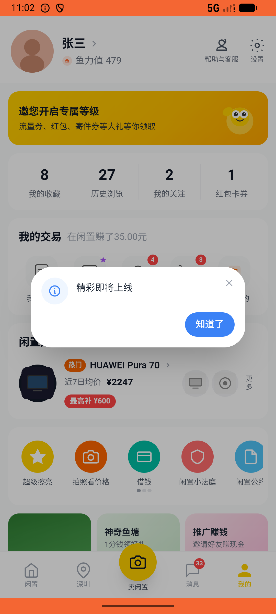

# recycle/v005_recycle_validator  ❌

- **Brand**: `xianzhiershouwang`
- **Class**: `XianzhiershouwangRecycleV005RecycleValidatorTask`
- **Pass@3**: **0/3**  (score = 0.00)
- **Elapsed**: 1021s (~17.0 min)
- **Model**: `doubao-seed-2-0-lite-260428`
- **Raw log**: [./raw_logs/XianzhiershouwangRecycleV005RecycleValidatorTask.log](./raw_logs/XianzhiershouwangRecycleV005RecycleValidatorTask.log)
- **Generated**: 2026-06-05T02:06:06+08:00

## Task Goal

> 【当前账户档案】账号：zhangsan@example.com；昵称：张三；支付密码：无需密码，如需支付直接确认即可；默认收货地址（JSON）：{"recipient": "张三", "phone": "13800138000", "address": "上海市 上海市 浦东新区 陆家嘴环路1000号"}。请基于以上档案打开 com.xianzhiershouwang 并完成以下任务：我的iPad Air 11寸 M2想回收是128G WiFi版，成色完美配件齐全，看看报价怎么样，联系人张三 13800138000

## Attempts

| # | Outcome | Steps | Terminated | Reason | Start → End |
|---|---------|-------|------------|--------|-------------|
| 1 | ❌ failed | 31 | answer | task 'XianzhiershouwangRecycleV005RecycleValidatorTask' was not initialized; current initialized task is 'XingqiushejiaowangGroupV010SetA... | 2026-06-04 22:45:28 → 2026-06-04 22:49:48 |
| 2 | ❌ failed | 4 | unknown | 回收订单已创建且关联iPad Air 11英寸(M2): 未找到 iPad Air 的回收订单 | 2026-06-04 22:49:48 → 2026-06-04 22:50:16 |
| 3 | ⏰ timeout | 80 | max_steps | task 'XianzhiershouwangRecycleV005RecycleValidatorTask' was not initialized; current initialized task is 'XingqiushejiaowangGroupV010SetA... | 2026-06-04 22:50:16 → 2026-06-04 23:02:28 |

## Failure Details

### Episode 1 — ❌ failed

- steps_used: `31`
- terminated_reason: `answer`
- reason:

  ```
  task 'XianzhiershouwangRecycleV005RecycleValidatorTask' was not initialized; current initialized task is 'XingqiushejiaowangGroupV010SetAnnouncementTask'
  ```
- death shot: 
  - state: [`./death_shots/XianzhiershouwangRecycleV005RecycleValidatorTask/episode_001/step_031.json`](./death_shots/XianzhiershouwangRecycleV005RecycleValidatorTask/episode_001/step_031.json)
  - digest: [`episode_digest.md`](./death_shots/XianzhiershouwangRecycleV005RecycleValidatorTask/episode_001/episode_digest.md)

### Episode 2 — ❌ failed

- steps_used: `4`
- terminated_reason: `unknown`
- reason:

  ```
  回收订单已创建且关联iPad Air 11英寸(M2): 未找到 iPad Air 的回收订单
  ```
- death shot: 
  - state: [`./death_shots/XianzhiershouwangRecycleV005RecycleValidatorTask/episode_002/step_003.json`](./death_shots/XianzhiershouwangRecycleV005RecycleValidatorTask/episode_002/step_003.json)
  - digest: [`episode_digest.md`](./death_shots/XianzhiershouwangRecycleV005RecycleValidatorTask/episode_002/episode_digest.md)

### Episode 3 — ⏰ timeout

- steps_used: `80`
- terminated_reason: `max_steps`
- reason:

  ```
  task 'XianzhiershouwangRecycleV005RecycleValidatorTask' was not initialized; current initialized task is 'XingqiushejiaowangGroupV010SetAnnouncementTask'
  ```
- death shot: 
  - state: [`./death_shots/XianzhiershouwangRecycleV005RecycleValidatorTask/episode_003/step_080.json`](./death_shots/XianzhiershouwangRecycleV005RecycleValidatorTask/episode_003/step_080.json)
  - digest: [`episode_digest.md`](./death_shots/XianzhiershouwangRecycleV005RecycleValidatorTask/episode_003/episode_digest.md)

---

> 本摘要由 `sengclaw/scripts/pipeline/log_summarizer.py` 自动生成。 原始完整 log 见上方 Raw log 链接（含每 step 的 messages / tool_call / screenshot 引用）。
