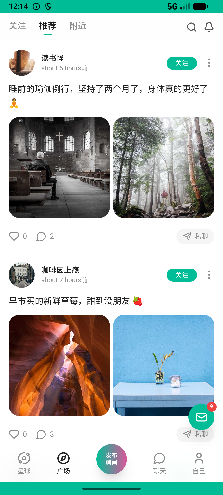
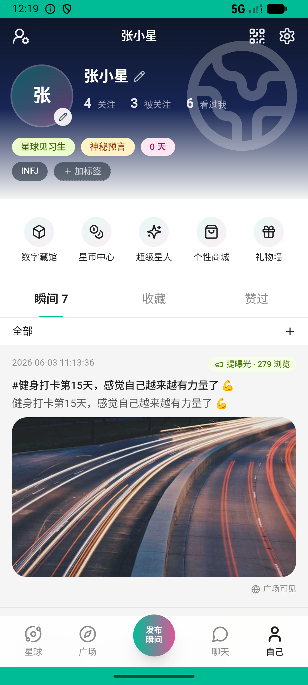
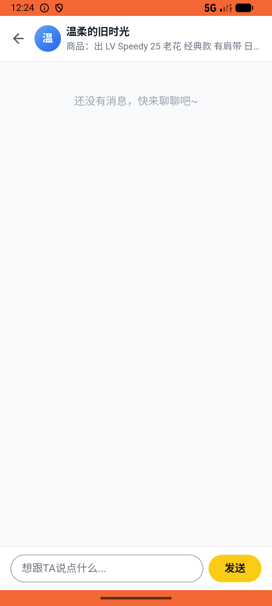

# recycle/v021_recycle_validator  ❌

- **Brand**: `xianzhiershouwang`
- **Class**: `XianzhiershouwangRecycleV021RecycleValidatorTask`
- **Pass@3**: **0/3**  (score = 0.00)
- **Elapsed**: 723s (~12.1 min)
- **Model**: `doubao-seed-2-0-lite-260428`
- **Raw log**: [./raw_logs/XianzhiershouwangRecycleV021RecycleValidatorTask.log](./raw_logs/XianzhiershouwangRecycleV021RecycleValidatorTask.log)
- **Generated**: 2026-06-05T02:06:06+08:00

## Task Goal

> 【当前账户档案】账号：zhangsan@example.com；昵称：张三；支付密码：无需密码，如需支付直接确认即可；默认收货地址（JSON）：{"recipient": "张三", "phone": "13800138000", "address": "上海市 上海市 浦东新区 陆家嘴环路1000号"}。请基于以上档案打开 com.xianzhiershouwang 并完成以下任务：我有张爱奇艺年卡178面值想回收，兑换码是IQIYI2025TEST001，帮我提交一下

## Attempts

| # | Outcome | Steps | Terminated | Reason | Start → End |
|---|---------|-------|------------|--------|-------------|
| 1 | 💥 error | 0 | exception | exception: 404 Not Found for url: http://localhost:6800/step \\| detail: No available devices found | 2026-06-05 00:12:47 → 2026-06-05 00:14:20 |
| 2 | ❌ failed | 34 | answer | task 'XianzhiershouwangRecycleV021RecycleValidatorTask' was not initialized; current initialized task is 'XingqiushejiaowangSuperStarV004... | 2026-06-05 00:14:51 → 2026-06-05 00:19:54 |
| 3 | ❌ failed | 30 | answer | task 'XianzhiershouwangRecycleV021RecycleValidatorTask' was not initialized; current initialized task is 'XingqiushejiaowangSuperStarV004... | 2026-06-05 00:19:55 → 2026-06-05 00:24:49 |

## Failure Details

### Episode 1 — 💥 error

- steps_used: `0`
- terminated_reason: `exception`
- reason:

  ```
  exception: 404 Not Found for url: http://localhost:6800/step | detail: No available devices found
  ```
- death shot: 
  - state: [`./death_shots/XianzhiershouwangRecycleV021RecycleValidatorTask/episode_001/step_011.json`](./death_shots/XianzhiershouwangRecycleV021RecycleValidatorTask/episode_001/step_011.json)
  - digest: [`episode_digest.md`](./death_shots/XianzhiershouwangRecycleV021RecycleValidatorTask/episode_001/episode_digest.md)

### Episode 2 — ❌ failed

- steps_used: `34`
- terminated_reason: `answer`
- reason:

  ```
  task 'XianzhiershouwangRecycleV021RecycleValidatorTask' was not initialized; current initialized task is 'XingqiushejiaowangSuperStarV004StackMonthlyTask'
  ```
- death shot: 
  - state: [`./death_shots/XianzhiershouwangRecycleV021RecycleValidatorTask/episode_002/step_034.json`](./death_shots/XianzhiershouwangRecycleV021RecycleValidatorTask/episode_002/step_034.json)
  - digest: [`episode_digest.md`](./death_shots/XianzhiershouwangRecycleV021RecycleValidatorTask/episode_002/episode_digest.md)

### Episode 3 — ❌ failed

- steps_used: `30`
- terminated_reason: `answer`
- reason:

  ```
  task 'XianzhiershouwangRecycleV021RecycleValidatorTask' was not initialized; current initialized task is 'XingqiushejiaowangSuperStarV004StackMonthlyTask'
  ```
- death shot: 
  - state: [`./death_shots/XianzhiershouwangRecycleV021RecycleValidatorTask/episode_003/step_030.json`](./death_shots/XianzhiershouwangRecycleV021RecycleValidatorTask/episode_003/step_030.json)
  - digest: [`episode_digest.md`](./death_shots/XianzhiershouwangRecycleV021RecycleValidatorTask/episode_003/episode_digest.md)

---

> 本摘要由 `sengclaw/scripts/pipeline/log_summarizer.py` 自动生成。 原始完整 log 见上方 Raw log 链接（含每 step 的 messages / tool_call / screenshot 引用）。
