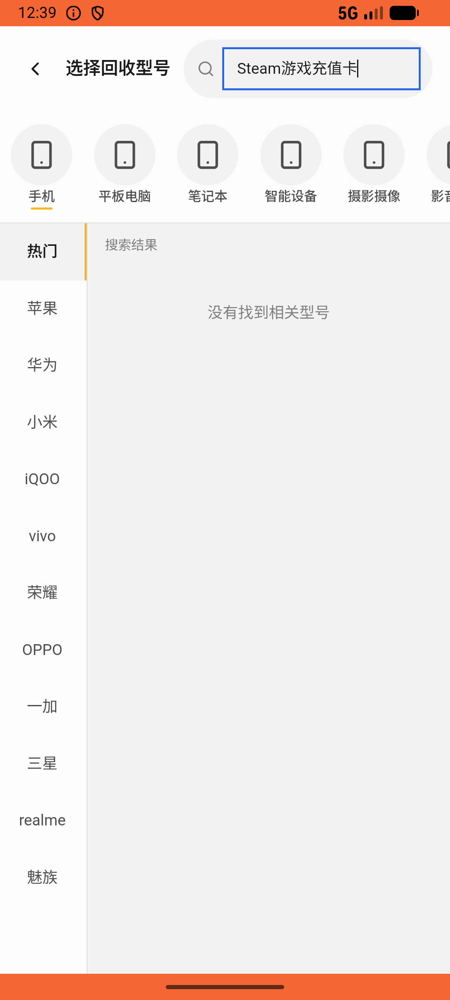
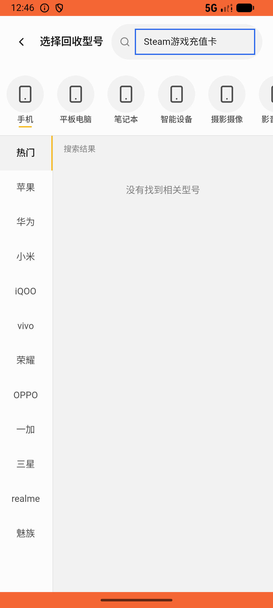

# recycle/v023_recycle_validator  ⚠️

- **Brand**: `xianzhiershouwang`
- **Class**: `XianzhiershouwangRecycleV023RecycleValidatorTask`
- **Pass@3**: **1/3**  (score = 1.00)
- **Elapsed**: 443s (~7.4 min)
- **Model**: `doubao-seed-2-0-lite-260428`
- **Raw log**: [./raw_logs/XianzhiershouwangRecycleV023RecycleValidatorTask.log](./raw_logs/XianzhiershouwangRecycleV023RecycleValidatorTask.log)
- **Generated**: 2026-06-05T02:06:06+08:00

## Task Goal

> 【当前账户档案】账号：zhangsan@example.com；昵称：张三；支付密码：无需密码，如需支付直接确认即可；默认收货地址（JSON）：{"recipient": "张三", "phone": "13800138000", "address": "上海市 上海市 浦东新区 陆家嘴环路1000号"}。请基于以上档案打开 com.xianzhiershouwang 并完成以下任务：我有张Steam游戏充值卡100块的想回收掉，兑换码STEAM25TEST00001，帮我弄一下提交出售

## Attempts

| # | Outcome | Steps | Terminated | Reason | Start → End |
|---|---------|-------|------------|--------|-------------|
| 1 | ❌ failed | 6 | answer | 卡券回收订单已创建且关联Steam: 未找到Steam的卡券回收订单（order_type=card_voucher） | 2026-06-05 00:38:52 → 2026-06-05 00:39:37 |
| 2 | ✅ passed | 36 | answer | – | 2026-06-05 00:39:37 → 2026-06-05 00:45:31 |
| 3 | ❌ failed | 6 | answer | 卡券回收订单已创建且关联Steam: 未找到Steam的卡券回收订单（order_type=card_voucher） | 2026-06-05 00:45:31 → 2026-06-05 00:46:15 |

## Failure Details

### Episode 1 — ❌ failed

- steps_used: `6`
- terminated_reason: `answer`
- reason:

  ```
  卡券回收订单已创建且关联Steam: 未找到Steam的卡券回收订单（order_type=card_voucher）
  ```
- death shot: 
  - state: [`./death_shots/XianzhiershouwangRecycleV023RecycleValidatorTask/episode_001/step_006.json`](./death_shots/XianzhiershouwangRecycleV023RecycleValidatorTask/episode_001/step_006.json)
  - digest: [`episode_digest.md`](./death_shots/XianzhiershouwangRecycleV023RecycleValidatorTask/episode_001/episode_digest.md)

### Episode 3 — ❌ failed

- steps_used: `6`
- terminated_reason: `answer`
- reason:

  ```
  卡券回收订单已创建且关联Steam: 未找到Steam的卡券回收订单（order_type=card_voucher）
  ```
- death shot: 
  - state: [`./death_shots/XianzhiershouwangRecycleV023RecycleValidatorTask/episode_003/step_006.json`](./death_shots/XianzhiershouwangRecycleV023RecycleValidatorTask/episode_003/step_006.json)
  - digest: [`episode_digest.md`](./death_shots/XianzhiershouwangRecycleV023RecycleValidatorTask/episode_003/episode_digest.md)

---

> 本摘要由 `sengclaw/scripts/pipeline/log_summarizer.py` 自动生成。 原始完整 log 见上方 Raw log 链接（含每 step 的 messages / tool_call / screenshot 引用）。
