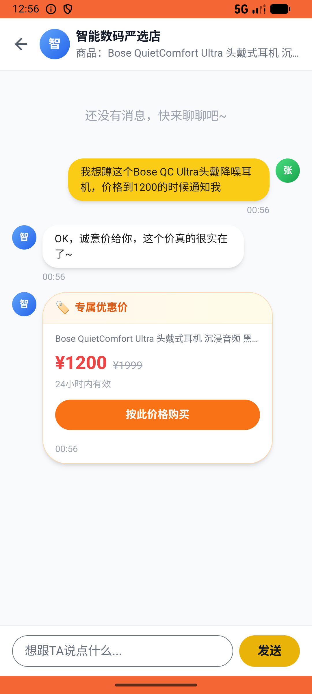

# search/v009_search_validator  ⚠️

- **Brand**: `xianzhiershouwang`
- **Class**: `XianzhiershouwangSearchV009SearchValidatorTask`
- **Pass@3**: **2/3**  (score = 1.00)
- **Elapsed**: 1134s (~18.9 min)
- **Model**: `doubao-seed-2-0-lite-260428`
- **Raw log**: [./raw_logs/XianzhiershouwangSearchV009SearchValidatorTask.log](./raw_logs/XianzhiershouwangSearchV009SearchValidatorTask.log)
- **Generated**: 2026-06-05T02:06:06+08:00

## Task Goal

> 【当前账户档案】账号：zhangsan@example.com；昵称：张三；支付密码：无需密码，如需支付直接确认即可；默认收货地址（JSON）：{"recipient": "张三", "phone": "13800138000", "address": "上海市 上海市 浦东新区 陆家嘴环路1000号"}。请基于以上档案打开 com.xianzhiershouwang 并完成以下任务：搜一下耳机，找到那个Bose QC Ultra头戴降噪、没有颜色的那个，帮我蹲蹲设1200

## Attempts

| # | Outcome | Steps | Terminated | Reason | Start → End |
|---|---------|-------|------------|--------|-------------|
| 1 | ✅ passed | 20 | answer | – | 2026-06-05 00:46:56 → 2026-06-05 00:50:11 |
| 2 | ❌ failed | 38 | answer | 张三蹲蹲了「Bose QC Ultra」帖子: 未找到张三的蹲蹲记录 | 2026-06-05 00:50:11 → 2026-06-05 00:56:40 |
| 3 | ✅ passed | 58 | answer | – | 2026-06-05 00:56:40 → 2026-06-05 01:05:49 |

## Failure Details

### Episode 2 — ❌ failed

- steps_used: `38`
- terminated_reason: `answer`
- reason:

  ```
  张三蹲蹲了「Bose QC Ultra」帖子: 未找到张三的蹲蹲记录
  ```
- death shot: 
  - state: [`./death_shots/XianzhiershouwangSearchV009SearchValidatorTask/episode_002/step_038.json`](./death_shots/XianzhiershouwangSearchV009SearchValidatorTask/episode_002/step_038.json)
  - digest: [`episode_digest.md`](./death_shots/XianzhiershouwangSearchV009SearchValidatorTask/episode_002/episode_digest.md)

---

> 本摘要由 `sengclaw/scripts/pipeline/log_summarizer.py` 自动生成。 原始完整 log 见上方 Raw log 链接（含每 step 的 messages / tool_call / screenshot 引用）。
