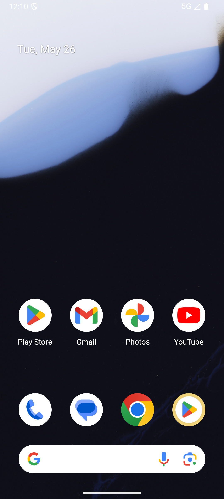

# comment/v014_comment_validator  ❌

- **Brand**: `xianzhiershouwang`
- **Class**: `XianzhiershouwangCommentV014CommentValidatorTask`
- **Pass@3**: **0/3**  (score = 0.00)
- **Elapsed**: 1095s (~18.2 min)
- **Model**: `doubao-seed-2-0-lite-260428`
- **Raw log**: [./raw_logs/XianzhiershouwangCommentV014CommentValidatorTask.log](./raw_logs/XianzhiershouwangCommentV014CommentValidatorTask.log)
- **Generated**: 2026-06-06T12:40:14+08:00

## Task Goal

> 帮我淘台二手Switch主机，要OLED版、95新、不超过2000，挑到了先收藏；再看看这卖家主页，他家那只Switch手柄也帮我买了

## Attempts

| # | Outcome | Steps | Terminated | Reason | Start → End |
|---|---------|-------|------------|--------|-------------|
| 1 | ❌ failed | 30 | answer | 收藏了 OLED + 95新 + ≤2000 的 Switch 主机: 未收藏 OLED+95新+≤2000 的 Switch 主机，实际收藏=[[136, "Switch OLED 港版 白色 送保护壳 有原装手柄"]]; 收藏列表里包含「卖家3那台 id=129」（唯一... | 2026-06-06 12:22:02 → 2026-06-06 12:30:18 |
| 2 | ❌ failed | 8 | answer | 收藏了 OLED + 95新 + ≤2000 的 Switch 主机: 未收藏 OLED+95新+≤2000 的 Switch 主机，实际收藏=[]; 收藏列表里包含「卖家3那台 id=129」（唯一同店有手柄的卖家）: 收藏列表里没有 id=129（卖家3那台 Switc... | 2026-06-06 12:30:18 → 2026-06-06 12:32:33 |
| 3 | ❌ failed | 29 | answer | 收藏了 OLED + 95新 + ≤2000 的 Switch 主机: 未收藏 OLED+95新+≤2000 的 Switch 主机，实际收藏=[[136, "Switch OLED 港版 白色 送保护壳 有原装手柄"]]; 收藏列表里包含「卖家3那台 id=129」（唯一... | 2026-06-06 12:32:33 → 2026-06-06 12:40:14 |

## Failure Details

### Episode 1 — ❌ failed

- steps_used: `30`
- terminated_reason: `answer`
- reason:

  ```
  收藏了 OLED + 95新 + ≤2000 的 Switch 主机: 未收藏 OLED+95新+≤2000 的 Switch 主机，实际收藏=[[136, "Switch OLED 港版 白色 送保护壳 有原装手柄"]]; 收藏列表里包含「卖家3那台 id=129」（唯一同店有手柄的卖家）: 收藏列表里没有 id=129（卖家3那台 Switch OLED 国行 ¥1999），买手柄的关键线索：进卖家主页要进卖家3的，因为他是 6 台候选里唯一同店在卖 Switch Pro 手柄的卖家; 购买了卖家3同店的 Switch Pro 手柄（id=444）: 未找到购买卖家3 Switch Pro 手柄(id=444, ¥249) 的订单——可能没进对卖家主页 / 买错了手柄
  ```
- death shot: 
  - state: [`./death_shots/XianzhiershouwangCommentV014CommentValidatorTask/episode_001/step_030.json`](./death_shots/XianzhiershouwangCommentV014CommentValidatorTask/episode_001/step_030.json)
  - digest: [`episode_digest.md`](./death_shots/XianzhiershouwangCommentV014CommentValidatorTask/episode_001/episode_digest.md)

### Episode 2 — ❌ failed

- steps_used: `8`
- terminated_reason: `answer`
- reason:

  ```
  收藏了 OLED + 95新 + ≤2000 的 Switch 主机: 未收藏 OLED+95新+≤2000 的 Switch 主机，实际收藏=[]; 收藏列表里包含「卖家3那台 id=129」（唯一同店有手柄的卖家）: 收藏列表里没有 id=129（卖家3那台 Switch OLED 国行 ¥1999），买手柄的关键线索：进卖家主页要进卖家3的，因为他是 6 台候选里唯一同店在卖 Switch Pro 手柄的卖家; 购买了卖家3同店的 Switch Pro 手柄（id=444）: 未找到购买卖家3 Switch Pro 手柄(id=444, ¥249) 的订单——可能没进对卖家主页 / 买错了手柄
  ```
- death shot: 
  - state: [`./death_shots/XianzhiershouwangCommentV014CommentValidatorTask/episode_002/step_008.json`](./death_shots/XianzhiershouwangCommentV014CommentValidatorTask/episode_002/step_008.json)
  - digest: [`episode_digest.md`](./death_shots/XianzhiershouwangCommentV014CommentValidatorTask/episode_002/episode_digest.md)

### Episode 3 — ❌ failed

- steps_used: `29`
- terminated_reason: `answer`
- reason:

  ```
  收藏了 OLED + 95新 + ≤2000 的 Switch 主机: 未收藏 OLED+95新+≤2000 的 Switch 主机，实际收藏=[[136, "Switch OLED 港版 白色 送保护壳 有原装手柄"]]; 收藏列表里包含「卖家3那台 id=129」（唯一同店有手柄的卖家）: 收藏列表里没有 id=129（卖家3那台 Switch OLED 国行 ¥1999），买手柄的关键线索：进卖家主页要进卖家3的，因为他是 6 台候选里唯一同店在卖 Switch Pro 手柄的卖家; 购买了卖家3同店的 Switch Pro 手柄（id=444）: 未找到购买卖家3 Switch Pro 手柄(id=444, ¥249) 的订单——可能没进对卖家主页 / 买错了手柄
  ```
- death shot: 
  - state: [`./death_shots/XianzhiershouwangCommentV014CommentValidatorTask/episode_003/step_029.json`](./death_shots/XianzhiershouwangCommentV014CommentValidatorTask/episode_003/step_029.json)
  - digest: [`episode_digest.md`](./death_shots/XianzhiershouwangCommentV014CommentValidatorTask/episode_003/episode_digest.md)

---

> 本摘要由 `sengclaw/scripts/pipeline/log_summarizer.py` 自动生成。 原始完整 log 见上方 Raw log 链接（含每 step 的 messages / tool_call / screenshot 引用）。
