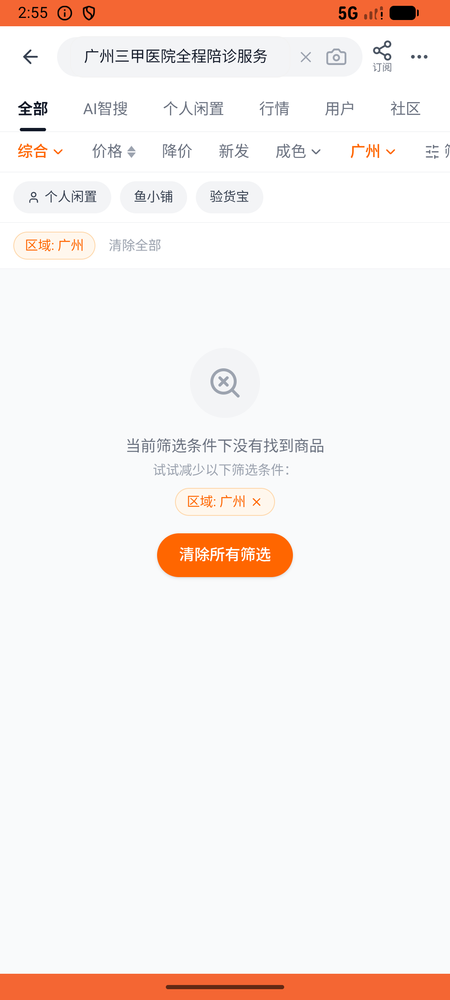

# side_job_order/v004_side_job_order_validator  ❌

- **Brand**: `xianzhiershouwang`
- **Class**: `XianzhiershouwangSideJobOrderV004SideJobOrderValidatorTask`
- **Pass@3**: **0/3**  (score = 0.00)
- **Elapsed**: 156s (~2.6 min)
- **Model**: `doubao-seed-2-0-lite-260428`
- **Raw log**: [./raw_logs/XianzhiershouwangSideJobOrderV004SideJobOrderValidatorTask.log](./raw_logs/XianzhiershouwangSideJobOrderV004SideJobOrderValidatorTask.log)
- **Generated**: 2026-06-07T02:55:44+08:00

## Task Goal

> 【当前账户档案】账号：zhangsan@example.com；昵称：张三；支付密码：无需密码，如需支付直接确认即可；默认收货地址（JSON）：{"recipient": "张三", "phone": "13800138000", "address": "上海市 上海市 浦东新区 陆家嘴环路1000号"}。请基于以上档案打开 com.xianzhiershouwang 并完成以下任务：帮妈妈在神奇副业找广州三甲医院全程陪诊服务，微信下单

## Attempts

| # | Outcome | Steps | Terminated | Reason | Start → End |
|---|---------|-------|------------|--------|-------------|
| 1 | ❌ failed | 6 | answer | 订单关联到「广州三甲医院全程陪诊服务」: 未找到对「广州三甲医院全程陪诊服务」的订单（可能买成了体检陪同/住院陪护/代取药等） | 2026-06-07 02:53:08 → 2026-06-07 02:53:49 |
| 2 | ❌ failed | 10 | answer | 订单关联到「广州三甲医院全程陪诊服务」: 未找到对「广州三甲医院全程陪诊服务」的订单（可能买成了体检陪同/住院陪护/代取药等） | 2026-06-07 02:53:50 → 2026-06-07 02:55:03 |
| 3 | ❌ failed | 6 | answer | 订单关联到「广州三甲医院全程陪诊服务」: 未找到对「广州三甲医院全程陪诊服务」的订单（可能买成了体检陪同/住院陪护/代取药等） | 2026-06-07 02:55:03 → 2026-06-07 02:55:44 |

## Failure Details

### Episode 1 — ❌ failed

- steps_used: `6`
- terminated_reason: `answer`
- reason:

  ```
  订单关联到「广州三甲医院全程陪诊服务」: 未找到对「广州三甲医院全程陪诊服务」的订单（可能买成了体检陪同/住院陪护/代取药等）
  ```
- death shot: 
  - state: [`./death_shots/XianzhiershouwangSideJobOrderV004SideJobOrderValidatorTask/episode_001/step_006.json`](./death_shots/XianzhiershouwangSideJobOrderV004SideJobOrderValidatorTask/episode_001/step_006.json)
  - digest: [`episode_digest.md`](./death_shots/XianzhiershouwangSideJobOrderV004SideJobOrderValidatorTask/episode_001/episode_digest.md)

### Episode 2 — ❌ failed

- steps_used: `10`
- terminated_reason: `answer`
- reason:

  ```
  订单关联到「广州三甲医院全程陪诊服务」: 未找到对「广州三甲医院全程陪诊服务」的订单（可能买成了体检陪同/住院陪护/代取药等）
  ```
- death shot: 
  - state: [`./death_shots/XianzhiershouwangSideJobOrderV004SideJobOrderValidatorTask/episode_002/step_010.json`](./death_shots/XianzhiershouwangSideJobOrderV004SideJobOrderValidatorTask/episode_002/step_010.json)
  - digest: [`episode_digest.md`](./death_shots/XianzhiershouwangSideJobOrderV004SideJobOrderValidatorTask/episode_002/episode_digest.md)

### Episode 3 — ❌ failed

- steps_used: `6`
- terminated_reason: `answer`
- reason:

  ```
  订单关联到「广州三甲医院全程陪诊服务」: 未找到对「广州三甲医院全程陪诊服务」的订单（可能买成了体检陪同/住院陪护/代取药等）
  ```
- death shot: 
  - state: [`./death_shots/XianzhiershouwangSideJobOrderV004SideJobOrderValidatorTask/episode_003/step_006.json`](./death_shots/XianzhiershouwangSideJobOrderV004SideJobOrderValidatorTask/episode_003/step_006.json)
  - digest: [`episode_digest.md`](./death_shots/XianzhiershouwangSideJobOrderV004SideJobOrderValidatorTask/episode_003/episode_digest.md)

---

> 本摘要由 `sengclaw/scripts/pipeline/log_summarizer.py` 自动生成。 原始完整 log 见上方 Raw log 链接（含每 step 的 messages / tool_call / screenshot 引用）。
