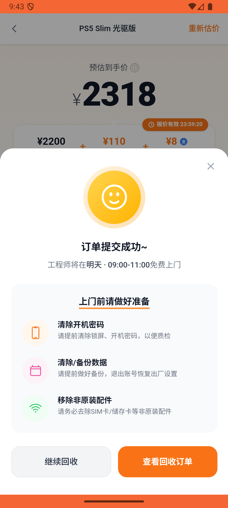
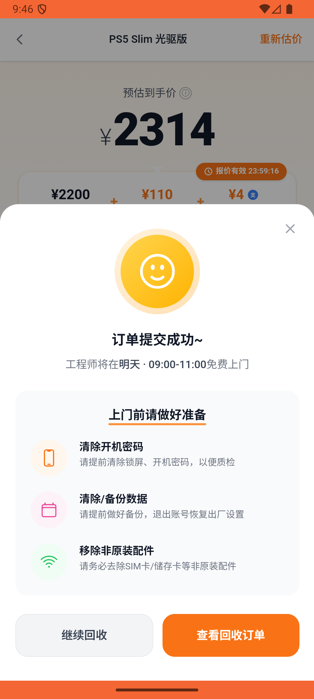

# recycle/v008_recycle_validator  ❌

- **Brand**: `xianzhiershouwang`
- **Class**: `XianzhiershouwangRecycleV008RecycleValidatorTask`
- **Pass@3**: **0/3**  (score = 0.00)
- **Elapsed**: 537s (~8.9 min)
- **Model**: `doubao-seed-2-0-lite-260428`
- **Raw log**: [./raw_logs/XianzhiershouwangRecycleV008RecycleValidatorTask.log](./raw_logs/XianzhiershouwangRecycleV008RecycleValidatorTask.log)
- **Generated**: 2026-06-07T21:47:52+08:00

## Task Goal

> 我的索尼PlayStation 5光驱版想回收，国行的，有点使用痕迹，个别按键不太灵敏，配件不全，帮我提交回收看看，联系人张三 13800138000

## System Prompt

<details>
<summary>展开查看完整 System Prompt</summary>


> You are provided with a task description, a history of previous actions, and corresponding screenshots. Your goal is to perform the next action to complete the task. Please note that if performing the same action multiple times results in a static screen with no changes, you should attempt a modified or alternative action.
> 
> ---
> 
> ## Function Definition
> 
> - `clarify` — Ask the user for more information to complete the task.
> - `click` — Mouse left single click action.
> - `double_click` — Mouse left double click action.
> - `drag` — Perform a drag action from the start point to the end point. Typically used for swiping or selecting elements.
> - `long_press` — Perform a long press action at the specified coordinates.
> - `open_app` — Open the specified application.
> - `press_back` — Press the back button.
> - `press_enter` — Press the enter key.
> - `press_home` — Press the home button.
> - `take_notes` — Take notes and report the result in the specified content.
> - `type` — Type the specified content. You should manually delete any text from the input box that you want to remove.
> - `wait` — Wait for a certain period of time.

</details>

## User Query

> 请在 com.xianzhiershouwang 里面完成以下任务：
> 我的索尼PlayStation 5光驱版想回收，国行的，有点使用痕迹，个别按键不太灵敏，配件不全，帮我提交回收看看，联系人张三 13800138000

## Attempts

| # | Outcome | Steps | Terminated | Reason | Start → End |
|---|---------|-------|------------|--------|-------------|
| 1 | ❌ failed | 18 | answer | 回收订单已创建且关联PS5光驱版: 未找到 PlayStation 5 光驱版的回收订单 | 2026-06-07 21:38:56 → 2026-06-07 21:43:00 |
| 2 | ❌ failed | 18 | answer | 回收订单已创建且关联PS5光驱版: 未找到 PlayStation 5 光驱版的回收订单 | 2026-06-07 21:43:00 → 2026-06-07 21:46:52 |
| 3 | 💥 error | 0 | exception | exception: 500 Internal Server Error for url: http://localhost:6800/task/init \\| detail: init_task('XianzhiershouwangRecycleV008RecycleV... | 2026-06-07 21:46:52 → 2026-06-07 21:47:52 |

## Failure Details

### Episode 1 — ❌ failed

- steps_used: `18`
- terminated_reason: `answer`
- reason:

  ```
  回收订单已创建且关联PS5光驱版: 未找到 PlayStation 5 光驱版的回收订单
  ```
- death shot: 
  - state: [`./death_shots/XianzhiershouwangRecycleV008RecycleValidatorTask/episode_001/step_018.json`](./death_shots/XianzhiershouwangRecycleV008RecycleValidatorTask/episode_001/step_018.json)
  - digest: [`episode_digest.md`](./death_shots/XianzhiershouwangRecycleV008RecycleValidatorTask/episode_001/episode_digest.md)

### Episode 2 — ❌ failed

- steps_used: `18`
- terminated_reason: `answer`
- reason:

  ```
  回收订单已创建且关联PS5光驱版: 未找到 PlayStation 5 光驱版的回收订单
  ```
- death shot: 
  - state: [`./death_shots/XianzhiershouwangRecycleV008RecycleValidatorTask/episode_002/step_018.json`](./death_shots/XianzhiershouwangRecycleV008RecycleValidatorTask/episode_002/step_018.json)
  - digest: [`episode_digest.md`](./death_shots/XianzhiershouwangRecycleV008RecycleValidatorTask/episode_002/episode_digest.md)

### Episode 3 — 💥 error

- steps_used: `0`
- terminated_reason: `exception`
- reason:

  ```
  exception: 500 Internal Server Error for url: http://localhost:6800/task/init | detail: init_task('XianzhiershouwangRecycleV008RecycleValidatorTask') failed: Task 'XianzhiershouwangRecycleV008RecycleValidatorTask' failed during initialize_task()
  ```

---

> 本摘要由 `sengclaw/scripts/pipeline/log_summarizer.py` 自动生成。 原始完整 log 见上方 Raw log 链接（含每 step 的 messages / tool_call / screenshot 引用）。
