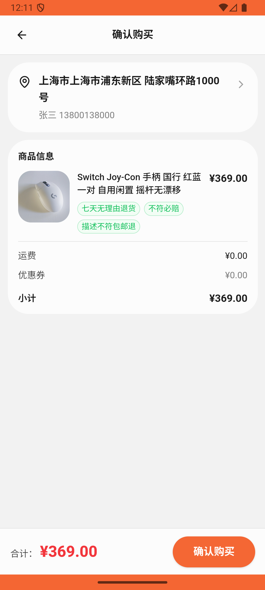

# comment/v014_comment_validator  ❌

- **Brand**: `xianzhiershouwang`
- **Class**: `XianzhiershouwangCommentV014CommentValidatorTask`
- **Pass@3**: **0/3**  (score = 0.00)
- **Elapsed**: 1000s (~16.7 min)
- **Model**: `doubao-seed-2-0-lite-260428`
- **Raw log**: [./raw_logs/XianzhiershouwangCommentV014CommentValidatorTask.log](./raw_logs/XianzhiershouwangCommentV014CommentValidatorTask.log)
- **Generated**: 2026-06-08T02:34:44+08:00

## Task Goal

> 帮我淘台二手Switch主机，要OLED版、国行95新有充电器、不超过2000，挑到了先收藏；再看看这卖家主页，他家那只 Switch Joy-Con 也帮我买了

## System Prompt

<details>
<summary>展开查看完整 System Prompt</summary>


> You are provided with a task description, a history of previous actions, and corresponding screenshots. Your goal is to perform the next action to complete the task. Please note that if performing the same action multiple times results in a static screen with no changes, you should attempt a modified or alternative action.
> 
> ---
> 
> ## Function Definition
> 
> - `clarify` — Ask the user for more information to complete the task.
> - `click` — Mouse left single click action.
> - `double_click` — Mouse left double click action.
> - `drag` — Perform a drag action from the start point to the end point. Typically used for swiping or selecting elements.
> - `long_press` — Perform a long press action at the specified coordinates.
> - `open_app` — Open the specified application.
> - `press_back` — Press the back button.
> - `press_enter` — Press the enter key.
> - `press_home` — Press the home button.
> - `take_notes` — Take notes and report the result in the specified content.
> - `type` — Type the specified content. You should manually delete any text from the input box that you want to remove.
> - `wait` — Wait for a certain period of time.

</details>

## User Query

> 请在 com.xianzhiershouwang 里面完成以下任务：
> 帮我淘台二手Switch主机，要OLED版、国行95新有充电器、不超过2000，挑到了先收藏；再看看这卖家主页，他家那只 Switch Joy-Con 也帮我买了

## Attempts

| # | Outcome | Steps | Terminated | Reason | Start → End |
|---|---------|-------|------------|--------|-------------|
| 1 | ❌ failed | 25 | answer | 收藏列表包含 id=129（唯一同店有 Switch Joy-Con 的卖家）: 收藏列表里没有 id=129（那台 Switch OLED 国行 ¥1999 有充电器）——买 Joy-Con 的关键线索：进卖家主页，id=129 是 2 台候选里唯一同店在卖 Switch... | 2026-06-07 22:11:06 → 2026-06-07 22:16:18 |
| 2 | ❌ failed | 34 | answer | 收藏列表包含 id=129（唯一同店有 Switch Joy-Con 的卖家）: 收藏列表里没有 id=129（那台 Switch OLED 国行 ¥1999 有充电器）——买 Joy-Con 的关键线索：进卖家主页，id=129 是 2 台候选里唯一同店在卖 Switch... | 2026-06-07 22:16:19 → 2026-06-07 22:24:21 |
| 3 | ❌ failed | 17 | answer | 收藏列表包含 id=129（唯一同店有 Switch Joy-Con 的卖家）: 收藏列表里没有 id=129（那台 Switch OLED 国行 ¥1999 有充电器）——买 Joy-Con 的关键线索：进卖家主页，id=129 是 2 台候选里唯一同店在卖 Switch... | 2026-06-07 22:24:21 → 2026-06-07 22:27:45 |

## Failure Details

### Episode 1 — ❌ failed

- steps_used: `25`
- terminated_reason: `answer`
- reason:

  ```
  收藏列表包含 id=129（唯一同店有 Switch Joy-Con 的卖家）: 收藏列表里没有 id=129（那台 Switch OLED 国行 ¥1999 有充电器）——买 Joy-Con 的关键线索：进卖家主页，id=129 是 2 台候选里唯一同店在卖 Switch Joy-Con 的卖家; 购买了 id=129 同店的 Switch Joy-Con 手柄（id=1686）: 未找到购买同店 Switch Joy-Con 手柄(id=1686, ¥369) 的订单——可能没进对卖家主页 / 买错了不同店的手柄
  ```
- death shot: 
  - state: [`./death_shots/XianzhiershouwangCommentV014CommentValidatorTask/episode_001/step_025.json`](./death_shots/XianzhiershouwangCommentV014CommentValidatorTask/episode_001/step_025.json)
  - digest: [`episode_digest.md`](./death_shots/XianzhiershouwangCommentV014CommentValidatorTask/episode_001/episode_digest.md)

### Episode 2 — ❌ failed

- steps_used: `34`
- terminated_reason: `answer`
- reason:

  ```
  收藏列表包含 id=129（唯一同店有 Switch Joy-Con 的卖家）: 收藏列表里没有 id=129（那台 Switch OLED 国行 ¥1999 有充电器）——买 Joy-Con 的关键线索：进卖家主页，id=129 是 2 台候选里唯一同店在卖 Switch Joy-Con 的卖家; 购买了 id=129 同店的 Switch Joy-Con 手柄（id=1686）: 未找到购买同店 Switch Joy-Con 手柄(id=1686, ¥369) 的订单——可能没进对卖家主页 / 买错了不同店的手柄
  ```
- death shot: 
  - state: [`./death_shots/XianzhiershouwangCommentV014CommentValidatorTask/episode_002/step_034.json`](./death_shots/XianzhiershouwangCommentV014CommentValidatorTask/episode_002/step_034.json)
  - digest: [`episode_digest.md`](./death_shots/XianzhiershouwangCommentV014CommentValidatorTask/episode_002/episode_digest.md)

### Episode 3 — ❌ failed

- steps_used: `17`
- terminated_reason: `answer`
- reason:

  ```
  收藏列表包含 id=129（唯一同店有 Switch Joy-Con 的卖家）: 收藏列表里没有 id=129（那台 Switch OLED 国行 ¥1999 有充电器）——买 Joy-Con 的关键线索：进卖家主页，id=129 是 2 台候选里唯一同店在卖 Switch Joy-Con 的卖家; 购买了 id=129 同店的 Switch Joy-Con 手柄（id=1686）: 未找到购买同店 Switch Joy-Con 手柄(id=1686, ¥369) 的订单——可能没进对卖家主页 / 买错了不同店的手柄
  ```
- death shot: 
  - state: [`./death_shots/XianzhiershouwangCommentV014CommentValidatorTask/episode_003/step_017.json`](./death_shots/XianzhiershouwangCommentV014CommentValidatorTask/episode_003/step_017.json)
  - digest: [`episode_digest.md`](./death_shots/XianzhiershouwangCommentV014CommentValidatorTask/episode_003/episode_digest.md)

---

> 本摘要由 `sengclaw/scripts/pipeline/log_summarizer.py` 自动生成。 原始完整 log 见上方 Raw log 链接（含每 step 的 messages / tool_call / screenshot 引用）。
